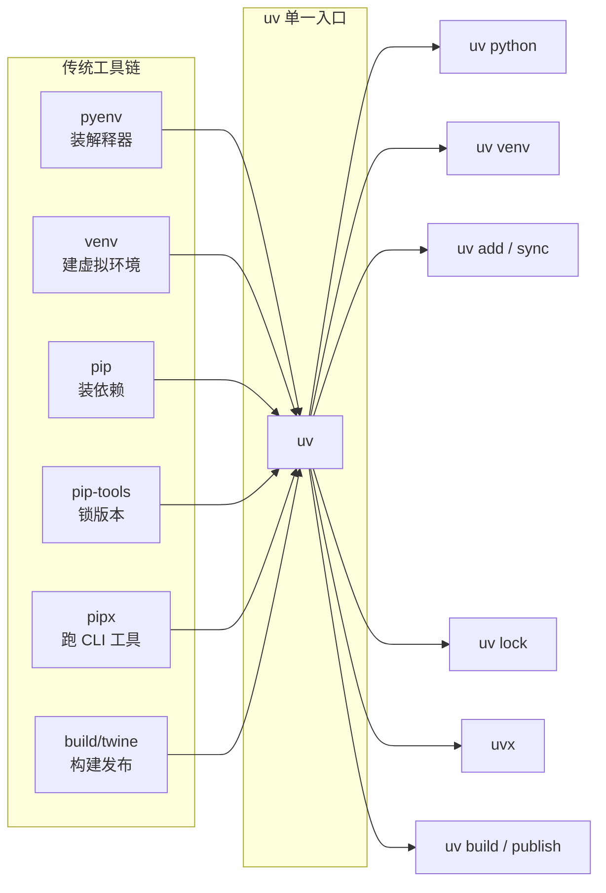
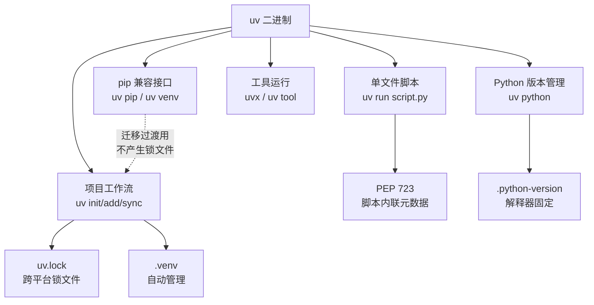

# uv：用一个工具替换整条 Python 工具链

> 本文基于 uv **0.12.11**（2026-09-08 发布）撰写，文中命令实测于 uv 0.10.7 / macOS arm64。
> uv 迭代极快，具体输出请以你本机 `uv --version` 为准。

---

## 缩写对照表

| 缩写 | 英文全称 | 中文 |
|---|---|---|
| uv | （Astral 出品的工具名，非缩写） | Python 包与项目管理器 |
| PyPI | Python Package Index | Python 包索引（官方包仓库） |
| PEP | Python Enhancement Proposal | Python 增强提案 |
| venv | virtual environment | 虚拟环境 |
| CI/CD | Continuous Integration / Continuous Delivery | 持续集成／持续交付 |
| CLI | Command-Line Interface | 命令行界面 |
| SBOM | Software Bill of Materials | 软件物料清单 |
| TOML | Tom's Obvious, Minimal Language | 一种配置文件格式 |
| CPython | （Python 官方 C 语言实现） | Python 官方解释器实现 |

---

## 一、要解决的问题：Python 工具链的碎片化

一个「正常」的 Python 项目，历史上需要同时理解这些工具：

| 职责 | 传统工具 |
|---|---|
| 装 Python 解释器本身 | pyenv／系统包管理器／官网安装包 |
| 创建虚拟环境 | `python -m venv`、virtualenv |
| 安装依赖 | pip |
| 锁定依赖版本 | pip-tools（`pip-compile`）、poetry、pdm |
| 运行命令行工具 | pipx |
| 构建与发布包 | build、twine |

这套组合的真实痛点不在于「工具多」，而在于**它们之间的状态是隐式的**：

- 你不知道当前 shell 里激活的是哪个虚拟环境；
- `requirements.txt` 不是锁文件，`pip install -r` 的结果依赖执行时刻的 PyPI 状态；
- 本机能跑、CI（持续集成）跑不起来，因为解释器小版本不同；
- 换一台机器要重新讲一遍「先 pyenv 再 venv 再 activate 再 pip」。

**uv 的定位就是把上表整列吃掉，用一个 Rust 编写的静态二进制替代它们，并把隐式状态变成显式文件。**



---

## 二、安装

```bash
# macOS / Linux 官方安装脚本
curl -LsSf https://astral.sh/uv/install.sh | sh

# macOS Homebrew
brew install uv

# Windows
powershell -c "irm https://astral.sh/uv/install.ps1 | iex"
```

uv 是**单个静态二进制**，不依赖系统 Python——这一点很关键：它可以在完全没有 Python 的机器上先装上，再由它去装 Python。

验证：

```bash
uv --version
# uv 0.10.7 (Homebrew 2026-02-27)
```

> **坑一：`uv version` 和 `uv --version` 不是一回事。**
> 在项目目录里执行 `uv version` 输出的是**当前项目的版本号**（如 `demo 0.1.0`），不是 uv 自身版本。查 uv 版本必须用 `uv --version`。

---

## 三、五个命令组：uv 的心智模型

理解 uv 的关键，是知道它其实是**五个相对独立的子工具**共用一个二进制。搞混命令组是新手最常见的困惑来源。

| 命令组 | 用途 | 代表命令 | 对标的旧工具 |
|---|---|---|---|
| **Python 版本** | 装／切换解释器 | `uv python install/list/pin` | pyenv |
| **项目（Project）** | 有 `pyproject.toml` 的正式项目 | `uv init/add/sync/lock/run/build` | poetry、pdm |
| **脚本（Script）** | 单文件脚本带依赖 | `uv run script.py`、`uv add --script` | 无对应物 |
| **工具（Tool）** | 跑／装命令行工具 | `uvx`、`uv tool install` | pipx |
| **pip 接口** | 手工管理环境，兼容旧习惯 | `uv venv`、`uv pip install` | pip、virtualenv |



**最重要的一条建议**：新项目直接用「项目」命令组（`uv add` / `uv sync`），不要用 `uv pip install`。后者只是给迁移期准备的兼容层，它不写锁文件，等于放弃了 uv 的核心价值。

---

## 四、项目工作流实测

### 4.1 初始化

```bash
$ uv init demo
Initialized project `demo` at `/tmp/uvdemo/demo`

$ ls -a
.git  .gitignore  .python-version  main.py  pyproject.toml  README.md
```

生成的 `pyproject.toml` 极简：

```toml
[project]
name = "demo"
version = "0.1.0"
description = "Add your description here"
readme = "README.md"
requires-python = ">=3.11"
dependencies = []
```

注意它同时生成了 `.python-version`（内容就是 `3.11`）和一份 Python 专用的 `.gitignore`（已包含 `.venv`）。

### 4.2 添加依赖

```bash
$ uv add requests
Using CPython 3.11.16
Creating virtual environment at: .venv
Resolved 6 packages in 5ms
Prepared 3 packages in 197ms
Installed 5 packages in 7ms
 + certifi==2026.7.22
 + charset-normalizer==3.5.1
 + idna==3.19
 + requests==2.34.2
 + urllib3==2.7.0
```

一条命令里发生了四件事：

1. 发现没有虚拟环境 → 自动创建 `.venv`；
2. 发现本机没有满足 `>=3.11` 的受管解释器 → 自动选用 CPython 3.11.16；
3. 解析依赖并写入 `pyproject.toml` 的 `dependencies`；
4. 生成 `uv.lock` 并同步安装。

**全程没有 `source .venv/bin/activate`。**

### 4.3 锁文件长什么样

`uv.lock` 是 TOML，逐包记录精确版本、来源、sdist 与每个 wheel 的 `sha256`：

```toml
version = 1
revision = 3
requires-python = ">=3.11"

[[package]]
name = "certifi"
version = "2026.7.22"
source = { registry = "https://pypi.org/simple" }
sdist = { url = "https://files.pythonhosted.org/.../certifi-2026.7.22.tar.gz", hash = "sha256:741e2c3b..." }
wheels = [
    { url = "https://files.pythonhosted.org/.../certifi-2026.7.22-py3-none-any.whl", hash = "sha256:62f22742..." },
]
```

关键特性：**`uv.lock` 是跨平台的**。它记录的是「在所有目标平台上的解析结果」，而不是「本机解析结果」。所以 macOS 上生成的锁文件，Linux 容器里 `uv sync` 能直接用——这是它相对 `pip freeze > requirements.txt` 的本质区别。

> `uv.lock` 的 schema 被 uv 官方视作公共 API，只在 minor 版本变更。但它**是 uv 专有格式**，poetry/pdm 读不了。需要互通时用 `uv export`（见 6.2）。

### 4.4 查看依赖树 / 运行

```bash
$ uv tree
Resolved 6 packages in 2ms
demo v0.1.0
└── requests v2.34.2
    ├── certifi v2026.7.22
    ├── charset-normalizer v3.5.1
    ├── idna v3.19
    └── urllib3 v2.7.0

$ uv run main.py
Hello from demo!
```

`uv run` 每次执行前都会校验环境与锁文件一致，不一致就先同步再跑。这是「不会有人忘记装依赖」的保证。

### 4.5 `--frozen` 与 `--locked` 的区别（易混淆）

```bash
uv sync              # 需要时更新锁文件，然后同步
uv sync --frozen     # 直接用现有锁文件，不检查是否过期
uv sync --locked     # 断言锁文件是最新的，若需更新则报错退出
```

- **CI（持续集成）里用 `--locked`**：如果谁改了 `pyproject.toml` 却忘了提交新的 `uv.lock`，构建会失败——这正是你想要的。
- **Docker 构建里用 `--frozen` 或 `--locked` 都行**，但绝不要用裸 `uv sync`，否则镜像内容会随构建时间漂移。

---

## 五、单文件脚本：uv 真正的独门功能

这是 poetry / pipenv 都没有的能力，基于 **PEP 723（Inline Script Metadata，脚本内联元数据）**。

给一个普通脚本加依赖：

```bash
$ uv add --script script.py httpx
Resolved 7 packages in 1ms
```

脚本被改写成：

```python
# /// script
# requires-python = ">=3.11"
# dependencies = [
#     "httpx>=0.28.1",
# ]
# ///
import httpx
print(httpx.__version__)
```

然后直接跑：

```bash
$ uv run script.py
Installed 7 packages in 6ms
0.28.1
```

**没有虚拟环境，没有 requirements.txt，没有安装步骤。** 依赖声明就在文件头部的注释里，uv 读到后建一个临时环境跑完就走。

这解决了一个长期存在的真实问题：运维脚本、数据分析小工具、一次性迁移脚本——这些东西「不值得建一个项目」，但又确实有依赖。以前的做法是写个 README 让别人自己 `pip install`，现在脚本自带说明书且可执行。

配合 shebang 还能做成可执行文件：

```python
#!/usr/bin/env -S uv run --script
# /// script
# dependencies = ["rich"]
# ///
from rich import print
print("[bold green]直接 ./tool.py 就能跑[/]")
```

---

## 六、工具运行与 pip 兼容层

### 6.1 `uvx`：一次性运行 CLI 工具

```bash
$ uvx ruff --version
Downloaded ruff
Installed 1 package in 1ms
ruff 0.16.6
```

`uvx` 等价于 `uv tool run`，对标 pipx。工具装在隔离环境里，不污染项目依赖。要常驻安装用 `uv tool install ruff`。

在 CI 里这非常好用——不需要为了跑一次 lint 而把 `ruff` 写进项目依赖。

### 6.2 pip 兼容接口与导出

```bash
uv venv                          # 建虚拟环境（替代 python -m venv）
uv pip install requests          # 装包（替代 pip install）
uv pip compile requirements.in   # 生成锁定的 requirements.txt（替代 pip-compile）
uv pip sync requirements.txt     # 精确同步环境（替代 pip-sync）
```

需要把 uv 项目导出成传统格式给别的系统消费（老 CI、SBOM 扫描器、不支持 `uv.lock` 的平台）：

```bash
$ uv export --no-hashes
# This file was autogenerated by uv via the following command:
#    uv export --no-hashes
certifi==2026.7.22
    # via requests
charset-normalizer==3.5.1
    # via requests
idna==3.19
    # via requests
requests==2.34.2
    # via demo
urllib3==2.7.0
```

去掉 `--no-hashes` 则带完整哈希，适合有供应链安全要求的场景。

---

## 七、Python 版本管理

```bash
uv python install 3.12       # 下载并安装 CPython 3.12
uv python list               # 列出可用／已装解释器
uv python pin 3.12           # 写入 .python-version
uv python uninstall 3.11
```

实测 `uv python pin`：

```bash
$ uv python pin 3.12
Updated `.python-version` from `3.11` -> `3.12`
```

CPython 走的是 **python-build-standalone** 预编译发行版（该项目现由 Astral 维护，Mise、bazel 的 rules_python 也在用），**不需要本地编译工具链**——这和 pyenv 每次装解释器都要现场编译形成鲜明对比。除 CPython 外，uv 也支持下载 PyPy 与 Pyodide。

`uv python list --only-installed` 会把受管解释器和系统解释器一起列出来，路径可区分：

```
cpython-3.14.7-macos-aarch64-none    /opt/homebrew/bin/python3.14      ← Homebrew 装的
cpython-3.11.16-macos-aarch64-none   ~/.local/share/uv/python/...      ← uv 受管的
cpython-3.9.6-macos-aarch64-none     /usr/bin/python3                  ← 系统自带
```

---

## 八、性能实测

官方宣传「比 pip 快 10–100 倍」。这个数字区间很大，值得自己测一次看看它到底从哪来。

**测试条件**：macOS arm64 / uv 0.10.7 / 安装 `fastapi uvicorn pydantic requests httpx rich`（连带传递依赖共 **25 个包**）／每次都是全新虚拟环境。

| 场景 | 耗时 | 相对 pip |
|---|---|---|
| `pip install`（pip 自身 HTTP 缓存已预热） | **3.28 s** | 1× |
| `uv pip install`（uv 缓存清空，需重新下载） | **0.60 s** | **约 5.5×** |
| `uv pip install`（uv 缓存已预热） | **0.048 s** | **约 68×** |

**怎么读这组数字，比数字本身更重要：**

- **「100 倍」只在缓存命中时成立。** 冷启动要走网络，网络带宽是共同瓶颈，uv 的优势会被压缩到 5 倍左右。
- **缓存命中才是日常主旋律。** 本地反复切分支、重建环境、CI 复用缓存目录——这些场景下 0.048 秒意味着「感觉不到等待」，这才是体验上的质变。
- uv 快的真正原因不只是 Rust：**全局硬链接缓存**（同一个 wheel 在磁盘上只存一份，各环境硬链接过去）省掉了绝大部分文件拷贝，加上并行下载与自研解析器。
- 这组数字是单机单次测量，不是严谨基准测试。你的项目依赖越重、包越多，差距通常越明显。

---

## 九、Docker 与 CI 实践

官方推荐从 distroless 镜像里拷贝二进制，而不是在镜像里跑安装脚本：

```dockerfile
# 生产环境务必钉死版本，不要用 :latest
COPY --from=ghcr.io/astral-sh/uv:0.12.11 /uv /uvx /bin/

ENV UV_COMPILE_BYTECODE=1   # 预编译 .pyc，改善容器启动速度
ENV UV_LINK_MODE=copy       # 配合 cache mount 使用，避免硬链接告警

WORKDIR /app

# 关键：先只装依赖，不装项目本身 —— 让依赖层可被缓存复用
RUN --mount=type=cache,target=/root/.cache/uv \
    --mount=type=bind,source=uv.lock,target=uv.lock \
    --mount=type=bind,source=pyproject.toml,target=pyproject.toml \
    uv sync --locked --no-install-project

# 再拷贝源码并安装项目
COPY . /app
RUN --mount=type=cache,target=/root/.cache/uv \
    uv sync --locked

CMD ["uv", "run", "python", "-m", "app"]
```

`--no-install-project` 这个分层技巧是重点：**依赖变化频率远低于业务代码**。分成两层之后，改一行业务代码只会让最后一层失效，依赖层直接命中缓存。

CI 里的最小实践：

```yaml
- run: curl -LsSf https://astral.sh/uv/install.sh | sh
- run: uv sync --locked        # 锁文件过期就让构建失败
- run: uv run pytest
```

---

## 十、坑与注意事项

| # | 坑 | 说明与对策 |
|---|---|---|
| 1 | `uv version` ≠ `uv --version` | 前者输出**项目**版本号。查 uv 自身版本用 `uv --version` |
| 2 | Homebrew 装的 uv 无法自更新 | `uv self update` 会报错并提示改用 `brew upgrade uv`。官方脚本安装的才支持自更新 |
| 3 | 尚未发布 1.0，且**不遵循语义化版本** | uv 用自定义方案：**minor 号表示破坏性变更**，patch 号表示修复与增强。升级 minor 版本前请看 changelog |
| 4 | `uv pip install` 不写锁文件 | 它只是兼容层。新项目请用 `uv add` / `uv sync`，否则等于白用 uv |
| 5 | `uv.lock` 是专有格式 | poetry / pdm 无法读取。跨工具协作用 `uv export` 导出 requirements 格式 |
| 6 | CI 里别用裸 `uv sync` | 用 `--locked`，让「忘记提交锁文件」变成显式的构建失败 |
| 7 | 缓存会长大 | 全局缓存在 `uv cache dir`。定期 `uv cache prune` 清理过期条目（`clean` 是全清，代价是下次全部重下） |
| 8 | 受管解释器不是系统解释器 | `.python-version` 只对 uv 生效。系统里直接敲 `python3` 用的仍是系统版本 |

---

## 十一、与同类工具的取舍

| 维度 | uv | poetry | pdm | pip + pip-tools |
|---|---|---|---|---|
| 速度 | 极快（Rust） | 慢 | 中等 | 慢 |
| 管理 Python 解释器 | ✅ 内置 | ❌ | 部分 | ❌ |
| 单文件脚本依赖（PEP 723） | ✅ | ❌ | ✅ | ❌ |
| 替代 pipx | ✅ `uvx` | ❌ | ❌ | ❌ |
| 跨平台锁文件 | ✅ | ✅ | ✅ | ❌（`pip freeze` 是单平台） |
| 生态成熟度 | 新，但采纳极快 | 成熟，社区最大 | 中等 | 最传统 |
| 版本稳定性承诺 | 0.x，minor 可能破坏 | 1.x 语义化 | 2.x 语义化 | 稳定 |

**选择建议：**

- **新项目 / 容器化服务 / CI 敏感场景** → 直接上 uv，收益最大。
- **已有稳定的 poetry 项目且没有痛点** → 不必急着迁。uv 的优势主要在速度与解释器管理，如果这两点不痛，迁移成本未必划算。
- **企业环境有工具审批流程** → 注意 uv 尚在 0.x，minor 版本可能带破坏性变更，需要钉死版本并纳入升级评审。
- **只写一次性脚本** → 哪怕不做项目，`uv run script.py` + PEP 723 也值得单独引入。

---

## 十二、小结

uv 的价值不在于「又一个更快的 pip」，而在于两件事：

1. **合并**——把解释器管理、虚拟环境、依赖解析、锁定、工具运行、构建发布收拢到一个二进制里，消除了工具间的隐式状态。
2. **显式化**——`.python-version` + `pyproject.toml` + `uv.lock` 三个文件完整描述了一个项目的可复现环境，不再依赖「你 shell 里激活了什么」。

速度是这两件事的副产品，但也正是速度让「每次都重建环境」从奢侈变成默认，进而让可复现性真正落地。

代价是它还年轻：0.x 版本号、非语义化版本策略、专有锁文件格式。对绝大多数项目这些代价可以接受，但值得在引入前想清楚。

---

## 参考资料

- [uv 官方文档](https://docs.astral.sh/uv/)
- [uv 功能总览](https://docs.astral.sh/uv/getting-started/features/)
- [uv Docker 集成指南](https://docs.astral.sh/uv/guides/integration/docker/)
- [uv 版本策略](https://docs.astral.sh/uv/reference/policies/versioning/)
- [astral-sh/uv GitHub Releases](https://github.com/astral-sh/uv/releases)
- [PEP 723 – Inline script metadata](https://peps.python.org/pep-0723/)
- 同目录：[Why Use uv for Python](./Why-Use-uv-for-Python.md)（早期剪藏的「为什么用 uv」概述）
