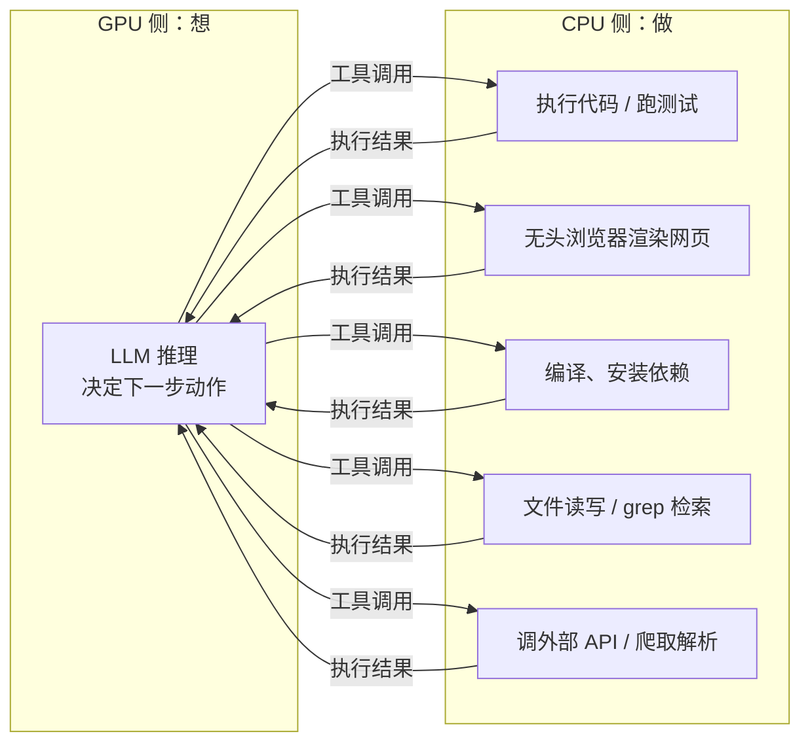

# 为什么 Agentic AI 阶段对 CPU 的需求会大大提升

## 一句话答案

Chat 阶段的负载几乎只有"模型推理"，重活全在 GPU；Agentic 阶段模型每思考一步，就要**真实地执行一个动作**——跑代码、开浏览器、查数据库、读写文件——而这些动作全部运行在 CPU 上。**GPU 负责"想"，CPU 负责"做"**；Agent 把"做"的比重从接近零拉到了与"想"平起平坐甚至更高。

## 一、负载结构变了：每轮推理都挂着一次真实执行

回顾 Agentic 循环：模型决策 → 调用工具 → 结果喂回 → 再决策。其中"调用工具"这一步在 Chat 时代根本不存在，而它恰恰全是 CPU 负载：

典型例子：

- **编码 Agent**（Claude Code、Codex）：每轮可能要 `pytest` 跑一遍测试套件、`npm install` 拉依赖、编译整个项目——这就是一个 CI 服务器的负载；
- **Computer Use / 浏览器 Agent**：背后是一个真实的无头浏览器实例在渲染 DOM、执行 JS、截图——单个 Chrome 实例就能吃掉 1~2 个核和几 GB 内存；
- **研究型 Agent**（Deep Research）：并发爬取几十个网页、解析 PDF、抽取表格，全是 CPU 密集的解析工作。

一次 50 轮的 agent 任务 = 50 次 GPU 推理 + 50 次 CPU 工具执行。后者在 Chat 时代的量级是零。

## 二、沙箱：每个 Agent 都要一台"专属小电脑"

Agent 要执行任意代码，就必须隔离——不能让它在裸机上乱跑。于是每个活跃 agent 会话背后都是一个独立的沙箱环境：容器、microVM（Firecracker/gVisor）或完整虚拟机，各自带着自己的文件系统、CPU 配额和内存。

这带来一个 Chat 时代不存在的资源模型：

| | Chat 会话 | Agentic 会话 |
|---|---|---|
| 服务端驻留资源 | 几乎为零（无状态 API 请求） | 一个沙箱：1~4 核 CPU + 几 GB 内存 + 磁盘 |
| 生命周期 | 毫秒~秒级（一次请求） | 分钟~小时级（任务全程驻留） |
| 扩容单位 | GPU 卡 | **CPU 服务器机群** |

关键在**占用时长的不对称**：一轮循环里 GPU 推理只占几秒，而工具执行（编译、测试、网页加载）动辄几十秒——沙箱全程驻留。GPU 是高吞吐地在几百个任务间轮转，沙箱却是每任务独占一份。一万个并发 agent = 一万个常驻沙箱 = 数万核的 CPU 池。E2B、Modal、各家 agent 云的本质，就是把"按秒起租的沙箱机群"做成基础设施。

## 三、推理服务本身的 CPU 配套也在膨胀

即使不算工具执行，agentic 负载也让推理链路上的 CPU 工作量倍增：

- **分词/反分词**：每轮重发几万 token 的上下文，tokenize 是 CPU 活，轮数一多总量可观；
- **结构化输出的约束与校验**：工具调用要求严格 JSON/语法约束（constrained decoding 的语法状态机、schema 校验、解析、重试），每轮都跑在 CPU 上；
- **KV Cache 分层存储**：前缀缓存要在几十轮间保活，显存装不下，主流方案是把冷缓存下沉到 **CPU 内存**乃至 SSD，命中时再搬回——CPU 大内存服务器成了缓存池；
- **调度与编排**：continuous batching 调度器、多 agent 编排框架、消息队列、重试逻辑、全链路日志与可观测性——传统后端 scale-out 负载，随 agent 轮数成倍放大；
- **RAG 配套**：向量检索、重排、文档切分、OCR/PDF 解析，agent 每轮都可能触发一次。

## 四、总量效应：Agent 把计算需求和"人的数量"解耦

Chat 的总负载有天然上限：人打字慢、要睡觉，一个人一天聊不了多少轮。Agent 不受此限——

- 一个人可以**同时挂十个 agent** 跑不同任务；
- Agent 可以**7×24 无人值守**运行（定时任务、CI 集成、自动化流水线）；
- Agent 还会**派生子 agent** 并行工作。

需求侧从"与活跃用户数成正比"变成"与任务数成正比"，而任务数没有生理上限。GPU 和 CPU 的需求同时被放大，但 CPU 侧因为"每任务常驻沙箱 + 每轮真实执行"，放大倍数更陡。

## 五、总结

1. **负载性质**：Chat 只有推理，Agentic 是"推理 + 执行"交替——执行全在 CPU；
2. **资源模型**：每个 agent 需要常驻沙箱（核数 + 内存 + 磁盘），占用时长远超 GPU 推理本身；
3. **配套链路**：分词、结构化校验、KV 缓存下沉、调度编排、RAG，全是随轮数放大的 CPU 负载；
4. **总量解耦**：agent 数量不受人的时间限制，任务总数爆炸式增长；
5. **一句话**：GPU 决定 agent **想得多快**，CPU 决定它**干得动多少活**——Agentic 时代的数据中心，是 GPU 训练/推理集群旁边再长出一片同样庞大的 CPU 沙箱机群。
