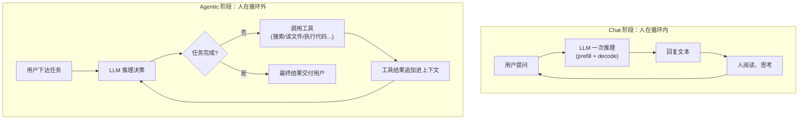
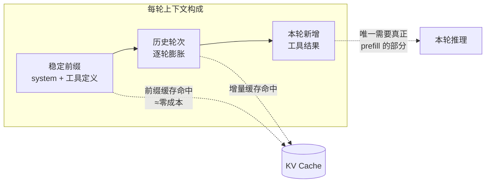

# Chat 阶段 vs Agentic 阶段：大模型使用范式的两代差异

## 一句话区别

**Chat 阶段：人是循环的一部分**——模型每输出一次就停下来，等人读、等人回，一问一答。
**Agentic 阶段：模型自己在循环里跑**——接到任务后自主决策：调工具、看结果、再决策，循环多轮，直到任务完成才回到人面前。

## 两种循环的结构对比

核心差别就一处：Chat 的循环节点是**人**，Agentic 的循环节点是**环境（工具执行结果）**。人被移出了内循环，只在任务的入口和出口出现。

## 逐维度对比

| 维度 | Chat 阶段 | Agentic 阶段 |
|---|---|---|
| 交互单位 | 一问一答（turn） | 一个任务（task），内含几十上百次推理 |
| 循环里的角色 | 人读完再发下一条 | 工具结果自动喂回，无人介入 |
| 输出的本质 | 给人看的文本 | 多数是**动作**（结构化工具调用），最后才是给人看的文本 |
| 上下文增长 | 慢，按人打字的速度 | 快且猛，每轮追加工具输出（日志、文件、网页），轻松堆到几万 token |
| 输入:输出 token 比 | 接近 1:1 到 5:1 | 常见 20:1 甚至 100:1，**输入占绝对大头** |
| 延迟指标 | TTFT + 逐字生成速度 | 端到端任务完成时间（几十次串行推理累加） |
| 错误的代价 | 答错一次，人当场纠正 | 错误逐步**复利放大**：第 3 步跑偏，后面 20 步全在错误方向上努力 |
| 对模型的核心要求 | 语言质量、知识 | 规划、工具使用、长程一致性、自我纠错 |
| 典型产品 | ChatGPT 网页版、客服机器人 | Claude Code、Deep Research、Computer Use、自动化 workflow |

## 和推理系列文章的衔接：Agentic 阶段改变了推理经济学

前两篇讲过 prefill/decode 和 KV Cache，Agentic 范式恰好把那套结论的重要性放大了一个数量级：

**1. 前缀缓存从"优化项"变成"生死线"。**
Agentic 循环每一轮都要把**全部历史**（system prompt + 任务 + 前面所有工具调用和结果）重新发给模型。没有 prefix caching，每轮都是一次全量 prefill，第 30 轮时光首字延迟就不可接受；命中缓存后，每轮只需增量 prefill 新追加的工具结果。API 厂商把缓存命中定价压到 1/10，就是为 agentic 负载准备的。

**2. 成本结构倒转。**
Chat 时代大家盯着"输出 token 贵 3~5 倍"；Agentic 时代账单大头反而是输入——因为历史被反复携带，输入量随轮数近似平方级累积。省钱的主战场从"少生成"变成"**上下文管理**"：压缩历史（compaction）、把大文件放缓存稳定前缀、工具结果做摘要后再入上下文。

**3. 串行推理次数成为新的延迟瓶颈。**
一次任务 = 几十次串行的 prefill+decode。单次快 20% 在 Chat 里感知不强，在 50 轮的 agent 任务里就是几分钟的差距。这也是投机解码、更快的小模型路由（简单步骤用小模型）在 agentic 场景下价值陡增的原因。

## 能力门槛：为什么 Agentic 到 2024 年后才爆发

Agentic 循环对模型有三个 Chat 时代不苛求的硬要求：

1. **可靠的结构化输出**：工具调用格式错一个括号，整个循环就断；
2. **长程目标保持**：几万 token 的轨迹里不忘记最初任务、不被中间结果带偏；
3. **失败恢复**：工具报错时能换路径重试，而不是复读同一个错误动作。

这三项本质上都是"多步乘法"问题：单步成功率 95% 的模型，20 步连乘只剩 36%；单步 99% 才有 82%。**Chat 到 Agentic 的跨越，不是加了个工具调用 API，而是单步可靠性跨过了让长链路乘积仍然可用的阈值。**

## 总结

- Chat 阶段：模型是**问答引擎**，人驱动循环，token 经济以输出为主，比拼语言质量；
- Agentic 阶段：模型是**任务执行引擎**，环境反馈驱动循环，token 经济以反复携带的输入为主，比拼规划、工具使用和长程可靠性；
- 对基础设施而言，Agentic 范式把 prefix caching、上下文管理、串行延迟优化从锦上添花变成了核心竞争力。
