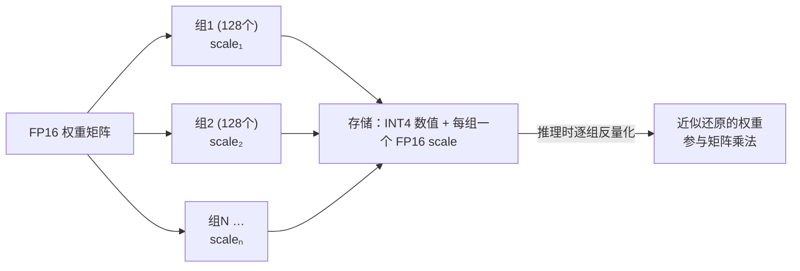

# FP16 与 INT4 量化：参数到底怎么存，为什么能压缩 4 倍还能用

## 前置：参数就是一堆浮点数，存法决定一切

模型的每个参数就是一个数（比如 0.0234、-1.7052）。**用几个比特（bit）来存这一个数**，直接决定模型文件大小、显存占用和推理速度：

| 格式 | 每参数占用 | 8B 模型体积 | 70B 模型体积 |
|---|---|---|---|
| FP32 | 4 字节 | 32 GB | 280 GB |
| **FP16 / BF16** | 2 字节 | 16 GB | 140 GB |
| INT8 | 1 字节 | ~8.5 GB | ~72 GB |
| **INT4** | 0.5 字节 | ~4.5 GB | ~40 GB |

（INT8/INT4 的实际体积略大于纯参数字节数，因为要额外存缩放系数，见下文。）

## 一、FP16：浮点数的"半精度"存法

### 浮点数怎么用比特表示

浮点数 = 科学计数法的二进制版：**符号位 × 尾数 × 2^指数**。分给指数的位数决定**能表示多大/多小的数（动态范围）**，分给尾数的位数决定**表示得多精细（精度）**：

| 格式 | 总位数 | 符号 | 指数 | 尾数 | 特点 |
|---|---|---|---|---|---|
| FP32（单精度） | 32 | 1 | 8 | 23 | 科学计算标准，范围大精度高 |
| **FP16（半精度）** | 16 | 1 | 5 | 10 | 体积减半；但最大只能表示 ±65504，**容易溢出** |
| **BF16（脑浮点）** | 16 | 1 | 8 | 7 | 指数位和 FP32 一样多 → 范围同 FP32，牺牲精度换稳定 |

### 为什么大模型默认 16 位而不是 32 位

实践发现：神经网络对参数的**精细度不敏感**——第 11 位小数抖一抖，模型行为几乎不变。于是全行业把 FP32 砍半：

- **训练**：主流用 **BF16**（Google 为 TPU 设计，后成为行业标准）。训练时梯度数值范围波动极大，FP16 的 ±65504 上限动不动就溢出（变成 inf/NaN，训练崩溃），BF16 用 FP32 同款的 8 位指数换来稳定，代价是尾数只剩 7 位——而这个代价模型不在乎；
- **发布/推理**：权重文件默认 FP16 或 BF16 —— 这就是"8B 模型 = 16 GB"（8B × 2 字节）的来历，也是本指南里所有显存账的基准线。

**所以 FP16/BF16 不叫"量化"——它仍是浮点数，只是位数少的浮点数，是模型的"出厂原始精度"。量化是下一步：从浮点跳到整数。**

## 二、INT4 量化：把浮点数映射成 4 位整数

### 核心思想：值域映射

INT4 只有 4 个比特，只能表示 **16 个不同的值**（如 -8 到 7 的整数）。量化就是把一组浮点权重**线性映射**到这 16 个格子上：

```
量化：   q = round( w / scale )          # 浮点 → 整数（存这个）
反量化： w' = q × scale                  # 整数 → 近似浮点（用这个算）
```

`scale`（缩放系数）= 这组权重的最大绝对值 ÷ 7，让最大的权重恰好落在格子边缘。

具体例子：某组权重 `[0.0234, -1.7052, 0.8801, ...]`，最大绝对值 1.7052 → scale = 1.7052/7 ≈ 0.2436：

| 原始 FP16 | ÷ scale 后取整（存 INT4） | 反量化还原 | 误差 |
|---|---|---|---|
| 0.0234 | 0 | 0.0000 | 0.0234 |
| -1.7052 | -7 | -1.7052 | ~0 |
| 0.8801 | 4 | 0.9744 | 0.0943 |

**16 个格子当然装不下连续的浮点世界——量化本质是一次有损压缩**，每个权重都被"吸附"到最近的格子上。

### 分组（group-wise）：让 16 个格子够用的关键

如果整个矩阵共用一个 scale，一个离群大值会把 scale 撑大，其他小权重全被挤到 0 附近，误差爆炸。实际做法是**每 32~128 个权重一组，各自配一个 scale**（有的方案再加零点 zero-point）：



这些额外的 scale 就是"INT4 的 8B 模型 ≈ 4.5 GB 而不是恰好 4 GB"的原因。另外，词嵌入层和输出层通常对精度最敏感，主流方案会把它们保留在更高精度——所以量化模型是"混合精度"的。

### 为什么砍到 1/4 精度模型还能用

三个原因叠加：

1. **参数天生冗余**：几十亿个参数存的是统计规律，单个参数的小误差会被海量参数平均掉；
2. **权重分布友好**：训练好的权重大多集中在 0 附近的窄区间，分组后 16 个格子的分辨率基本够用；
3. **聪明的量化算法**：不是傻乎乎四舍五入——**GPTQ** 逐列量化并把误差补偿到后续列；**AWQ** 先找出对输出影响最大的 1% "重要权重"重点保护；ollama 用的 **GGUF k-quants**（如 `q4_K_M`）对不同层用不同位宽混搭。这些都属于**训练后量化（PTQ）**：拿几百条校准数据调 scale，几小时搞定，不用重新训练。

代价仍然存在：INT4 通常带来轻微的困惑度上升，表现为长推理链偶尔断裂、边缘知识更易出错。经验规律：**模型越大越抗量化**（70B-INT4 的损失几乎无感，1B-INT4 明显变笨）；INT8 基本无损，INT4 是"性价比甜点"，再往下（2-3 bit）质量快速崩塌。

## 三、量化换来什么：显存 + 速度双赢

- **显存**：70B 从 140 GB（需 2×A100）压到 ~40 GB（单卡可跑）；8B 从 16 GB 压到 ~4.5 GB（MacBook/手机可跑）。**量化直接改写了"谁能跑什么模型"的门槛**；
- **速度**：decode 是内存带宽受限的——每个 token 都要把全部权重搬运一遍。**权重体积减到 1/4，搬运时间就减到约 1/4**，token/s 近似翻 4 倍（计算时再反量化的开销远小于搬运节省）。省显存的同时还提速，这是量化在 LLM 上格外划算的根本原因；
- 同样的思路也用在 KV Cache 上（INT8/INT4 KV cache），显存账见 KV Cache 篇。

## 四、实用速查

| 场景 | 建议 |
|---|---|
| ollama 模型标签 `q4_K_M` / `q8_0` | q4_K_M = 4bit 混合量化（默认甜点）；q8_0 = 8bit 近无损 |
| 显存紧张 | 先试 INT4；质量不满意升 INT8 或 q5/q6 |
| 小模型（≤3B） | 尽量用 INT8 以上，小模型经不起 4bit 折腾 |
| 微调 | QLoRA：基座冻结在 INT4（NF4），只训 FP16 的 LoRA 增量——消费级显卡微调 70B 的标准姿势 |

**一句话总结：FP16 是模型的出厂原始精度（浮点、2 字节）；INT4 量化是把每 128 个权重一组线性映射到 16 个整数格子的有损压缩（0.5 字节 + 少量 scale）——用几乎无感的精度损失，换显存 1/4、decode 速度 ~4 倍，以及"笔记本跑大模型"这件事本身。**
