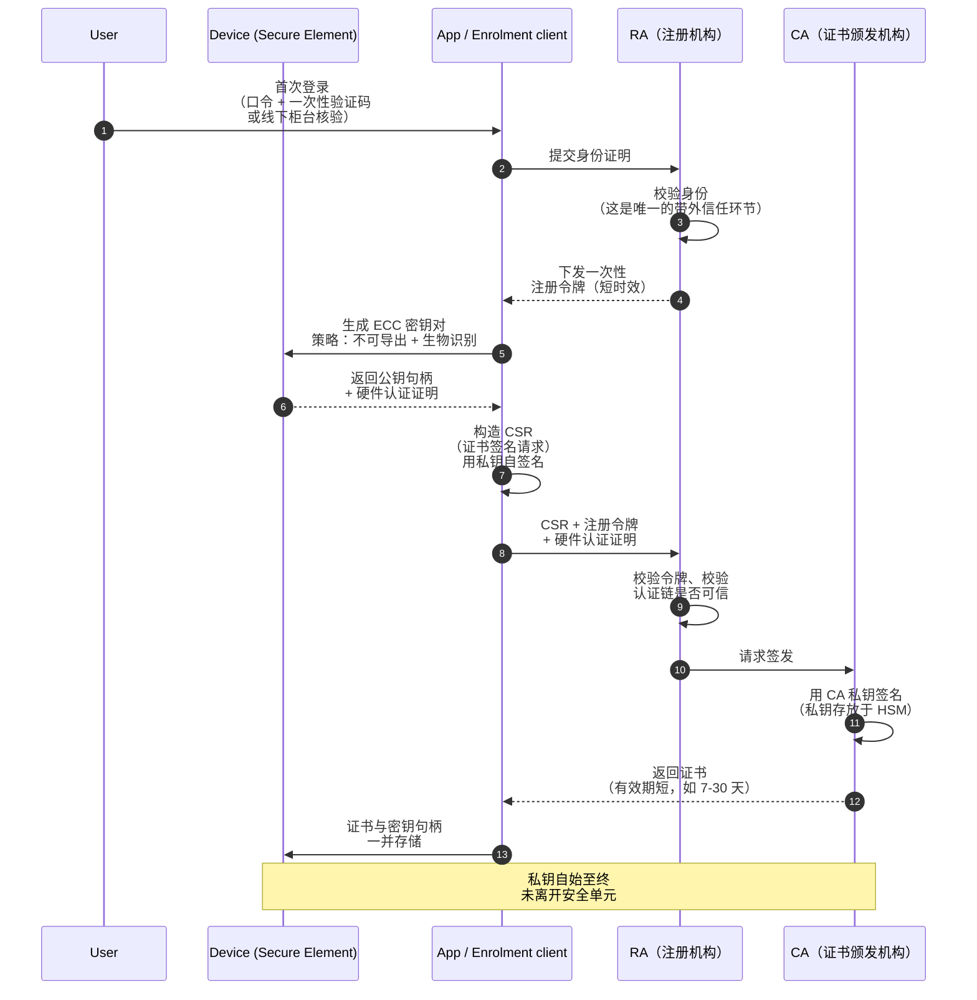
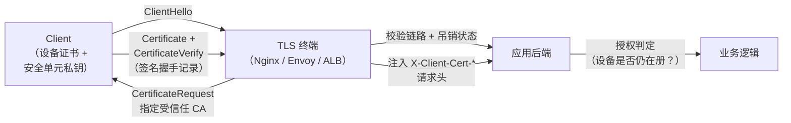

# Public Key Infrastructure for User and Device Authentication

> Using an Elliptic Curve Cryptography key pair, held in device hardware, as the credential — instead of a password, an OTP, or a bearer token.

## Abbreviation glossary

| Abbreviation | Full English name | 中文 |
|---|---|---|
| PKI | Public Key Infrastructure | 公钥基础设施 |
| ECC | Elliptic Curve Cryptography | 椭圆曲线密码学 |
| ECDSA | Elliptic Curve Digital Signature Algorithm | 椭圆曲线数字签名算法 |
| EdDSA | Edwards-curve Digital Signature Algorithm | 爱德华兹曲线数字签名算法 |
| CA | Certificate Authority | 证书颁发机构 |
| RA | Registration Authority | 注册机构 |
| CSR | Certificate Signing Request | 证书签名请求 |
| mTLS | Mutual Transport Layer Security | 双向 TLS 认证 |
| TPM | Trusted Platform Module | 可信平台模块 |
| HSM | Hardware Security Module | 硬件安全模块 |
| SAN | Subject Alternative Name | 主题备用名称 |
| OCSP | Online Certificate Status Protocol | 在线证书状态协议 |
| CRL | Certificate Revocation List | 证书吊销列表 |
| OTP | One-Time Password | 一次性密码 |
| SCEP | Simple Certificate Enrollment Protocol | 简单证书注册协议 |
| EST | Enrollment over Secure Transport | 基于安全传输的注册协议 |
| MDM | Mobile Device Management | 移动设备管理 |
| SPIFFE | Secure Production Identity Framework For Everyone | 通用生产身份框架 |

---

## 1. Why bother: what a shared secret cannot do

Every classic credential — password, OTP seed, API key, bearer token — is a **shared secret**. The verifier must hold something that is enough to impersonate the holder. That single property is the root of most authentication failures:

- The server's credential store is a breach jackpot. Steal the database, replay every account.
- The secret travels on the wire on every authentication. Anything on the path — a phishing proxy, a mis-issued certificate, a compromised CDN — can capture and replay it.
- The user can be socially engineered into typing it into the wrong origin. An OTP does not help; the attacker's proxy simply relays it in real time.

Public key authentication inverts the asymmetry. The device generates a key pair; the **private key never leaves the device**, and in a well-built system never leaves the hardware security boundary at all. The server stores only the public key (or a certificate over it). Authentication becomes: *prove you can sign this fresh challenge*.

That gives you three properties no shared secret can offer:

1. **Server breach yields nothing usable.** A public key is not a credential.
2. **Replay is impossible** — the challenge is per-session and never repeats.
3. **Phishing resistance is achievable** — if the signature is bound to the channel or origin (mTLS channel binding, or WebAuthn's origin binding), a relaying attacker's signature is invalid at the real server.

PKI is the layer that makes this manageable at scale: instead of the server pre-registering every public key out of band, a trusted **CA** vouches for the binding between an identity and a public key, and the verifier trusts one root instead of N keys.

---

## 2. First principles: five objects and nothing more

Strip PKI down and it is five things:

| Object | What it actually is | Who holds it |
|---|---|---|
| Private key | A random scalar `d` (for ECC, an integer mod the curve order) | Device only, ideally non-exportable hardware |
| Public key | Curve point `Q = d·G` | Anyone |
| Certificate | A signed statement: "this public key belongs to this subject, until this date, for these uses" | Everyone; it is public data |
| CA | A key pair whose public half the verifiers trust a priori | Your organisation (or a vendor) |
| Revocation state | "…unless I said otherwise" | Published by the CA, consumed by verifiers |

A certificate is *not* a secret and *not* a credential. It is a **portable, offline-verifiable assertion**. The credential is the private key, and the certificate only tells the verifier what that key is allowed to claim.

The practical consequence: **anything you cannot express in the certificate must be checked at authentication time.** A certificate proving "this is device 7f3a" does not prove the device is still enrolled, still healthy, or still owned by the same user. Those are authorisation questions, and they belong in your service, not in the X.509 chain.

---

## 3. Why ECC and not RSA on devices

For user/device credentials, ECC is the correct default. The comparison at equivalent security strength:

| Property | RSA-3072 | ECC P-256 (secp256r1) | Ed25519 |
|---|---|---|---|
| Security strength | ~128-bit | ~128-bit | ~128-bit |
| Private key size | ~1.7 KB | 32 bytes | 32 bytes |
| Public key size | 384 bytes | 64 bytes (uncompressed point) | 32 bytes |
| Signature size | 384 bytes | ~64–72 bytes (DER-encoded) | 64 bytes |
| Keygen cost on a phone | hundreds of ms to seconds | sub-millisecond | sub-millisecond |
| Sign cost | slow | fast | fast |
| Verify cost | fast | moderate | fast |
| Hardware support (Secure Enclave / StrongBox / TPM) | limited / absent | **universal** | partial |
| Needs a good random nonce per signature | no | **yes** (ECDSA `k` reuse leaks the key) | no (deterministic) |

Three things drive the decision:

- **Key generation happens on the device, in hardware.** RSA keygen is a prime search; a secure element doing that takes seconds and burns battery. ECC keygen is one scalar multiplication.
- **Hardware backing is the whole point.** Apple's Secure Enclave supports exactly one algorithm for signing: ECDSA on P-256. Android StrongBox and most TPM 2.0 devices support P-256 universally, RSA inconsistently. If you pick something the hardware does not do, your "private key" is a file — and files get exfiltrated.
- **Bytes on the wire matter** when a certificate chain rides on every handshake from a mobile network.

The ECDSA nonce caveat is real and has burned people (the PlayStation 3 key extraction, and repeated Bitcoin wallet losses, were both `k` reuse). It is a non-issue when signing happens inside a secure element with a hardware RNG; it is a live risk in a hand-rolled software implementation. Prefer Ed25519 where hardware allows it, P-256 everywhere else, and never implement ECDSA yourself.

---

## 4. Where the private key lives — the part that actually decides your security

The entire scheme reduces to one question: **how hard is it to extract `d`?**

| Storage | Extraction difficulty | Notes |
|---|---|---|
| File on disk | Trivial once the device is compromised | Not device authentication; it is a portable secret |
| OS keystore, software-backed | Moderate; tied to OS user, root breaks it | Acceptable fallback only |
| Secure Enclave (iOS) / StrongBox (Android) | Requires a hardware attack | Key is **non-exportable by construction** — the API returns a handle, never bytes |
| TPM 2.0 (desktop) | Requires a hardware attack | Bind to PCRs if you also want boot-state attestation |
| HSM (server side, for the CA) | Requires physical + policy compromise | Where the CA private key must live |

The important API shape on modern platforms is that you **never see the private key**. You ask the keystore to create a key with a given policy, you get back a reference, and you ask the keystore to sign. The policy is where the interesting controls live:

- **User presence / biometric gating** — the key only signs after a successful Face ID / fingerprint check. This is what turns "device authentication" into "user-on-this-device authentication".
- **Invalidate on biometric enrolment change** — if a new fingerprint is added, the key is destroyed. Prevents an attacker who has the unlock PIN from adding their own biometric and inheriting the credential.
- **Key attestation** — the secure element signs a statement, chaining to a vendor root, saying "I generated this key, in hardware, with these properties, on a device with this boot state". This is what lets your CA distinguish a genuine hardware-backed key from a software key claiming to be one.

Without attestation, an enrolment endpoint cannot tell hardware keys from software keys, and the hardware guarantee becomes a hope rather than a control.

---

## 5. Enrolment: the one moment that needs out-of-band trust

Issuance is the only step where the system needs a pre-existing trust anchor for the *human*. Get this wrong and the strongest key material in the world certifies the wrong person.



Three details that separate a working design from a broken one:

**The CSR proves possession.** The client self-signs the CSR with the very key being certified. The CA verifies that signature before issuing. This is what stops an attacker from getting a certificate over *someone else's* public key.

**The enrolment token must be single-use and short-lived.** It is a bearer credential — the one shared secret remaining in the system — so minimise its blast radius. Bind it to the user, expire it in minutes, and burn it on first use.

**Attestation is checked at the RA, not later.** Once you have issued a certificate, you have lost the ability to tell how the key was created. Validate the vendor attestation chain, the claimed security level (`StrongBox` vs `TEE` vs software), and the boot state *before* signing.

At fleet scale, this flow is usually not hand-rolled: **SCEP** (legacy but ubiquitous, typically driven by **MDM**) and **EST** (the modern TLS-based replacement, RFC 7030) exist precisely to automate it. On the server side, SPIFFE/SPIRE does the analogous job for workloads.

---

## 6. Authentication: two shapes, pick deliberately

### 6.1 mTLS — identity at the transport layer

The client presents its certificate during the TLS handshake and signs the handshake transcript. The server validates the chain and terminates the connection if it fails.



**Strengths:** authentication happens before a single byte of application data; it is transparent to application code; the signature is bound to the TLS channel, so a relaying proxy cannot reuse it.

**Costs and gotchas:**
- The certificate is sent **in cleartext in TLS 1.2** — a passive observer learns which device is connecting. TLS 1.3 encrypts it. Use TLS 1.3.
- Terminating mTLS at a load balancer means the backend trusts injected headers. **Strip client-supplied `X-Client-Cert-*` headers at the edge** or you have built a trivial impersonation bypass.
- Corporate TLS-inspecting middleboxes break it, by design. This is a real deployment constraint, not a theoretical one.
- Session resumption can skip re-verification. Make sure revocation is still consulted on the path you care about.

### 6.2 Application-layer challenge-response — identity in the request

The server issues a nonce; the client signs it (plus a context binding) and returns the signature.

```
server → { nonce, timestamp, audience, tls_exporter_binding }
client → signature over canonical(nonce ‖ timestamp ‖ audience ‖ binding ‖ method ‖ path)
```

**Strengths:** survives proxies and middleboxes; the signature can be bound to the *request*, not just the connection, giving you per-operation non-repudiation (the "sign this transfer of ¥50,000" case); works over any transport.

**Costs:** it is application code, which means it is your bug. The classic mistakes: signing the nonce alone (so the signature is replayable against a different endpoint or a different tenant), omitting the audience (cross-service replay), and accepting a wide clock skew window without nonce tracking.

**WebAuthn / FIDO2 is the standardised version of this shape** — hardware-backed ECC key pair, per-origin scoping, user presence check, and a battle-tested signature format. If your use case is browser or mobile app login, use WebAuthn rather than inventing this protocol. You need custom PKI when you need X.509 semantics: cross-organisational trust, offline verification, or integration with existing enterprise CA infrastructure.

---

## 7. Running example: issue and verify an ECC device certificate

A minimal but complete chain you can run locally. In production the CA key lives in an HSM and never touches a filesystem; here it is a file so the mechanics are visible.

### Build a CA

```bash
# CA private key — in production: HSM-resident, never exported
openssl ecparam -name prime256v1 -genkey -noout -out ca.key

# Self-signed root, long-lived, CA:TRUE
openssl req -x509 -new -key ca.key -sha256 -days 3650 -out ca.crt \
  -subj "/C=SG/O=Example Corp/CN=Example Device Root CA" \
  -addext "basicConstraints=critical,CA:TRUE,pathlen:0" \
  -addext "keyUsage=critical,keyCertSign,cRLSign"
```

### Device generates its key and a CSR

On a real device this is a keystore API call and the key bytes never materialise. The equivalent locally:

```bash
openssl ecparam -name prime256v1 -genkey -noout -out device.key

cat > device.cnf <<'EOF'
[req]
distinguished_name = dn
req_extensions     = ext
prompt             = no

[dn]
C  = SG
O  = Example Corp
OU = Devices
CN = device-7f3a9c21

[ext]
# Device identity as a URI SAN — machine-parseable, unlike CN
subjectAltName = URI:spiffe://example.corp/device/7f3a9c21, email:alice@example.com
keyUsage       = critical, digitalSignature
extendedKeyUsage = clientAuth
EOF

openssl req -new -key device.key -out device.csr -config device.cnf
```

### CA verifies proof-of-possession and issues

```bash
# The CA MUST check the CSR self-signature before issuing
openssl req -in device.csr -noout -verify   # → "Certificate request self-signature verify OK"

openssl x509 -req -in device.csr -CA ca.crt -CAkey ca.key -CAcreateserial \
  -out device.crt -days 30 -sha256 \
  -extfile device.cnf -extensions ext
```

Note `-days 30`. Short validity is the cheapest revocation mechanism you will ever deploy — see §8.

### Inspect and verify

```bash
openssl x509 -in device.crt -noout -text | \
  grep -A2 -E "Subject:|Public Key Algorithm|X509v3 Subject Alternative Name|Not After"

openssl verify -CAfile ca.crt device.crt      # → device.crt: OK
```

### Prove it end-to-end with an mTLS handshake

```bash
# Server: require and verify a client certificate
openssl req -x509 -newkey ec -pkeyopt ec_paramgen_curve:prime256v1 \
  -nodes -keyout server.key -out server.crt -days 30 -subj "/CN=localhost"

openssl s_server -accept 8443 -cert server.crt -key server.key \
  -CAfile ca.crt -Verify 1 -tls1_3 -www

# Client, in another shell
openssl s_client -connect localhost:8443 \
  -cert device.crt -key device.key -CAfile ca.crt -tls1_3 </dev/null 2>&1 \
  | grep -E "Verify return code|Peer certificate|Protocol"
```

Drop `-cert`/`-key` from the client and the handshake fails — which is the whole point. `-Verify 1` (capital V) makes the client certificate mandatory; `-verify 1` merely requests one and is a common, silent misconfiguration.

### Nginx side, for a realistic terminator

```nginx
server {
    listen 443 ssl;
    ssl_protocols TLSv1.3;

    ssl_certificate         /etc/nginx/tls/server.crt;
    ssl_certificate_key     /etc/nginx/tls/server.key;

    ssl_client_certificate  /etc/nginx/tls/ca.crt;
    ssl_verify_client       on;      # reject the handshake if absent or invalid
    ssl_verify_depth        1;

    location / {
        # Strip anything the client tried to inject, THEN set our own
        proxy_set_header X-Client-Cert-Subject "";
        proxy_set_header X-Client-Cert-Serial  "";

        proxy_set_header X-Client-Cert-Subject $ssl_client_s_dn;
        proxy_set_header X-Client-Cert-Serial  $ssl_client_serial;
        proxy_set_header X-Client-Verify       $ssl_client_verify;

        proxy_pass http://backend;
    }
}
```

The backend must still check `X-Client-Verify == SUCCESS` and must only ever be reachable through this terminator. A backend listening on a routable address with no mTLS of its own turns all of the above into decoration.

---

## 8. Lifecycle: issuance is easy, revocation is where designs die

A certificate says "valid until *T*". The hard question is what happens when the answer changes before *T*.

| Mechanism | How it works | Reality on mobile/device fleets |
|---|---|---|
| **CRL** | Verifier downloads a signed list of revoked serials | Grows without bound; stale by design; a 10 MB download on a metered connection is a non-starter |
| **OCSP** | Verifier asks the CA "is serial X still good?" | Adds a network round trip to every handshake; a CA outage becomes your outage; soft-fail (the common default) means an attacker who can block OCSP defeats it entirely |
| **OCSP stapling** | Server attaches a recent CA-signed status | Solves the privacy and latency problem for *server* certs; does not help for *client* certs, which is the direction that matters here |
| **Short-lived certificates** | Certificate expires in hours or days; renewal is automatic and silently checks entitlement | **The right default.** Revocation becomes "stop renewing" |

For user and device authentication, **short-lived certificates plus a live entitlement check at renewal** is the design that survives contact with reality. Issue for hours or days; have the client renew automatically in the background well before expiry; make the renewal endpoint re-check that the device is still enrolled, the user still employed, the device still compliant. Revocation then means flipping a flag in your own database, with a worst-case exposure equal to the certificate lifetime — a number you control by policy.

Keep a CRL anyway for the emergency case (a stolen device reported ten minutes ago, lifetime 24 hours), but do not make it the load-bearing mechanism.

**Renewal must reuse the key or rotate it — decide explicitly.** Reusing the hardware key keeps the device identity stable across renewals and avoids repeated attestation; rotating limits the damage from a slow key compromise. For hardware-backed non-exportable keys, reuse is the common and defensible choice, with rotation forced on a long cycle or on any security event.

---

## 9. Binding a user to a device — the modelling decision

Three workable models, with different consequences:

**One certificate, both identities.** `CN=alice@example.com` with a device identifier in the SAN. Simple, one artifact. But the certificate must be reissued when either fact changes, and a shared device (a ward tablet, a shop-floor terminal) cannot be represented.

**Two certificates.** A device certificate, long-lived, issued at provisioning; a user certificate or session token, short-lived, obtained after the user authenticates *on* that device. The device certificate answers "is this a managed device"; the user layer answers "who is using it". This is the model that scales to shared devices and to "the device is trusted, the user just left".

**Device certificate plus user assertion.** The device certificate secures the channel via mTLS; the user identity rides inside as a signed assertion or OIDC token. Common in enterprise zero-trust deployments, where device posture and user identity are evaluated by different systems.

Pick based on whether device and user can change independently. They almost always can.

---

## 10. Failure modes worth internalising

- **You cannot back up a hardware key — that is the feature.** Device lost means re-enrolment, which means your recovery flow is now the weakest link in the entire system. Design it as carefully as the primary flow, because that is what an attacker will target. A hardware-backed key protected by an account-recovery flow that accepts an SMS code is a hardware-backed key protected by an SMS code.
- **Registering a second device is the graceful answer.** Multiple credentials per account, with enrolment of device N+1 requiring approval from device N, removes the pressure on account recovery.
- **The certificate is not the authorisation.** Chain validity means the key was certified, not that the holder may perform the operation. Look up the device and user in your own store on every request.
- **Clock skew breaks everything silently.** `notBefore`/`notAfter` are absolute. A device with a wrong clock sees valid certificates as expired, and the error surfaces as an opaque TLS failure. Log the actual validation error.
- **Certificate pinning plus a CA rotation is a fleet-bricking event.** If clients pin your CA, plan the rotation with an overlap period and ship the new root before you need it.
- **A CA private key on a filesystem is a CA you have already lost.** HSM, offline root, short-lived intermediates. `pathlen:0` on the root so an intermediate cannot mint further CAs.
- **Validate the full chain, not just the signature.** `basicConstraints`, `keyUsage`, `extendedKeyUsage=clientAuth`, and the expected issuer. Libraries that skip `extendedKeyUsage` will happily accept a *server* certificate from your own CA as a client credential.
- **Attestation is only as good as its freshness.** A device attestation checked once at enrolment says nothing about the device's state a year later. Re-attest on renewal.

---

## 11. Choosing between this and the alternatives

| You need | Use |
|---|---|
| Browser or mobile app user login, phishing-resistant | **WebAuthn / FIDO2 passkeys** — same cryptography, standardised, no CA to operate |
| Managed device fleet, enterprise CA already in place | **X.509 + mTLS**, enrolled via SCEP or EST through MDM |
| Service-to-service identity inside a cluster | **SPIFFE/SPIRE** — short-lived X.509 SVIDs, automatic rotation |
| Per-transaction non-repudiation (payments, signing) | **Application-layer challenge-response** over a hardware key, signing the transaction content |
| Third-party API clients | Usually asymmetric **JWT** client assertions (RFC 7523) — PKI semantics without certificate lifecycle management |

The decision hinges on one question: do you need to *operate a CA*? Running a CA means owning key ceremonies, HSMs, rotation plans, revocation infrastructure, and the incident response for a root compromise. That is justified when you need offline verification, cross-organisational trust, or integration with existing enterprise infrastructure. When you do not, a registered-public-key system such as WebAuthn gives you the same cryptographic properties with a fraction of the operational surface.

---

## See also

- [JWT](./JWT.md)
- [Microservice security](./microservice-security.md)
- [Mobile banking authentication](./mobile_banking_auth.md)
- [How HTTPS works](../tls/how-https-works.md)
