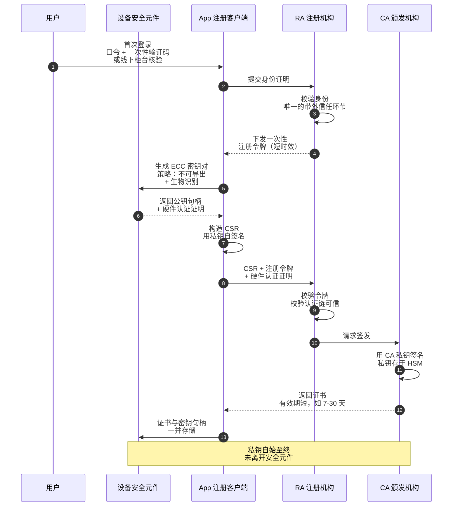
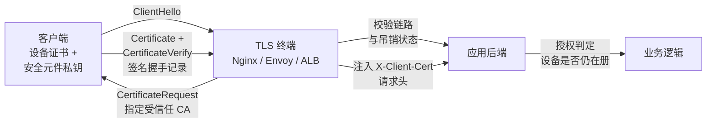

# 用 PKI 做用户与设备认证：把凭证从「共享秘密」换成「硬件私钥」

> 用一对存放在设备硬件里的椭圆曲线密钥当凭证——取代口令、一次性验证码和 bearer token。

## 缩写对照表

| 缩写 | 英文全称 | 中文 |
|---|---|---|
| PKI | Public Key Infrastructure | 公钥基础设施 |
| ECC | Elliptic Curve Cryptography | 椭圆曲线密码学 |
| ECDSA | Elliptic Curve Digital Signature Algorithm | 椭圆曲线数字签名算法 |
| EdDSA | Edwards-curve Digital Signature Algorithm | 爱德华兹曲线数字签名算法 |
| CA | Certificate Authority | 证书颁发机构 |
| RA | Registration Authority | 注册机构 |
| CSR | Certificate Signing Request | 证书签名请求 |
| mTLS | Mutual Transport Layer Security | 双向 TLS 认证 |
| TPM | Trusted Platform Module | 可信平台模块 |
| HSM | Hardware Security Module | 硬件安全模块 |
| SAN | Subject Alternative Name | 主题备用名称 |
| OCSP | Online Certificate Status Protocol | 在线证书状态协议 |
| CRL | Certificate Revocation List | 证书吊销列表 |
| OTP | One-Time Password | 一次性密码 |
| SCEP | Simple Certificate Enrollment Protocol | 简单证书注册协议 |
| EST | Enrollment over Secure Transport | 基于安全传输的注册协议 |
| MDM | Mobile Device Management | 移动设备管理 |
| SPIFFE | Secure Production Identity Framework For Everyone | 通用生产身份框架 |

---

## 一、为什么值得折腾：共享秘密做不到的三件事

口令、OTP 种子、API key、bearer token——所有经典凭证都是**共享秘密**：验证方手里必须握着"足以冒充持有者"的东西。这一条性质，就是大多数认证事故的根。

- **服务端的凭证库是一次性大奖。** 拖走数据库，每个账号都能重放。
- **每次认证秘密都要上网。** 路径上的任何东西——钓鱼代理、误签发的证书、被攻陷的 CDN——都能截获并重放。
- **用户会被骗着把它敲进错误的站点。** OTP 救不了：攻击者的代理实时转发就行。

公钥认证把这个不对称性反过来。设备自己生成密钥对，**私钥永不离开设备**——设计得好的话根本不离开硬件安全边界。服务端只存公钥（或一张覆盖它的证书）。认证变成一句话：*证明你能签下这个新鲜的挑战值*。

于是你拿到三条共享秘密给不了的性质：

1. **服务端被拖库也拿不到能用的东西。** 公钥不是凭证。
2. **重放不可能**——挑战值每次会话都不同。
3. **抗钓鱼是可达成的**——只要签名绑定到信道或来源（mTLS 的信道绑定，或 WebAuthn 的 origin 绑定），中转攻击者的签名在真服务器那里就是无效的。

PKI 是让这件事在规模上可管理的那一层：服务端不必带外预注册每一个公钥，而是由受信的 **CA** 为"身份 ↔ 公钥"的绑定背书，验证方只需信任一个根，而不是 N 把密钥。

---

## 二、第一性原理：只有五个对象

把 PKI 剥到底，就五样东西：

| 对象 | 它到底是什么 | 谁持有 |
|---|---|---|
| 私钥 | 一个随机标量 `d`（ECC 下是曲线阶的模整数） | 只在设备上，最好是不可导出的硬件 |
| 公钥 | 曲线上的点 `Q = d·G` | 任何人 |
| 证书 | 一份签名声明："这把公钥属于这个主体，在此日期前，用于这些用途" | 所有人；它是公开数据 |
| CA | 一对密钥，其公钥被验证方先验信任 | 你的组织（或供应商） |
| 吊销状态 | "……除非我另行声明" | CA 发布，验证方消费 |

**证书不是秘密，也不是凭证。** 它是一份**可离线验证的可携带断言**。凭证是私钥；证书只告诉验证方，这把密钥被允许主张什么。

由此得到一条很实用的推论：**凡是你无法写进证书的东西，都必须在认证时另行检查。** 一张证明"这是设备 7f3a"的证书，并不能证明这台设备仍在册、仍健康、仍属于同一个人。那些是授权问题，属于你的服务，不属于 X.509 证书链。

---

## 三、设备上为什么用 ECC 而不是 RSA

做用户/设备凭证，ECC 是正确的默认值。同等安全强度下的对比：

| 性质 | RSA-3072 | ECC P-256 (secp256r1) | Ed25519 |
|---|---|---|---|
| 安全强度 | ~128 位 | ~128 位 | ~128 位 |
| 私钥大小 | ~1.7 KB | 32 字节 | 32 字节 |
| 公钥大小 | 384 字节 | 64 字节（非压缩点） | 32 字节 |
| 签名大小 | 384 字节 | ~64–72 字节（DER 编码） | 64 字节 |
| 手机上生成密钥的开销 | 数百毫秒到数秒 | 亚毫秒 | 亚毫秒 |
| 签名开销 | 慢 | 快 | 快 |
| 验签开销 | 快 | 中等 | 快 |
| 硬件支持（安全隔区 / StrongBox / TPM） | 有限甚至没有 | **普遍支持** | 部分 |
| 每次签名是否需要好的随机数 | 否 | **是**（ECDSA 的 `k` 复用会泄露私钥） | 否（确定性） |

三点决定了这个选择：

- **密钥是在设备上、在硬件里生成的。** RSA 生成密钥要搜素数；安全元件做这件事要几秒，还费电。ECC 生成密钥只是一次标量乘法。
- **硬件背书才是重点。** 苹果的安全隔区（Secure Enclave）用于签名的算法**只有一种**：P-256 上的 ECDSA。Android StrongBox 和大多数 TPM 2.0 设备普遍支持 P-256，对 RSA 的支持参差不齐。**如果你选了硬件做不了的算法，你的"私钥"就只是一个文件——而文件是会被偷走的。**
- **上网的字节数是有代价的**，尤其当证书链在移动网络上的每次握手都要跑一遍。

ECDSA 的随机数问题是真的坑过人（PS3 的密钥提取、以及反复出现的比特币钱包被盗，根因都是 `k` 复用）。在带硬件随机数源的安全元件里签名时这不是问题；在手搓的软件实现里它是活的风险。**硬件允许就用 Ed25519，否则用 P-256，永远不要自己实现 ECDSA。**

---

## 四、私钥住在哪里——真正决定安全性的那一项

整个方案可以归约成一个问题：**提取出 `d` 有多难？**

| 存放位置 | 提取难度 | 备注 |
|---|---|---|
| 磁盘上的文件 | 设备一旦被攻陷就是白给 | 这不是设备认证，这是一个可携带的秘密 |
| 操作系统密钥库（软件实现） | 中等；绑定到 OS 用户，root 即破 | 只能当兜底方案 |
| 安全隔区（iOS）/ StrongBox（Android） | 需要硬件攻击 | 密钥**从构造上就不可导出**——API 只给句柄，从不给字节 |
| TPM 2.0（桌面） | 需要硬件攻击 | 需要引导状态证明时可绑定到 PCR |
| HSM（服务端，给 CA 用） | 需要物理 + 策略双重攻陷 | CA 私钥就该住这儿 |

现代平台的 API 形态有个关键点：**你永远看不到私钥**。你让密钥库按某个策略创建密钥，拿回一个引用，再让密钥库去签名。有意思的控制点全在策略里：

- **用户在场 / 生物识别门禁**——只有 Face ID 或指纹校验通过后密钥才会签名。**这一条把"设备认证"升级成了"本设备上的这个人"的认证。**
- **生物识别录入变更即失效**——新增一枚指纹就销毁密钥。防止拿到解锁 PIN 的攻击者录入自己的生物特征、继承这份凭证。
- **密钥认证（attestation）**——安全元件签一份声明并链到厂商根，说"这把密钥是我在硬件里生成的，具备这些属性，设备的引导状态是这样"。**这是你的 CA 用来区分真硬件密钥和冒充硬件的软件密钥的唯一手段。**

没有 attestation，注册端点就分不出硬件密钥和软件密钥，"硬件保障"就从一项控制退化成一种期望。

---

## 五、注册：唯一需要带外信任的时刻

签发是整个系统里**唯一**需要对"人"预先存在信任锚的环节。这一步错了，再强的密钥material也只是给错误的人背书。



*这张图回答：一次注册里，信任是从哪一步、由谁建立起来的。*

三个把「能用的设计」和「坏掉的设计」分开的细节：

**CSR 证明了持有权。** 客户端用**正在被认证的那把密钥**给 CSR 自签名，CA 在签发前校验这个签名。这就是阻止攻击者拿**别人的公钥**去换证书的机制。

**注册令牌必须一次性且短命。** 它是一个 bearer 凭证——系统里仅存的那个共享秘密——所以要把爆炸半径压到最小：绑定到用户、几分钟过期、首次使用即作废。

**attestation 必须在 RA 处校验，而不是事后。** 证书一旦签发，你就永远失去了判断这把密钥是怎么生成的能力。**在签名之前**验证厂商认证链、声明的安全级别（`StrongBox` / `TEE` / 软件）以及引导状态。

到了车队规模，这套流程通常不是手搓的：**SCEP**（老但普及，通常由 **MDM** 驱动）和 **EST**（基于 TLS 的现代替代品，RFC 7030）就是为自动化它而生的。服务端一侧，SPIFFE/SPIRE 对工作负载做同样的事。

---

## 六、认证：两种形态，要刻意选

### 6.1 mTLS——身份在传输层

客户端在 TLS 握手中出示证书，并对握手记录签名。服务端校验链路，失败就断连。



*这张图回答：mTLS 下身份在哪一跳建立、又是怎么传给后端的。*

**优点：** 认证发生在任何一个应用字节之前；对应用代码透明；签名绑定到 TLS 信道，中转代理无法复用。

**代价与坑：**

- **TLS 1.2 下证书是明文发送的**——被动观察者能知道哪台设备在连。TLS 1.3 会加密它。**用 TLS 1.3。**
- 在负载均衡处终结 mTLS，意味着后端信任注入的请求头。**必须在边缘剥掉客户端自带的 `X-Client-Cert-*` 头**，否则你亲手造了一个一行就能冒充的绕过。
- 企业的 TLS 审查中间盒会破坏它——按设计如此。这是真实的部署约束，不是理论问题。
- 会话复用可能跳过重新校验。确认你在意的那条路径上吊销检查仍然生效。

### 6.2 应用层挑战-响应——身份在请求里

服务端发一个 nonce，客户端对它（外加上下文绑定）签名并回传。

```
服务端 → { nonce, timestamp, audience, tls_exporter_binding }
客户端 → 对 canonical(nonce ‖ timestamp ‖ audience ‖ binding ‖ method ‖ path) 的签名
```

**优点：** 能穿过代理和中间盒；签名可以绑定到**请求**而不只是连接，从而得到逐操作的不可否认性（"请签署这笔 5 万元转账"就属于这类）；任何传输层都能用。

**代价：** 它是应用代码，所以它的 bug 是你的 bug。经典错误有三个：只签 nonce（于是签名可以被重放到别的端点或别的租户）、漏掉 audience（跨服务重放）、以及在不做 nonce 跟踪的情况下接受很宽的时钟偏移窗口。

**WebAuthn / FIDO2 就是这一形态的标准化版本**——硬件背书的 ECC 密钥对、按 origin 隔离、用户在场校验，外加一套久经考验的签名格式。**如果你的场景是浏览器或移动 App 登录，请直接用 WebAuthn，不要自己发明这个协议。** 只有当你需要 X.509 的语义时才需要自建 PKI：跨组织信任、离线验证，或与既有企业 CA 基础设施集成。

---

## 七、动手：签发并验证一张 ECC 设备证书

一条最小但完整的链路，可以在本地跑通。生产里 CA 私钥住在 HSM 里、永不落盘；这里用文件只是为了让机制可见。

### 建一个 CA

```bash
# CA 私钥 —— 生产环境应当驻留 HSM，永不导出
openssl ecparam -name prime256v1 -genkey -noout -out ca.key

# 自签根证书，长有效期，CA:TRUE
openssl req -x509 -new -key ca.key -sha256 -days 3650 -out ca.crt \
  -subj "/C=SG/O=Example Corp/CN=Example Device Root CA" \
  -addext "basicConstraints=critical,CA:TRUE,pathlen:0" \
  -addext "keyUsage=critical,keyCertSign,cRLSign"
```

### 设备生成密钥并构造 CSR

真实设备上这是一次密钥库 API 调用，密钥字节从不出现。本地等价物：

```bash
openssl ecparam -name prime256v1 -genkey -noout -out device.key

cat > device.cnf <<'EOF'
[req]
distinguished_name = dn
req_extensions     = ext
prompt             = no

[dn]
C  = SG
O  = Example Corp
OU = Devices
CN = device-7f3a9c21

[ext]
# 设备身份写成 URI SAN —— 机器可解析，优于 CN
subjectAltName = URI:spiffe://example.corp/device/7f3a9c21, email:alice@example.com
keyUsage       = critical, digitalSignature
extendedKeyUsage = clientAuth
EOF

openssl req -new -key device.key -out device.csr -config device.cnf
```

### CA 校验持有权并签发

```bash
# CA 在签发前【必须】校验 CSR 的自签名
openssl req -in device.csr -noout -verify   # → "Certificate request self-signature verify OK"

openssl x509 -req -in device.csr -CA ca.crt -CAkey ca.key -CAcreateserial \
  -out device.crt -days 30 -sha256 \
  -extfile device.cnf -extensions ext
```

注意 `-days 30`。**短有效期是你能部署的最便宜的吊销机制**——见第八节。

### 检查与验证

```bash
openssl x509 -in device.crt -noout -text | \
  grep -A2 -E "Subject:|Public Key Algorithm|X509v3 Subject Alternative Name|Not After"

openssl verify -CAfile ca.crt device.crt      # → device.crt: OK
```

### 用一次 mTLS 握手端到端验证

```bash
# 服务端：要求并校验客户端证书
openssl req -x509 -newkey ec -pkeyopt ec_paramgen_curve:prime256v1 \
  -nodes -keyout server.key -out server.crt -days 30 -subj "/CN=localhost"

openssl s_server -accept 8443 -cert server.crt -key server.key \
  -CAfile ca.crt -Verify 1 -tls1_3 -www

# 客户端，另开一个终端
openssl s_client -connect localhost:8443 \
  -cert device.crt -key device.key -CAfile ca.crt -tls1_3 </dev/null 2>&1 \
  | grep -E "Verify return code|Peer certificate|Protocol"
```

把客户端的 `-cert`/`-key` 去掉，握手就失败——这正是重点所在。

**`-Verify 1`（大写 V）表示客户端证书是必需的；`-verify 1`（小写）只是"请求"一张，这是一个非常常见、而且不会报错的配置失误。**

### Nginx 侧：一个现实的终结点

```nginx
server {
    listen 443 ssl;
    ssl_protocols TLSv1.3;

    ssl_certificate         /etc/nginx/tls/server.crt;
    ssl_certificate_key     /etc/nginx/tls/server.key;

    ssl_client_certificate  /etc/nginx/tls/ca.crt;
    ssl_verify_client       on;      # 没有或无效就直接拒绝握手
    ssl_verify_depth        1;

    location / {
        # 先清掉客户端可能注入的，再写我们自己的
        proxy_set_header X-Client-Cert-Subject "";
        proxy_set_header X-Client-Cert-Serial  "";

        proxy_set_header X-Client-Cert-Subject $ssl_client_s_dn;
        proxy_set_header X-Client-Cert-Serial  $ssl_client_serial;
        proxy_set_header X-Client-Verify       $ssl_client_verify;

        proxy_pass http://backend;
    }
}
```

后端仍然必须检查 `X-Client-Verify == SUCCESS`，并且**只能经由这个终结点访问到**。一个监听在可路由地址、自身没有 mTLS 的后端，会让上面所有努力沦为装饰。反向代理本身的配置细节见 [Nginx 反向代理](../../devops/networking/nginx-as-a-reverse-proxy.zh.md)。

---

## 八、生命周期：签发很容易，吊销才是设计的坟场

证书说的是"有效期到 *T*"。难题是：**在 *T* 之前答案就变了，怎么办？**

| 机制 | 怎么工作 | 在移动/设备车队里的现实 |
|---|---|---|
| **CRL** | 验证方下载一份已吊销序列号的签名列表 | 无上限增长；设计上就是滞后的；在计费流量上下载 10 MB 根本不可行 |
| **OCSP** | 验证方问 CA"序列号 X 还有效吗" | 每次握手多一次网络往返；**CA 宕机变成你宕机**；soft-fail（常见默认）意味着能阻断 OCSP 的攻击者可以完全绕过它 |
| **OCSP stapling** | 服务端附上一份近期的 CA 签名状态 | 解决的是**服务端**证书的隐私与延迟问题；对**客户端**证书没用——而这里恰恰是客户端方向 |
| **短有效期证书** | 证书几小时或几天就过期，续期自动进行并顺带校验资格 | **正确的默认值。** 吊销变成"不再续期" |

做用户与设备认证，**短有效期证书 + 续期时的实时资格校验**是唯一能经得起现实检验的设计。签发期设为数小时到数天；客户端在过期前很久就在后台自动续期；**续期端点重新检查设备是否仍在册、用户是否仍在职、设备是否仍合规**。吊销于是变成在你自己的数据库里翻一个标志位，最坏暴露窗口等于证书有效期——一个你可以用策略控制的数字。

CRL 还是要留着应对紧急情况（十分钟前刚报失的设备，而有效期是 24 小时），但**不要让它成为承重机制**。

**续期时是复用密钥还是轮换密钥，必须明确决定。** 复用硬件密钥能让设备身份跨续期保持稳定，也免去反复 attestation；轮换则能限制慢速密钥泄露的损失。对硬件背书的不可导出密钥而言，复用是常见且站得住脚的选择，再辅以长周期强制轮换或安全事件触发轮换。

---

## 九、把用户绑到设备上——建模决策

三种可行模型，后果各不相同：

**一张证书，两个身份。** `CN=alice@example.com`，SAN 里放设备标识。简单，只有一个产物。但**任何一边变化都要重新签发**，而且共享设备（病房平板、车间终端）根本没法表达。

**两张证书。** 设备证书长期有效，在开局配置时签发；用户证书或会话令牌短期有效，在用户**在这台设备上**认证之后获得。设备证书回答"这是不是一台受管设备"，用户层回答"现在是谁在用"。**这是能扩展到共享设备、以及"设备可信但人已经走开了"场景的模型。**

**设备证书 + 用户断言。** 设备证书用 mTLS 保护信道，用户身份以签名断言或 OIDC 令牌的形式跑在里面。企业零信任部署里常见，设备姿态与用户身份由不同系统评估。

**选型依据只有一条：设备和用户能否独立变化。** 答案几乎总是"能"。

---

## 十、值得刻进脑子的失败模式

- **硬件密钥备份不了——这是特性不是缺陷。** 设备丢失意味着重新注册，也就意味着**你的账号恢复流程成了整个系统最薄弱的一环**。它必须和主流程一样被认真设计，因为攻击者恰恰会打它。**一把被"接受短信验证码的账号恢复流程"保护着的硬件密钥，实际强度就等于一条短信。**
- **注册第二台设备才是优雅的答案。** 每个账号多份凭证，且第 N+1 台设备的注册需要第 N 台批准，可以把压力从账号恢复流程上卸掉。
- **证书不是授权。** 链路有效只说明这把密钥被认证过，不说明持有者可以执行这个操作。**每个请求都要在你自己的库里查设备和用户。**
- **时钟偏移会悄无声息地毁掉一切。** `notBefore`/`notAfter` 是绝对时间。时钟不准的设备会把有效证书看成已过期，而错误表现为一个语焉不详的 TLS 失败。**把真实的校验错误打到日志里。**
- **证书固定 + CA 轮换 = 批量变砖事件。** 如果客户端固定了你的 CA，轮换必须规划重叠期，并在需要之前就把新根下发下去。
- **文件系统上的 CA 私钥，等于这个 CA 已经丢了。** HSM、离线根、短有效期中间 CA。根上加 `pathlen:0`，让中间 CA 无法再派生 CA。
- **要校验完整链路，而不只是签名。** `basicConstraints`、`keyUsage`、`extendedKeyUsage=clientAuth`，以及预期的签发者。**跳过 `extendedKeyUsage` 的库会欣然接受你自家 CA 签的一张服务端证书当作客户端凭证。**
- **attestation 的有效性等于它的新鲜度。** 注册时查过一次的设备认证，说明不了一年后这台设备的状态。**续期时重新 attest。**

---

## 十一、和替代方案怎么选

| 你的需求 | 选 |
|---|---|
| 浏览器或移动 App 的用户登录，且要抗钓鱼 | **WebAuthn / FIDO2 passkey**——同一套密码学，已标准化，不用自己运营 CA |
| 受管设备车队，企业 CA 已就位 | **X.509 + mTLS**，通过 MDM 走 SCEP 或 EST 注册 |
| 集群内的服务间身份 | **SPIFFE/SPIRE**——短有效期 X.509 SVID，自动轮换 |
| 逐笔交易的不可否认（支付、签署） | **应用层挑战-响应**，用硬件密钥对交易内容签名 |
| 第三方 API 客户端 | 通常用非对称 **JWT** 客户端断言（RFC 7523）——有 PKI 的语义，没有证书生命周期管理的负担 |

决策取决于一个问题：**你是否真的需要运营一个 CA？** 运营 CA 意味着要承担密钥仪式、HSM、轮换计划、吊销基础设施，以及根被攻陷时的应急响应。当你需要离线验证、跨组织信任或与既有企业设施集成时，这是值得的。**当你不需要时，像 WebAuthn 这样的"已注册公钥"系统能用零头的运维面积给你同样的密码学性质。**

---

## 参见

- [JWT](./JWT.md)
- [微服务安全](./microservice-security.md)
- [移动银行认证](./mobile_banking_auth.md)
- [HTTPS 是怎么工作的](../tls/how-https-works.md)
