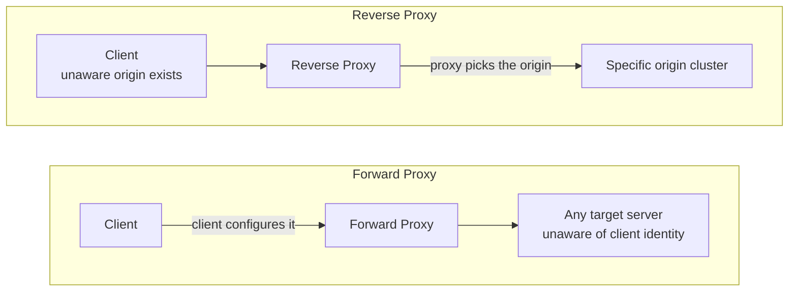
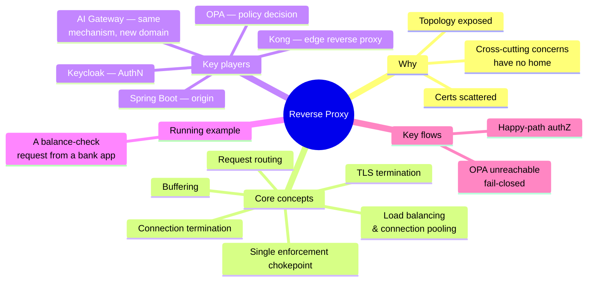
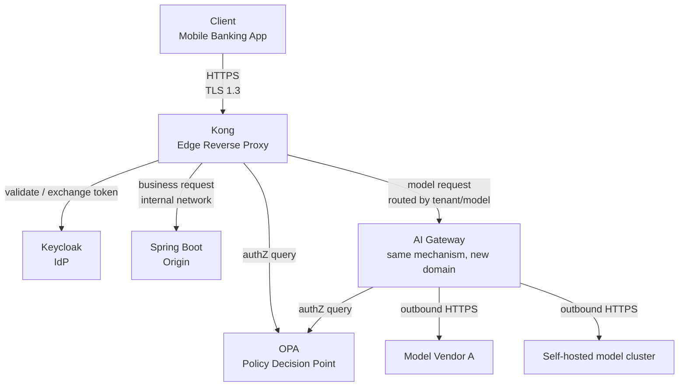
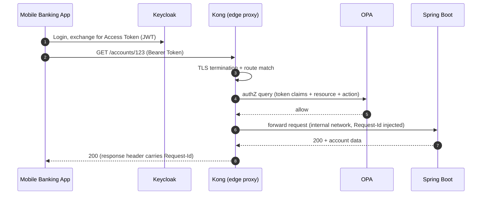
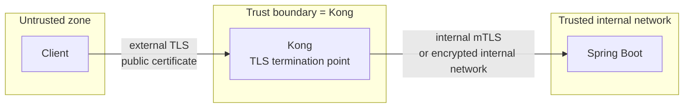
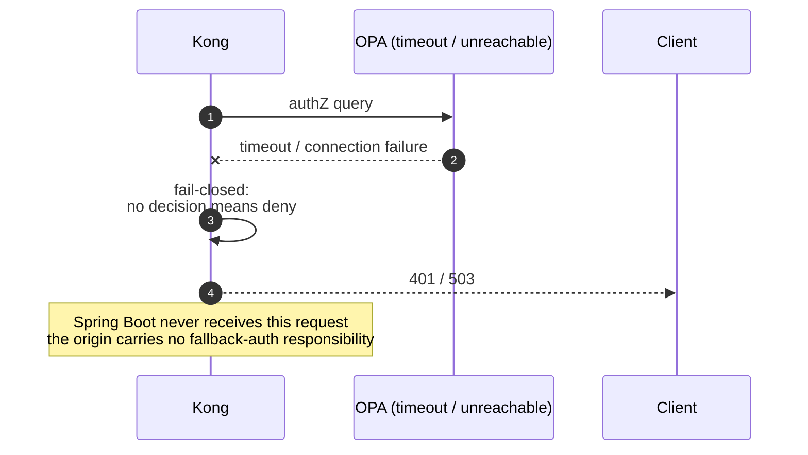
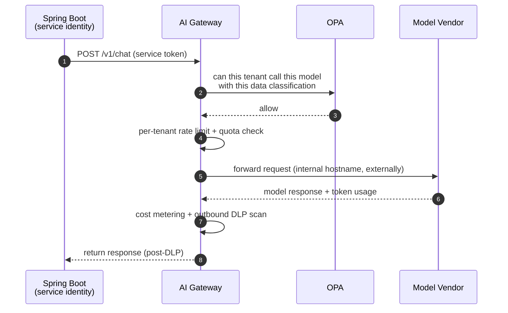

# Reverse Proxy: First Principles, from the Bank Edge to the AI Gateway

> A reverse proxy is often shorthand for "a load balancer" or "an Nginx config file." Both readings are too narrow. Its real identity is simpler and more powerful: **it is the only server the client ever sees.** Once you accept that definition, TLS termination, routing, rate limiting, audit logging, and even forwarding LLM (Large Language Model) requests to different model vendors all turn out to be facets of the same mechanism. This article works outward from that mechanism, anchored to a concrete banking edge chain — Keycloak → Kong → OPA → Spring Boot — and then extends the same pattern into an AI gateway and a banking-compliance lens.

## Abbreviation Glossary

| Abbreviation | Full Name |
|---|---|
| TLS | Transport Layer Security |
| mTLS | Mutual TLS |
| JWT | JSON Web Token |
| IdP | Identity Provider |
| OPA | Open Policy Agent |
| PDP | Policy Decision Point |
| PEP | Policy Enforcement Point |
| LLM | Large Language Model |
| API | Application Programming Interface |
| DLP | Data Loss Prevention |
| PII | Personally Identifiable Information |
| gRPC | gRPC Remote Procedure Call |
| SSE | Server-Sent Events |
| QPS | Queries Per Second |
| SNI | Server Name Indication |
| O11y | Observability |

---

## 1. Why a Reverse Proxy Exists

Picture a bank's system without one: every microservice — account lookup, transfers, fraud scoring — sits directly on a publicly reachable address. Four problems follow immediately:

1. **TLS certificates are scattered.** Who renews them? Who enforces a consistent cipher policy? A service quietly running TLS 1.0 stays invisible until an audit finally trips over it.
2. **Clients must know the topology.** Canary releases, blue/green cuts, scale-out — any time a backend instance's address changes, clients either need reconfiguring or have to lean on brittle DNS round robin.
3. **Cross-cutting concerns have nowhere to live.** Rate limiting, access logging, request authorization, audit trails — none of these belong to any single business service, yet every service needs them. Either each service reimplements its own version (inconsistent, unauditable), or nobody implements it at all.
4. **The attack surface equals the service count.** Every directly exposed service is an independent entry point; a security team has to watch N doors instead of one.

Earlier fixes — DNS round robin for load spreading, client-side SDKs with built-in retry and service discovery — chipped away at parts of this, but missed the core requirement: **a single, trusted place to enforce policy.** DNS round robin performs no health checks; logic baked into a client SDK can't be centrally audited or hot-patched by a security team.

The reverse proxy's answer is direct: **take "which server the client sees" away from every business service and concentrate it in one layer.** That layer becomes the natural place to enforce every cross-cutting concern, because all traffic physically passes through it. This is exactly why banking-compliance scenarios care so much about reverse proxies: audit, admission control, and egress governance all need a mandatory checkpoint, and the reverse proxy *is* that checkpoint.

Today the same pressure reappears in a new shape: business systems now call multiple LLM providers, each with its own hostname, auth scheme, and rate limits — a rerun of the exact problem microservices had with TLS a decade ago, just one layer up the stack.

---

## 2. What a Reverse Proxy Is

**One-sentence definition:** a reverse proxy is a server that terminates client connections and receives requests on behalf of a group of origin servers, forwarding each request to the appropriate origin, so that the client always talks only to the proxy and never needs to know — or care — what the real origin topology looks like.

### Contrast with a Forward Proxy

A forward proxy speaks on behalf of the **client** (the client deliberately configures it; the server sees only the proxy's IP). A reverse proxy speaks on behalf of the **server** (the client has no idea a proxy exists at all — it thinks it's talking directly to "the website"). The direction is inverted, which is where the name comes from. A fuller comparison lives in [Forward and Reverse Proxy](../../devops/networking/forward_reverse_proxy.md).

*This diagram answers: which side configures the relationship, and which party is invisible to whom.*

### Boundaries: What a Reverse Proxy Is Not

- **It is not a synonym for a load balancer**, even though nearly every production-grade reverse proxy ships with load-balancing built in. Load balancing is one implementation of the proxy's "forward to the right origin" responsibility, not the definition itself.
- **It does not make authentication decisions on its own**, even though it's often the first hop in an auth flow. Issuing identity tokens belongs to the IdP (Identity Provider, e.g. Keycloak); the proxy at most passes the token through or validates its signature.
- **It is not a place for business logic.** The moment a business rule sneaks into the reverse proxy layer (say, "route VIP account types differently"), the proxy is quietly becoming a hidden, hard-to-test business service — a smell worth catching early.

### Where It Sits

A reverse proxy sits below the cloud load balancer (which supplies a public IP and cross-AZ distribution) and above the origin services. One more semantic layer can stack on top — "API gateway" or "AI gateway" — routing to different API versions or different model vendors, metering per tenant. Mechanically, though, both an API gateway and an AI gateway are domain specializations of this same reverse-proxy role. That claim is the spine of this article, and Section 5 develops it in full.

---

## 3. The Whole Territory: Concepts and Key Players

Before descending into any single component, lay out the entire map.

*This diagram answers: what does the whole territory look like, before we walk into any one corner of it.*

### 3.1 Mapping the Problem onto Concepts

| Real-world problem | Reverse-proxy concept | Why this abstraction |
|---|---|---|
| Client-side TCP connections have a different lifecycle than what the origin needs | **Connection termination** | Decouples the two connection lifecycles so the proxy can retry and fan out without the client noticing |
| A request has to reach the *right* backend | **Request routing** (path / host / header-based) | Expresses "who owns this class of request" declaratively instead of hard-coding addresses on the client |
| Certificate management and cipher policy scattered across services | **TLS termination** | Centralizes the trust decision in one place; the client-facing protocol can differ from the upstream protocol |
| A single origin instance can't absorb all the traffic | **Load balancing & connection pooling** | Reuses long-lived connections to the origin and distributes requests by policy, avoiding a fresh handshake per request |
| A slow origin shouldn't stall the client, and vice versa | **Buffering** | Decouples read/write rates on either side of the proxy, except where streaming demands it be turned off |
| No single place sees all the traffic | **Single enforcement chokepoint** | Audit, rate limiting, and authorization only need to be implemented correctly once |

### 3.2 Key Players: Owns / Knows / Does Not Do

Using the banking edge chain **Keycloak → Kong → OPA → Spring Boot** as the reference:

| Component | Owns | Knows | Does not do |
|---|---|---|---|
| **Keycloak** (IdP) | Issuing and validating identity tokens (JWT) | User credentials, identity attributes, session state | No request routing, no authorization decisions, no forwarding of business traffic |
| **Kong** (edge reverse proxy, PEP) | Terminating client connections, TLS termination, routing, rate limiting, packaging token + request context for OPA | Route table, upstream service registry, plugin config | Doesn't issue identity tokens, doesn't make policy decisions (only enforces OPA's), carries no business logic |
| **OPA** (Policy Decision Point) | Deciding whether a given request is permitted, based on policy (Rego) | The policy rules themselves; the input needed for one decision (token claims + request context) | Doesn't terminate connections, doesn't forward requests, doesn't authenticate users |
| **Spring Boot** (origin) | Implementing business logic, operating on domain data | The domain model and its data | Doesn't terminate TLS, and typically doesn't re-run authorization already decided at the edge — it trusts requests that passed through Kong and OPA |
| **AI Gateway** (same mechanism, new domain) | Routing to specific model vendors, per-tenant rate limiting and metering, inspecting request/response content | Tenant quotas, model routing table, usage metering | Doesn't perform model inference itself, doesn't replace OPA's tenant-level authorization — it calls OPA for the decision |

### 3.3 Coordination at a Glance

*This diagram answers: once a request arrives, who calls whom, and on which hop the data actually moves.*

Both main paths pass through Kong, and both lean on OPA for the decision — not a coincidence, but the direct payoff of "single enforcement chokepoint": whether the request is a balance check or an LLM call, the authorization decision should be made in the same place, using the same policy language.

---

## 4. A Real Request: The Banking Edge Chain

Scenario: a customer checks an account balance in the mobile banking app. It's simple enough to state in three sentences, yet it touches every component above.

*This diagram answers: how many hops does the request take from client to business data, and in what order.*

Walking through it shallowly: the app first exchanges credentials for a token at **Keycloak** — a separate connection from the business request that follows; Keycloak never learns which account the user is about to query. The app then calls **Kong** with the token attached. Two things happen here that aren't visible from the outside: Kong **terminates the client's TLS connection**, and it **matches a routing rule to decide where `/accounts/123` should go**. Before forwarding, Kong packages the token's claims together with the requested resource and action and asks **OPA**: "can this identity read this account?" OPA answers only yes or no — it has no idea, and no need to know, what happens to the request afterward. Only once OPA allows it does Kong forward the request to **Spring Boot**, which focuses purely on business logic and never re-validates identity — it trusts anything that has already cleared Kong and OPA.

The same mechanism, a different scenario: the app's chat-assistant feature needs to call an LLM to answer a customer question. That call never goes straight to a model vendor — it first reaches Spring Boot, which then calls the internal **AI Gateway** using a service identity. The AI Gateway asks OPA the same kind of question — "can this tenant call this model with this class of data" — and only routes to a specific vendor once that's approved. Section 5.6 unpacks this path at full depth.

---

## 5. Depth Dives

### 5.1 Connection Termination and TLS Termination (Kong)

**Role recap:** Kong is the only server the client ever sees; it's on stage at steps 2–3 of the running example.

**Internal design:** TLS termination means the client's TLS handshake ends at Kong, which decrypts and hands off plaintext HTTP. This matters because it strips "who owns the certificate, who sets the cipher policy, which TLS version is allowed" out of every origin service and centralizes it in one place. The second hop, Kong to Spring Boot, can be plaintext (inside a trusted internal network), TLS re-encryption, or mTLS (mutual TLS, where both sides present certificates — typical across trust domains or in zero-trust networks). SNI (Server Name Indication) lets a single listening port serve different certificates depending on the hostname the client requested — the reason one reverse proxy can host many domains without a dedicated port per domain.

*This diagram answers: where the trust boundary is actually drawn — not "wherever TLS encryption happens," but "wherever Kong sits."*

**⚓ Back to the example:** at step 2–3, the app's HTTPS request is decrypted once Kong completes the TLS handshake; "TLS termination + route match" at step 3 is exactly this mechanism. Only after decrypting can Kong read the Bearer Token in the header and proceed to the authorization query.

**Failure behavior:** an expired certificate or a failed handshake shows up as a connection failure at the TLS layer, and Spring Boot never even learns the attempt happened — precisely the benefit of centralizing TLS termination at the edge: the origin's failure domain simply doesn't include certificate problems.

### 5.2 Request Routing

**Role recap:** routing decides who owns a request — the part of step 3 labeled "route match."

**Internal design:** routing rules typically match, in priority order, on path (`/accounts/*`), host (`api.bank.com` vs `ai-gateway.bank.internal`), or headers (e.g. routing by `X-Tenant-Id` to a tenant-specific backend). Match order matters — a more specific rule must take precedence over a catch-all, or you get the classic failure mode where a newly added route never fires because a broader, older rule intercepts it first.

**⚓ Back to the example:** `/accounts/123` matches the routing rule for the account service's upstream group. Swap the path for `/v1/chat`, and the same routing layer sends the request to the AI Gateway instead of Spring Boot — exactly why Section 3.3's coordination diagram shows both paths sharing one Kong instance.

**Failure behavior:** when nothing matches, the proxy returns a 404 at the edge rather than letting the "not found" surface as if it came from an origin — the client always sees a uniform, proxy-owned error shape, which never reveals whether an origin exists at all.

### 5.3 Load Balancing, Connection Pooling, and Buffering

**Role recap:** distributing requests to healthy origin instances, while keeping the two sides of the proxy from stalling each other.

**Internal design:** Kong typically maintains a **connection pool** to Spring Boot, reusing keep-alive connections instead of a fresh three-way handshake per request — a meaningful latency difference at high QPS. A load-balancing algorithm (round robin, least connections, etc.) decides which healthy instance gets the next request; health checks (usually passive, based on observed failure rate) pull unhealthy instances out of rotation. **Sticky sessions** (always routing the same client to the same origin instance) should be avoided in a stateless design — the banking edge chain pushes session state into the JWT itself, so any Spring Boot instance can handle any request, which is exactly what makes horizontal scaling and rolling deploys painless. **Buffering** decouples the read/write rates on either side of the proxy — a slow origin response shouldn't tie up the client's TCP buffer — but streaming use cases (SSE, WebSocket, gRPC streaming) need buffering explicitly turned off on that route, or the proxy will wait to accumulate a batch before forwarding, killing real-time behavior.

**⚓ Back to the example:** at step 6, Kong's forward to Spring Boot reuses an already-established keep-alive connection from the pool rather than a fresh handshake. If the balance-check endpoint were later reworked to push live balance updates via SSE, that specific route would need buffering disabled explicitly.

**Failure behavior:** if a Spring Boot instance goes down, passive health checking removes it from rotation after a threshold of failures — but any in-flight requests during that window fail. That's the cost of passive health checking: the first few failures are always paid by a real user.

### 5.4 Policy Decisions and Externalized Authorization (OPA)

**Role recap:** OPA is called at steps 4–5 of the running example — the only place the allow/deny call actually gets made.

**Internal design:** OPA separates the Policy Enforcement Point (PEP — Kong here) from the Policy Decision Point (PDP — OPA itself). Kong gathers the inputs a decision needs (token claims, requested resource, action) and enforces the outcome, but owns none of the business rules. Rules live entirely in Rego (OPA's policy language), maintained and released independently of the gateway config. The payoff: a security team can centrally audit and version policy without it being entangled with gateway configuration.

**⚓ Back to the example:** at step 4, Kong bundles the JWT claims (user ID, role) with the requested path `/accounts/123` and method `GET` into an input document and sends it to OPA; at step 5, OPA returns only `allow` or `deny` — it never learns what happens to the request afterward.

**Failure behavior — the mandatory edge flow to draw out loud:** this is the piece most often overlooked in banking-compliance discussions, and the one most likely to be gotten wrong: **what happens when OPA is unreachable.**

*This diagram answers: when the policy decision point is unavailable, does the system default to open or to closed.*

**Fail-closed** (no decision means deny) is the only defensible default in a banking-compliance context — **fail-open** (no decision means allow) turns a transient network blip on OPA into an unauthorized access event that no audit trail can explain away. This is also why OPA is typically deployed as a sidecar alongside Kong, on the same node and network domain — minimizing how often "OPA is unreachable" can even occur in the first place.

### 5.5 Observability: The Single Point for Audit and Tracing

**Role recap:** because all traffic physically passes through Kong, it is the natural place to inject a correlation ID, write access logs, and stitch together distributed tracing — this role isn't tied to any single step of the running example; it runs through all of them.

**Internal design:** Kong generates (or passes through, if the client already sent a W3C Trace Context `traceparent` header) a Request-Id the moment a request arrives, injects it into the calls it makes to OPA and Spring Boot, and echoes it back in the response headers. Access logs — who, when, what resource, what OPA decided, how long each hop took — are formatted uniformly at the edge and shipped to the O11y (observability) stack for centralized storage and search. In a banking-compliance context, this log stream *is* audit evidence: it has to be tamper-evident, retained for the period regulation demands, and able to reconstruct a customer complaint from the edge log, the OPA decision log, and Spring Boot's processing time, end to end.

**⚓ Back to the example:** step 6's "Request-Id injected" is this exact mechanism — if Spring Boot's business logs print the same Request-Id, an operator can stitch a single customer complaint together from the edge log, the OPA decision log, and the business log into one coherent request lifecycle.

### 5.6 From Edge Gateway to AI Gateway: the Same Mechanism, a New Domain

**Role recap:** this is the article's differentiator. The AI Gateway isn't a new architecture — it's the exact same set of things Kong already does (connection termination, routing, rate limiting, audit) reapplied to "route to an LLM vendor" instead of "route to a microservice."

**Internal design:** taking Section 3.1's concept-mapping table and substituting the concrete technology choices yields the AI Gateway's core mechanism:

- **Request routing** goes from "path-based routing to a microservice" to "route by model name, tenant, or a request header carrying a model version, to a specific model vendor or a self-hosted model cluster."
- **Load balancing** goes from "multiple Spring Boot instances" to "multiple model vendors or multiple regional model deployments," and doubles as failover — if one vendor is rate-limiting or unavailable, traffic shifts to a fallback vendor.
- **Rate limiting** narrows from "requests per IP or API key" to "token-consumption rate per tenant" — because an LLM call's cost unit is the token, not the request, and a single request's cost can vary by a hundred-fold depending on prompt and response length.
- **Audit logging** expands from "who hit which endpoint" to "who consumed how many tokens, at what cost, against which model version" — the foundation of token/cost metering.
- **TLS termination and egress control** goes from "shielding the origin from direct exposure" to "shielding the model vendor's real endpoint from being hard-coded into business code." A business service only ever needs a stable internal hostname (e.g. `ai-gateway.bank.internal`); switching vendors or regions never requires a code change downstream.

*This diagram answers: for one LLM call, exactly what does the reverse-proxy mechanism do between the business code and the model vendor.*

**⚓ Back to the example:** the chat-assistant scenario mentioned at the end of Section 4 is this diagram made concrete — Spring Boot never holds any model vendor's API key; it only knows the AI Gateway's address. The authorization decision still reuses the same OPA from Section 5.4, except this time the policy input carries an extra field, a data-classification label, deciding whether this batch of data is allowed to leave the internal network boundary at all.

**The banking-compliance lens — three things only this layer can enforce, not something you can count on business code to self-regulate:**

1. **Least-privilege egress.** At the network layer, only the AI Gateway holds an egress rule to model vendors; Spring Boot's subnet has no route to any public model endpoint. Even a compromised business service can't bypass the gateway and exfiltrate data directly to an external model API.
2. **The one place DLP inspection can actually happen.** The AI Gateway is the only component that sees both the request (which may carry sensitive customer information) and the response (a model can "echo" training data or infer PII it was never explicitly given). Redaction, masking, and content review belong here as a plugin, not reimplemented piecemeal inside every service that happens to call an LLM.
3. **Allow-listing and model-version pinning.** Banking compliance typically requires that production only call model versions that have gone through evaluation. Mechanically, that's just an allow-listed routing table — a model identifier not on the list is rejected before the request ever reaches a vendor.

### 5.7 Security Trade-offs: the Proxy as MITM, the Trust Boundary, Certificate Pinning

A reverse proxy is, cryptographically, a sanctioned man-in-the-middle (MITM): it decrypts the client's TLS traffic, inspects the plaintext, and re-originates it on another connection. That's not a flaw — it's the entire point: audit, DLP, and routing decisions all require visibility into plaintext content. But it also means **the trust boundary is drawn at the machine running Kong, not at the abstract concept of "TLS encryption."** Whoever controls Kong's configuration and runtime environment can, in principle, see all traffic in the clear — which is exactly why the host Kong runs on, its deployment pipeline, and its configuration-change approvals deserve to be treated as sensitive assets on par with, or above, the origin services themselves.

**Certificate pinning is in inherent tension with a reverse proxy.** Mobile apps pin the server's certificate into client code to defend against man-in-the-middle attacks — but if an enterprise network also runs a separate TLS-inspecting transparent proxy at its egress, pinning will reject that legitimate inspection proxy along with any real attacker. A banking app should pin **its own edge reverse proxy's certificate (Kong's)**, not the origin's — the client was never aware the origin existed in the first place. Whether the hop from Kong to a model vendor should also pin the vendor's certificate depends on how sensitive that egress connection is and how often the vendor rotates certificates; it's a trade-off that platform and security teams need to negotiate explicitly, not a toggle that defaults on or off.

---

## 6. Full Walkthrough, End to End

Stitch the mechanisms from the sections above back into one continuous story, in two parts: first the account balance check, then the chat-assistant call layered on top — showing how the same set of mechanisms gets reused rather than reinvented.

**Part one — the balance check (Section 4's running example, now with internals filled in):**

1. The app exchanges a username and password with Keycloak for a JWT, whose claims carry the user ID and role.
2. The app sends `GET https://api.bank.com/accounts/123` with `Authorization: Bearer <JWT>`.
3. The request reaches Kong. Kong completes the TLS handshake (selecting the certificate for `api.bank.com` via SNI), decrypts to plaintext, and its routing rule matches `/accounts/*` to the account service's upstream group.
4. Kong generates a Request-Id (or reuses an incoming `traceparent` if present), bundles the JWT claims with the requested resource and action into an input document, and calls OPA.
5. OPA loads the relevant Rego policy, decides whether this role may `GET` this account ID, and returns `allow`.
6. Kong forwards the request over a pooled keep-alive connection to a healthy Spring Boot instance, carrying the Request-Id but no authorization data for Spring Boot to re-check — it trusts the decision OPA already made.
7. Spring Boot queries domain data and responds; Kong returns the response to the app along with the Request-Id; the access log — including OPA's decision and per-hop latency — is shipped to the O11y stack.

**Part two — the same customer triggers the chat assistant, reusing the exact same mechanism:**

8. Spring Boot, acting under a service identity rather than the user's identity, issues `POST /v1/chat` to the AI Gateway, with the customer's question as the payload.
9. The AI Gateway calls the same OPA instance (or another policy set in the same language) — this time the input document carries a "data classification: customer-sensitive" label alongside the service identity, and OPA decides whether this tenant, with this data classification, may call the specified model vendor.
10. Once approved, the AI Gateway checks the tenant's current token quota and rate; under the limit, the call proceeds.
11. The AI Gateway forwards the request to the model vendor — business code and the vendor are always separated by this one stable internal hostname.
12. The model responds; the AI Gateway records the token usage for billing and runs an outbound DLP scan on the response content (checking, say, whether the model accidentally echoed a customer's national ID number).
13. The redacted response travels back to Spring Boot and finally to the customer.

Both parts share the same Kong instance, the same OPA policy decision point, and the same access-log and tracing infrastructure — which is exactly the claim this article opened with: **a reverse proxy isn't a synonym for a load balancer; it's the set of mechanisms behind "the only server the client ever sees," and that set of mechanisms doesn't care whether what's behind it is an account balance or a model inference call.**

---

## 7. See Also

- [Nginx as a Reverse Proxy](../../devops/networking/nginx-as-a-reverse-proxy.en.md) — one concrete implementation of this role, focused on operational detail
- [Forward and Reverse Proxy](../../devops/networking/forward_reverse_proxy.md) — a fuller forward/reverse comparison
- [PKI for User and Device Authentication](../auth/pki-for-user-and-device-authentication.en.md) — first principles of the TLS trust chain and certificate management
