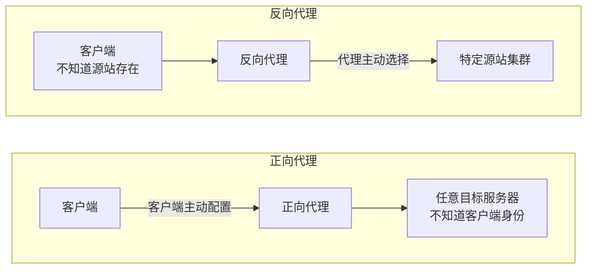
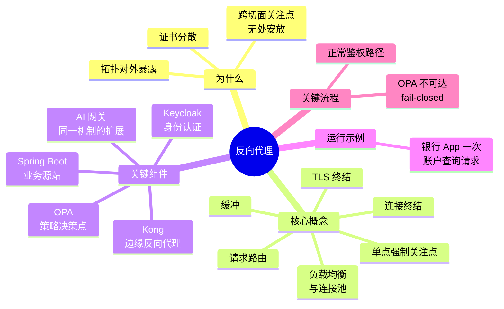
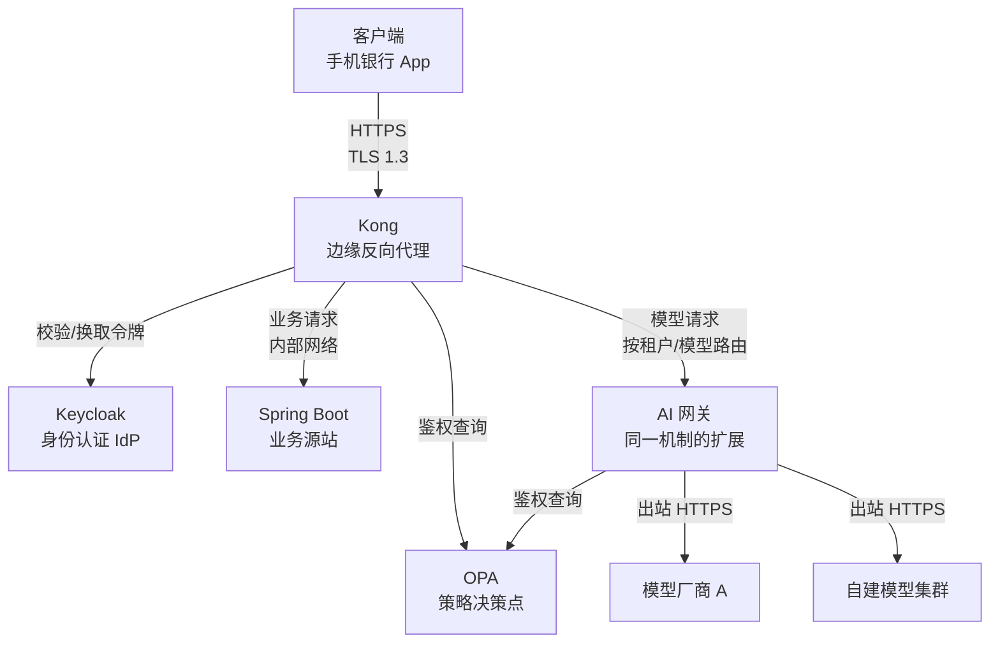
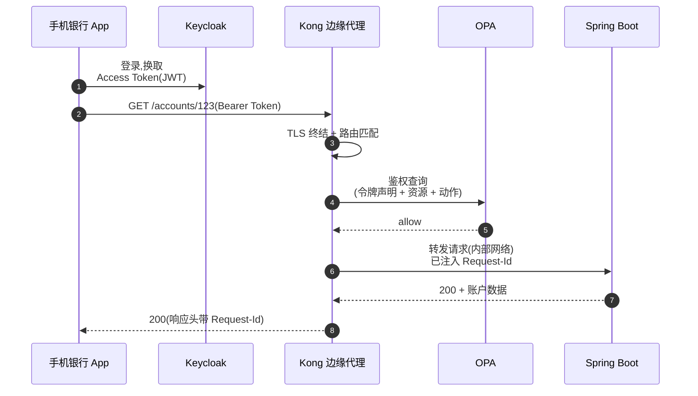
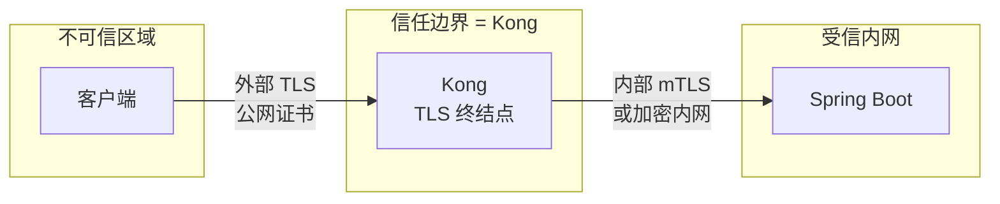
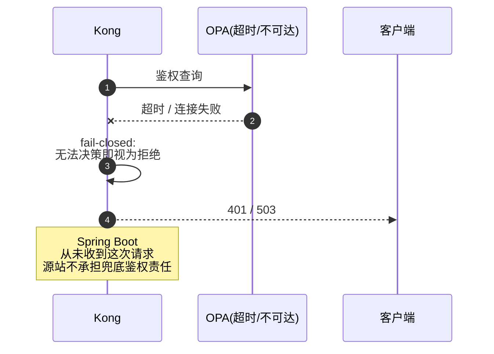
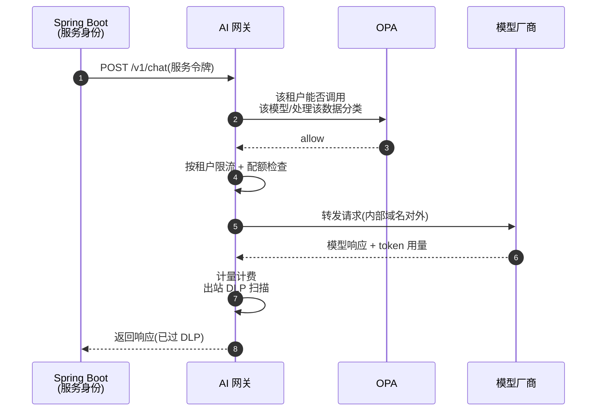

# 反向代理：从银行边缘网关到 AI 网关的第一性原理

> 反向代理常被当作"负载均衡器的别名"或"Nginx 配置文件"来理解，这两种理解都太窄。它真正的身份是：**客户端唯一能看到的服务器**。一旦接受这个定义，TLS 终结、路由、限流、审计、乃至把 LLM（Large Language Model，大语言模型）请求转发给不同模型厂商，全都变成了同一个机制的不同侧面。本文从这个机制出发，串起银行边缘链路 Keycloak → Kong → OPA → Spring Boot 这个具体例子，再延伸到 AI 网关和银行合规场景。

## 缩写对照表

| 缩写 | 英文全称 | 中文 |
|---|---|---|
| TLS | Transport Layer Security | 传输层安全协议 |
| mTLS | Mutual TLS | 双向 TLS 认证 |
| JWT | JSON Web Token | JSON 格式的令牌 |
| IdP | Identity Provider | 身份提供方 |
| OPA | Open Policy Agent | 开放策略代理 |
| PDP | Policy Decision Point | 策略决策点 |
| PEP | Policy Enforcement Point | 策略执行点 |
| LLM | Large Language Model | 大语言模型 |
| API | Application Programming Interface | 应用程序编程接口 |
| DLP | Data Loss Prevention | 数据防泄漏 |
| PII | Personally Identifiable Information | 个人身份信息 |
| gRPC | gRPC Remote Procedure Call | 一种高性能 RPC 框架 |
| SSE | Server-Sent Events | 服务器推送事件 |
| QPS | Queries Per Second | 每秒查询数 |
| SNI | Server Name Indication | 服务器名称指示 |
| O11y | Observability | 可观测性 |

---

## 一、为什么需要反向代理

设想一个没有反向代理的银行系统：每个业务微服务——账户查询、转账、风控——都直接绑定在公网可达的地址上。这立刻带来四个无法回避的问题：

1. **TLS 证书分散在每个服务里。** 谁负责续期？谁保证加密套件策略一致？一个服务用了过期的 TLS 1.0 而没人发现，审计时才第一次暴露。
2. **客户端必须知道拓扑。** 灰度发布、蓝绿切换、扩缩容——只要后端实例的地址会变，客户端配置就要跟着变，或者依赖脆弱的 DNS 轮询。
3. **跨切面关注点无处安放。** 限流、访问日志、请求鉴权、审计留痕——这些不属于任何一个业务服务，但每个服务都需要。要么每个服务重复实现一遍（不一致、难审计），要么干脆没人做。
4. **攻击面等于服务数量。** 每个直接暴露的服务都是一个独立的攻击入口，安全团队要盯的不是一个点，而是 N 个点。

早期的应对方式——DNS 轮询做负载均衡、客户端 SDK 里内置重试和服务发现——解决了部分问题，但没有解决核心的一点：**没有一个单一的、可信的位置来强制执行策略**。DNS 轮询不做健康检查，客户端 SDK 里的逻辑无法被安全团队集中审计和更新。

反向代理的答案很直接：**把"谁是客户端能看到的那台服务器"这件事,从每个业务服务里拿走，集中到一层**。这一层天然成为强制执行一切跨切面关注点的位置——因为所有流量物理上都要经过它。这正是银行合规场景格外看重反向代理的原因：审计、准入控制、出站流量管控，都需要一个"必经之路"，反向代理就是这条必经之路。

而今天,同一个压力又以新的形式出现:业务系统开始调用多个 LLM 服务商的 API,每个服务商有自己的域名、认证方式、限流策略——这和十年前"每个微服务自己管TLS"是同一个问题的重演。

---

## 二、什么是反向代理

**一句话定义:** 反向代理是一台服务器,它代表一组源站(origin server)终结客户端连接、接收请求,并将请求转发给合适的源站,使客户端始终只与代理本身通信,而不知道也不需要知道源站的真实拓扑。

### 与正向代理的对比

正向代理代表**客户端**说话(客户端主动配置代理,服务器看到的是代理的 IP);反向代理代表**服务端**说话(客户端根本不知道背后有代理,以为自己直接在和"网站"通信)。两者的方向是反的,这也是"反向"二字的来源。更完整的对比参见 [正向代理与反向代理](../../devops/networking/forward_reverse_proxy.md)。

*这张图回答:配置发生在哪一侧,谁对谁"隐身"。*

### 边界:反向代理不是什么

- **它不等于负载均衡器**,虽然几乎所有生产级反向代理都内置负载均衡能力。负载均衡是反向代理"转发给合适源站"这一职责的一种实现方式,而不是反向代理的定义本身。
- **它本身不做身份认证决策**,虽然它常常是鉴权流程的第一个入口。认证令牌的签发是 IdP(Identity Provider,身份提供方,如 Keycloak)的职责;反向代理最多是把令牌透传或校验签名。
- **它不是业务逻辑的容身之处。** 一旦反向代理里出现业务规则(比如"如果账户类型是 VIP 就走不同的处理"),它就在悄悄变成一个隐藏的、难以测试的业务服务,这是需要警惕的坏味道。

### 生态位置

反向代理位于云负载均衡器(提供公网 IP 和跨可用区分发)之下、源站服务之上。在这一层之上,还可以叠加一层"API 网关"或"AI 网关"的语义(路由到不同 API 版本、不同模型厂商、按租户计量)——但机制上,API 网关和 AI 网关都是反向代理这同一个角色的领域特化,这一点是本文的核心论点,第五节会展开。

---

## 三、核心概念与关键组件全景

在深入任何一个组件之前,先把整张地图铺开。

*这张图回答:整个领域有哪些概念和组件,读者需要在下潜之前先记住这张全景图。*

### 3.1 问题到概念的映射

| 现实世界的问题 | 反向代理概念 | 为什么用这个抽象 |
|---|---|---|
| 客户端建立的 TCP 连接和源站需要的连接生命周期不一样 | **连接终结**(connection termination) | 把两条连接的生命周期解耦,代理可以重试、扇出而客户端无感知 |
| 请求要到达"正确的"那个后端 | **请求路由**(path / host / header-based routing) | 用声明式规则表达"这类请求归谁管",而不是让客户端硬编码地址 |
| 证书管理、加密套件策略分散在各服务 | **TLS 终结**(TLS termination) | 把信任决策集中到一处,客户端与代理之间的协议可以和代理与源站之间的协议不同 |
| 单个源站实例扛不住全部流量 | **负载均衡与连接池**(load balancing & connection pooling) | 复用到源站的长连接,按策略分发请求,避免每次请求都重新握手 |
| 源站响应慢,客户端连接不能被占住;反之亦然 | **缓冲**(buffering) | 代理两侧的读写速率解耦,除非是流式场景需要显式关闭缓冲 |
| 没有一个位置能统一看到全部流量 | **单点强制关注点**(chokepoint for cross-cutting concerns) | 审计、限流、鉴权只需要在一处正确实现一次 |

### 3.2 关键组件:owns / knows / does not do

以银行边缘链路 **Keycloak → Kong → OPA → Spring Boot** 为例:

| 组件 | 拥有的职责(owns) | 掌握的信息(knows) | 刻意不做的事(does not do) |
|---|---|---|---|
| **Keycloak**(IdP) | 签发与校验身份令牌(JWT) | 用户凭证、身份属性、会话状态 | 不做请求路由,不做业务鉴权决策,不转发业务流量 |
| **Kong**(边缘反向代理,PEP) | 终结客户端连接、TLS 终结、路由、限流、把令牌和请求上下文转交给 OPA | 路由表、上游服务清单、插件配置 | 不签发身份令牌,不做策略决策(只执行 OPA 给出的决定),不含业务逻辑 |
| **OPA**(策略决策点,PDP) | 基于策略(Rego)对"这个请求是否被允许"做出决定 | 策略规则本身;单次决策所需的输入(令牌声明 + 请求上下文) | 不终结连接,不转发请求,不认证用户身份 |
| **Spring Boot**(业务源站) | 实现业务逻辑,操作领域数据 | 领域模型与数据 | 不做 TLS 终结,通常也不重复做边缘层已经做过的鉴权决策——它信任经过 Kong 和 OPA 的请求 |
| **AI 网关**(同一机制的领域扩展) | 路由到具体模型厂商、按租户限流与计量、请求/响应内容检查 | 租户配额、模型路由表、计量数据 | 不做模型推理本身,不替代 OPA 做租户级授权决策——它调用 OPA 获得决策 |

### 3.3 协调关系总览

*这张图回答:请求进来之后,各个组件之间谁调用谁,数据在哪一跳流动。*

两条主干路径都经过 Kong,也都依赖 OPA 做决策——这不是巧合,而是"单点强制关注点"这条设计原则的直接体现:无论是查账户余额还是调用一个 LLM,授权决策都应该在同一个地方、用同一套策略语言做出。

---

## 四、一次真实请求:银行边缘链路

场景:一位客户在手机银行 App 里查询账户余额。这个场景足够简单,但会依次触达上面提到的每一个组件。

*这张图回答:一次请求从客户端到业务数据,经过了哪几跳,顺序如何。*

浅浅走一遍:App 先向 **Keycloak** 换取令牌——这一步和后续的业务请求是分开的连接,Keycloak 全程不知道用户接下来会查询哪个账户。App 拿着令牌请求 **Kong**,Kong 在这里做了两件第一眼看不见的事:**终结了客户端的 TLS 连接**,并且**用路由规则判断这个 `/accounts/123` 该转发到哪个上游**。在真正转发之前,Kong 把令牌里的声明和请求的资源、动作打包,问 **OPA**:"这个人能不能查这个账户?"OPA 只回答是或否,不知道也不关心请求最终怎么被处理。拿到允许后,Kong 才把请求转发给 **Spring Boot**,后者只管业务逻辑,完全不重新校验身份——它信任经过 Kong 和 OPA 的请求。

同样的机制,换一个场景:App 里的智能客服功能需要调用一个 LLM 来回答用户问题。这个请求不会直接打到模型厂商——它会先到 Spring Boot,再由 Spring Boot 用服务身份调用内部的 **AI 网关**,AI 网关同样会问 OPA"这个租户能不能调用这个模型、处理这类数据",通过之后才路由到具体的模型厂商。第五节 5.6 会把这条路径完整展开。

---

## 五、逐组件深潜

### 5.1 连接终结与 TLS 终结(Kong)

**职责回顾:** Kong 是客户端唯一能看到的服务器,在运行示例的第 2-3 步登场。

**内部设计:** TLS 终结意味着客户端的 TLS 握手在 Kong 这里结束,Kong 解密后得到明文 HTTP 请求。这一步之所以关键,是因为它把"谁负责证书、谁决定加密套件、谁支持哪个 TLS 版本"这件事从每个源站里抽走,集中到一处管理。Kong 到 Spring Boot 之间的第二跳连接,可以选择明文(在受信任的内网里)、TLS 重新加密,或者 mTLS(双向证书校验,通常用于跨信任域或零信任网络)。SNI(Server Name Indication)用于在同一个监听端口上,根据客户端请求的域名选择不同的证书——这是反向代理能同时服务多个域名而不需要每个域名独立监听端口的原因。

*这张图回答:信任边界实际画在哪里——不是"TLS 加密的地方",而是"Kong 所在的地方"。*

**⚓ 回到运行示例:** 第 2 步,App 发出的 HTTPS 请求在 Kong 完成 TLS 握手后解密;第 3 步的"TLS 终结 + 路由匹配"就是这里描述的机制。Kong 拿到明文请求后才能读取 Header 里的 Bearer Token,继续走后续的鉴权查询。

**失败行为:** 证书过期或握手失败,客户端在 TLS 层就会看到连接失败,Spring Boot 完全不会感知到这次尝试——这正是把 TLS 终结集中到边缘的好处:源站的故障域里根本不包含证书问题。

### 5.2 请求路由

**职责回顾:** 路由决定"这个请求归谁管",对应运行示例第 3 步里"路由匹配"的部分。

**内部设计:** 路由规则通常按优先级匹配路径(`/accounts/*`)、主机名(`api.bank.com` vs `ai-gateway.bank.internal`)、或请求头(比如按 `X-Tenant-Id` 路由到不同租户的后端)。规则的匹配顺序很重要——最具体的规则应该优先于兜底规则,否则会出现"新加的路由规则永远匹配不到,因为被一条更宽泛的旧规则先截胡"这种典型故障。

**⚓ 回到运行示例:** `/accounts/123` 被路由规则匹配到账户服务的上游分组;如果换成 `/v1/chat` 这样的路径,同一个路由层会把请求导向 AI 网关而不是 Spring Boot——这就是 3.3 节协调图里两条路径共享同一个 Kong 实例的原因。

**失败行为:** 没有规则匹配时,代理在边缘直接返回 404,不会把这种"路由未找到"的错误暴露成源站的错误——客户端看到的永远是代理层的统一错误格式,不会泄露源站到底存不存在。

### 5.3 负载均衡、连接池与缓冲

**职责回顾:** 保证请求被分发到健康的源站实例,同时不让代理两侧的连接互相拖累。

**内部设计:** Kong 到 Spring Boot 之间通常维护一个**连接池**,复用 keep-alive 连接而不是每个请求都重新三次握手——这对延迟的影响在高 QPS 场景下非常显著。负载均衡策略(轮询、最少连接数等)决定新请求分给哪个健康实例;健康检查(通常是被动的,依赖请求失败率)负责把故障实例摘出轮转。**粘性会话**(sticky session,同一个客户端的请求始终发给同一个源站实例)在无状态设计里应当避免——银行边缘链路把会话状态放进 JWT 本身,Spring Boot 的任意实例都能独立处理请求,这正是水平扩展和滚动发布能够顺利进行的前提。**缓冲**的作用是让代理两侧的读写速率解耦:源站响应慢,不代表客户端的 TCP 缓冲区要被占住;但对流式场景(SSE、WebSocket、gRPC streaming)要显式关闭缓冲,否则代理会等攒够一批数据才转发,实时性就没了。

**⚓ 回到运行示例:** 第 6 步 Kong 转发给 Spring Boot 时,用的是连接池里已经建立好的 keep-alive 连接,而不是新握手;如果查询接口未来改造成 SSE 推送实时余额变动,这条转发路径必须单独配置为关闭缓冲。

**失败行为:** 某个 Spring Boot 实例宕机,被动健康检查会在若干次失败后把它从轮转里摘除,期间这个实例上"在途"的请求会失败——这是被动健康检查的代价:头几次失败总是由真实用户来承担的。

### 5.4 策略决策与鉴权外置(OPA)

**职责回顾:** OPA 在运行示例第 4-5 步被调用,是唯一做"允许还是拒绝"这个判断的地方。

**内部设计:** OPA 把"策略执行点"(PEP,这里是 Kong)和"策略决策点"(PDP,OPA 自己)分开——Kong 负责收集决策所需的输入(令牌声明、请求的资源、动作)并强制执行决策结果,但不掌握任何一条业务规则;规则全部写在 Rego(OPA 的策略语言)里,由 OPA 独立维护、独立发布。这样做的好处是策略可以被安全团队集中审计和版本管理,而不必和网关配置耦合在一起。

**⚓ 回到运行示例:** 第 4 步,Kong 把 JWT 里的声明(用户 ID、角色)、请求路径 `/accounts/123`、方法 `GET` 一起打包成一个输入文档发给 OPA;第 5 步 OPA 只返回 `allow` 或 `deny`,不知道请求接下来会被如何处理。

**失败行为(必须画出来的边缘流程):** 这是银行合规场景里最容易被忽视、也最容易出错的一点——**OPA 不可达时该怎么办**。

*这张图回答:策略决策点不可用时,系统是该"默认放行"还是"默认拒绝"。*

**fail-closed**(决策不可得就拒绝)是银行合规场景下唯一站得住脚的默认值——**fail-open**(决策不可得就放行)意味着 OPA 的一次网络抖动会变成一次未授权访问,这在审计上是无法解释的。这也是为什么 OPA 通常以边车(sidecar)形式和 Kong 部署在同一节点、同一网络域内,把"OPA 不可达"这种情况本身的发生概率降到最低。

### 5.5 可观测性:作为审计与追踪的单点

**职责回顾:** 因为全部流量都物理经过 Kong,它是注入关联 ID、记录访问日志、串联分布式追踪的天然位置——这个职责不专属于运行示例的某一步,而是贯穿始终。

**内部设计:** Kong 在收到请求的第一时间生成或透传一个 Request-Id(如果客户端已经带了追踪头,遵循 W3C Trace Context 规范的 `traceparent`,就沿用而不是覆盖),把它注入到转发给 OPA 和 Spring Boot 的请求里,也写回响应头返回给客户端。访问日志(谁、什么时候、请求了什么资源、OPA 给出了什么决策、耗时多少)在边缘统一格式化,推送到 O11y(可观测性)技术栈做集中存储和检索。对银行合规而言,这份访问日志本身就是审计证据的一部分——它必须是不可篡改的、保留期符合监管要求的、且能够把一次客户投诉从边缘一路追溯到具体的 OPA 决策和 Spring Boot 处理耗时。

**⚓ 回到运行示例:** 第 6 步 Kong 转发给 Spring Boot 时"已注入 Request-Id"指的就是这里——Spring Boot 的业务日志如果打印同一个 Request-Id,运维就能把一条客户投诉从边缘日志、OPA 决策日志、业务日志三处拼接成完整的请求生命周期。

### 5.6 从边缘网关到 AI 网关:同一机制的领域扩展

**职责回顾:** 这是本文的差异化部分。AI 网关不是一个全新的架构,而是 Kong 已经在做的事——连接终结、路由、限流、审计——被重新应用到"路由到 LLM 服务商"这个新场景。

**内部设计:** 把 3.1 节的概念映射表原样搬过来,替换掉具体的技术选择,就得到 AI 网关的核心机制:

- **请求路由** 从"按 URL 路径路由到微服务"变成"按模型名称、租户、或请求头里的模型版本标识,路由到不同的模型厂商或自建模型集群"。
- **负载均衡** 从"多个 Spring Boot 实例"变成"多个模型厂商或多个区域的模型部署",还可以用作故障转移(某个厂商限流或不可用时切到备选厂商)。
- **限流** 从"按 IP 或 API Key 限制请求数"细化为"按租户限制 token 消耗速率"——因为 LLM 调用的成本单位是 token 而不是请求次数,单次请求的成本可能相差百倍。
- **审计日志** 从"记录谁访问了哪个接口"扩展为"记录谁用了多少 token、花了多少钱、调用的是哪个模型版本"——这是计量计费(token/cost metering)的基础。
- **TLS 终结与出站管控** 从"保护源站不被直接暴露"变成"保护模型厂商的真实端点不被业务代码直接依赖"——业务系统只需要知道一个稳定的内部域名(如 `ai-gateway.bank.internal`),模型厂商换供应商、换区域,业务代码不用变。

*这张图回答:一次 LLM 调用,在业务代码和模型厂商之间,反向代理机制具体做了哪些事。*

**⚓ 回到运行示例:** 第四节末尾提到的智能客服场景,就是这张图的具体化——Spring Boot 不直接持有任何模型厂商的 API Key,它只认识 AI 网关这一个地址;鉴权决策依然复用第五节 5.4 描述的 OPA,只是这次策略输入里多了"数据分类标签"这个字段,用来判断这批数据能不能出内网边界。

**银行合规视角:** 三件事只有反向代理这一层能做,而不能指望业务代码自觉去做——

1. **出站最小权限(least-privilege egress)。** 网络层面只允许 AI 网关持有到模型厂商的出站规则,Spring Boot 所在的网段没有到公网模型厂商的路由。即使业务代码被攻破,也无法绕过网关直接把数据发给外部模型服务。
2. **DLP 检查的唯一落脚点。** AI 网关是唯一同时看到请求(可能包含客户敏感信息)和响应(模型可能"复述"出训练数据或推断出的 PII)的组件,所以脱敏、掩码、内容审查的插件天然应该挂在这里,而不是分散在每个调用 LLM 的业务服务里重复实现。
3. **准入名单(allow-listing)与模型版本冻结。** 银行合规通常要求"生产环境只能调用经过评估的模型版本",这在路由规则里就是白名单式的路由表——不在名单里的模型标识,请求在到达任何模型厂商之前就被拒绝。

### 5.7 安全权衡:代理即 MITM,信任边界,证书钉扎

反向代理在密码学意义上就是一个合法的中间人(MITM,Man-in-the-Middle)——它解密客户端的 TLS 流量,检视明文,再用另一条连接重新发出去。这不是缺陷,而是它存在的意义:审计、DLP、路由决策都要求能看到明文内容。但这也意味着**信任边界画在 Kong 这台机器上,而不是画在"TLS 加密"这条抽象概念上**——凡是能控制 Kong 配置和运行环境的人,理论上就能看到全部流量的明文,这正是为什么 Kong 所在的主机、部署流水线、配置变更审批,本身要被当作和源站同等级别甚至更高级别的敏感资产来保护。

**证书钉扎(certificate pinning)与反向代理天然存在张力。** 移动端 App 把服务端证书钉扎在客户端代码里,是为了防止中间人攻击——但如果企业内部还部署了另一层做 TLS 检视的透明代理(比如某些企业网络出口的安全网关),钉扎会让合法的检视代理也被当成攻击者拒绝连接。银行 App 钉扎的应该是**自己的边缘反向代理(Kong)的证书**,而不是最终源站的证书——因为客户端本来就只知道 Kong 的存在。至于 Kong 到模型厂商之间是否需要钉扎对方的证书,取决于该出站连接的敏感度和厂商证书轮换的频率,这是一个需要在安全团队和平台团队之间显式协商的权衡,而不是默认打开或默认关闭的开关。

---

## 六、端到端完整走查

把前面几节的机制重新串成一条完整的故事,分两段:先是传统的账户查询,再接上 AI 网关的调用,展示同一套机制如何被复用。

**第一段——账户查询(对应第四节的运行示例,现在补上内部细节):**

1. App 用用户名密码向 Keycloak 换取 JWT,声明里带上用户 ID 和角色。
2. App 携带 `Authorization: Bearer <JWT>` 请求 `GET https://api.bank.com/accounts/123`。
3. 请求到达 Kong;Kong 完成 TLS 握手(用的是 `api.bank.com` 对应的证书,通过 SNI 选中),解密后得到明文请求,路由规则把 `/accounts/*` 匹配到账户服务的上游分组。
4. Kong 生成 Request-Id(若客户端已带 `traceparent` 则沿用),把 JWT 声明 + 资源路径 + 动作打包成输入文档,调用 OPA。
5. OPA 加载对应的 Rego 策略,判断"这个角色能否 GET 这个账户 ID",返回 `allow`。
6. Kong 通过连接池里的 keep-alive 连接把请求转发给一个健康的 Spring Boot 实例,请求头带着 Request-Id,但不再携带需要 Spring Boot 重新校验的鉴权信息——它信任经过 OPA 的决策。
7. Spring Boot 查询领域数据,返回响应;Kong 把响应连同 Request-Id 一起返回给 App;访问日志(含 OPA 决策结果和各跳耗时)被推送到 O11y 技术栈。

**第二段——同一位客户触发智能客服,继续复用相同机制:**

8. Spring Boot(以服务身份,而非用户身份)向 AI 网关发起 `POST /v1/chat`,请求体是客户的问题原文。
9. AI 网关调用同一个 OPA 实例(或同一套策略语言的另一组策略),这次输入文档里除了服务身份,还带上"数据分类:客户敏感信息"这个标签;OPA 判断该租户、该数据分类,是否允许发往指定的模型厂商。
10. 通过后,AI 网关检查该租户当前的 token 配额与速率,未超限则放行。
11. AI 网关把请求转发给模型厂商——业务代码和模型厂商之间,永远隔着这一层稳定的内部域名。
12. 模型响应返回,AI 网关记录本次消耗的 token 数用于计费,同时对响应内容做出站 DLP 扫描(比如检查模型是否意外"回显"了客户的身份证号)。
13. 脱敏后的响应沿原路返回给 Spring Boot,最终呈现给客户。

两段故事共享同一个 Kong 实例、同一个 OPA 策略决策点、同一套访问日志与追踪体系——这正是本文开篇那句话的落地:**反向代理不是负载均衡器的别名,而是"客户端唯一能看到的服务器"这一身份的机制集合,这套机制不关心背后转发的是账户余额还是一次模型推理。**

---

## 七、参见

- [Nginx 做反向代理:角色、实现,以及那些会咬人的默认值](../../devops/networking/nginx-as-a-reverse-proxy.zh.md) —— 反向代理这个角色的一种具体实现,聚焦运维细节
- [正向代理与反向代理](../../devops/networking/forward_reverse_proxy.md) —— 更完整的正反向对比
- [用 PKI 做用户与设备认证](../auth/pki-for-user-and-device-authentication.zh.md) —— TLS 信任链与证书管理的第一性原理
