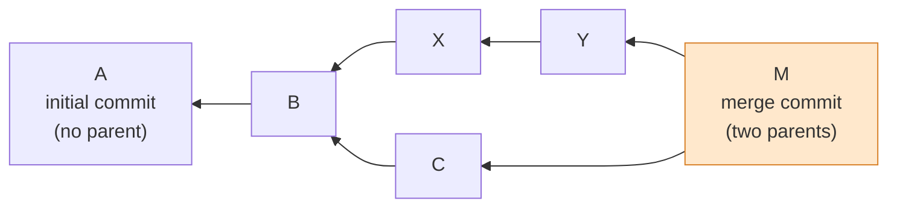
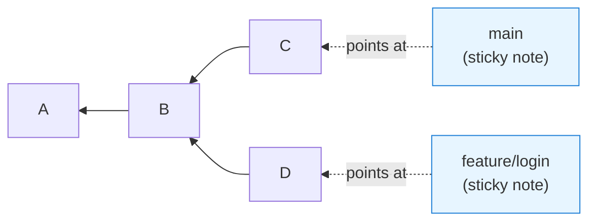
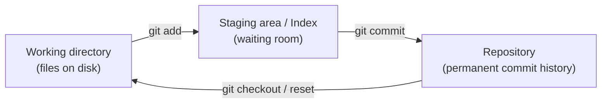
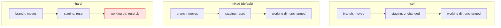
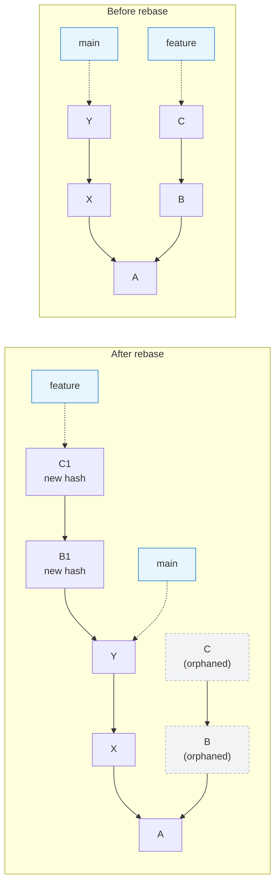

# Git, Finally Understood: A Snapshot Database and a Handful of Pointers

> Source video: [Git Will Finally Make Sense After This](https://www.youtube.com/watch?v=Ala6PHlYjmw) (LearnThatStack, 13:25)
> Written from the video's transcript and structure, with runnable commands added so every claim can be verified locally.
> Chinese version: [git-mental-model-snapshots-pointers.zh.md](./git-mental-model-snapshots-pointers.zh.md)

## Abbreviations

| Abbreviation | Full name |
|---|---|
| DAG | Directed Acyclic Graph |
| HEAD | (Reserved Git name, not an acronym — the pointer to "where you are") |
| SHA-1 | Secure Hash Algorithm 1 (the algorithm behind Git commit hashes) |
| GC | Garbage Collection |
| VCS | Version Control System |
| WIP | Work In Progress |
| reflog | Reference Log |

---

## 1. Knowing the commands is not the same as knowing Git

Plenty of engineers with years of experience run Git through exactly three verbs: `commit`, `push`, `pull`. That works — right up until it doesn't. Then it's 11 p.m., you're searching "how to undo git rebase", and you're pasting Stack Overflow commands into your terminal hoping you don't make things worse.

The problem isn't a thin command vocabulary. It's a **missing model**. If you don't know what `reset` actually moves, or why `rebase` is said to "rewrite history", every command has to be memorized — and when something breaks, you have nothing to reason from.

The whole model fits in two sentences:

1. **Git is a database of snapshots**, and its fundamental unit is the commit.
2. **Branches and HEAD are just pointers**, and most of the "dangerous" commands do nothing more than move a pointer.

Once those land, the difference between `checkout`, `reset`, `revert` and `rebase` becomes something you can *derive* instead of recall.

---

## 2. A commit is a snapshot, not a diff

The most common misconception is that a commit records "the lines I changed". It doesn't. A commit is a **complete photograph of your entire project at one moment in time** — every file exactly as it existed, not a change set.

Three things live inside a commit:

| Part | What it is |
|---|---|
| Snapshot pointer | Points at the full file tree (the `tree` object) for that moment |
| Metadata | Author, timestamp, commit message |
| Parent pointer | Points at the commit that came directly before |

That third item gives us the rule that governs everything else: **commits point backwards, always backwards.** Children know their parents; parents never know their future children.

Two special cases:

- **The first commit has no parent.** It's the origin point of the history.
- **A merge commit has two parents** — the record of a history that forked and rejoined.

You can look straight into a commit:

```bash
git cat-file -p HEAD          # tree / parent / author / message
git cat-file -p HEAD^{tree}   # the full file tree of that snapshot
```

> One implementation detail the video skips but that's worth knowing: storing full snapshots sounds wasteful, and it would be — except Git is content-addressed (identical content is stored once as a single blob) and delta-compresses objects when it packs them. **Compression happens in the storage layer; the semantics stay snapshot-based.** That's exactly why jumping to any point in history needs no replay of changes.

---

## 3. Those commits form a DAG (Directed Acyclic Graph)

If everyone committed strictly one after another, history would be a straight line. Real development forks: you branch for a feature, a colleague branches for a bug fix, and now two commits share a parent while heading in different directions. Then you merge, and a node with two parents appears.

The formal name for that shape is a **DAG (Directed Acyclic Graph)**. Intimidating name, ordinary idea — read it as a family tree:

- **Directed** — relationships run one way only. Children point at parents, never the reverse.
- **Acyclic** — no loops. Nobody can be their own grandparent; history cannot contain a cycle.
- **Graph** — nodes (commits) and edges (parent links). That's all.



(Arrows point at parents, which is why the graph grows right-to-left.)

This graph *is* your project's history — every branch, every merge, every decision anyone ever made, preserved in the structure. And because **every commit is a complete snapshot**, you can jump to any node and see the project exactly as it was. No reconstruction, no replaying diffs. It's just there.

---

## 4. A branch is a sticky note

Newcomers imagine a branch as something heavy: a separate copy of the codebase. **Completely wrong.**

A branch is **a sticky note — a pointer, a tiny text file holding one commit hash.** You can see it with your own eyes:

```bash
cat .git/refs/heads/main      # one line: a 40-character hash
git for-each-ref refs/heads   # every branch and the commit it points at
```

Create a branch called `feature/login` and the entirety of what Git does is write a small file saying "this branch points at commit a1b23…". Nothing else.

Consequences fall out immediately:

- **Commits have no idea which branches exist.** Branches don't *contain* commits; they point at them.
- **Committing on a branch** creates the new commit (pointing back at where you were), then slides the sticky note forward onto it. That's the whole mechanism of branching.
- **So creating a branch is instant** — nothing is copied, a note is placed.
- **`main` is not special.** It's another sticky note that we've agreed by convention marks the primary line of work.



---

## 5. HEAD: how Git knows where you are

We have commits, and branches pointing at commits. One piece is missing: how does Git know where *you* are working?

That's **HEAD**. It's another pointer — but normally it **doesn't point at a commit, it points at a branch**:

```
HEAD → main → commit C
```

Run `git checkout feature` and HEAD now points at `feature`; you are "on" that branch. Again, you can just look:

```bash
cat .git/HEAD          # usually: ref: refs/heads/main
git symbolic-ref HEAD  # the official way to ask
```

### Detached HEAD

What if you check out a **raw commit hash** rather than a branch? HEAD then points directly at that commit, with no branch in between. Git calls this **detached HEAD**.

It sounds alarming; it stops being alarming once you know what it means: **you can still work and still commit, but no branch is following you.** The moment you switch away, those commits are orphaned — nothing points at them, they're floating in space, and eventually **GC (Garbage Collection)** removes them.

The classic accident from the video:

> A developer checked out an old commit to test something, found a bug while there, fixed it, committed the fix, then ran `git checkout main` to merge it — and the fix had vanished. It had never been on a branch. It was orphaned and then garbage collected. Two hours of work, gone.

That's why Git warns you when you enter this state. Not because anything is broken, but because **whatever you commit here won't be kept unless you create a branch to hold it**:

```bash
git switch -c rescue-fix   # create a branch right here to catch those commits
```

---

## 6. Three areas: where your changes actually live

Before talking about undo, one more concept. Your code can live in **three places**:

| Area | Also called | What it is |
|---|---|---|
| Working directory | — | The real files on disk, what your editor shows |
| Staging area | Index | A waiting room for what goes into the next commit |
| Repository | — | The commit database; permanent history |

How things move:



- Edit a file → only the working directory changed. Git notices but doesn't care yet.
- `git add` → move those changes into staging: "this goes in my next commit".
- `git commit` → Git packages everything in staging into a commit and writes it to permanent history.

**Why does this matter?** Because the commands below manipulate these three layers in different ways. **Understanding the three layers is the key to understanding `reset`.**

---

## 7. checkout vs reset vs revert — three "undos", three different operations

They all look like undo. They do three different things, and mixing them up genuinely loses work.

### checkout — moves HEAD

Moving HEAD is its entire job.

- `git checkout main` → HEAD points at `main`.
- `git checkout C1` → HEAD points directly at that commit, and the working directory updates to match that snapshot.

The important part: **no commit changes, no branch moves, history is untouched.** You're just looking around from a different vantage point. Safe and non-destructive.

> Modern Git splits `checkout`'s two jobs apart: `git switch` changes branches, `git restore` restores files. Prefer those in new work — the intent is unambiguous.

### reset — moves a branch

`reset` is far more dangerous, because **what it moves is the branch itself**.

On `main`, `git reset C1` means "slide the `main` sticky note onto C1". The commits that were ahead **still exist in the database, but they're orphaned** — no branch points at them.

`reset` has three modes, and each touches the three areas differently:

| Mode | Branch | Staging area | Working directory | When to use |
|---|---|---|---|---|
| `--soft` | moves | unchanged | unchanged | Squash three commits into one: soft reset, then recommit. The undone changes are waiting for you **already staged** |
| `--mixed` (default) | moves | reset to target | unchanged | You committed but want to restage differently, e.g. split into several commits. Changes are still in your files, just **unstaged** |
| `--hard` | moves | reset | **reset** | Abandon the work entirely and start over — and you're sure |



A blunt warning about `--hard`: **the orphaned commits are recoverable for a while through the reflog (section 9), but changes you never committed are gone forever.** The video's author says he has watched developers lose days of work to `git reset --hard` because they assumed it could be undone. It can't.

### revert — adds an inverse commit

`revert` takes an entirely different philosophy: **it moves nothing and abandons nothing.** It **creates a new commit that does the opposite of an old one**.

Commit C added 50 lines; `git revert C` produces commit D that removes those same 50 lines. History is preserved in full, the original commit still exists, and you've simply recorded: "we decided to undo what we did earlier."

**When to use it?** When the thing you're undoing has **already been pushed and shared**. You can't rewrite shared history, but you can add to it.

### The one-line cheat sheet

| Command | What moves | Safety | Use for |
|---|---|---|---|
| `checkout` | HEAD only | Safe | Exploring history |
| `reset` | The branch, possibly your working directory too | Risky | Reshaping **local** work |
| `revert` | Nothing moves; a new commit appears | Safe | Undoing **shared** history |

---

## 8. Why rebase "rewrites history"

The setup: you branched off `main` and made commits B and C. Meanwhile `main` moved on with X and Y. You have two ways to integrate.

**Option one: merge.** Create a merge commit with two parents. The history shows **the truth** — two parallel lines of work that joined.

**Option two: rebase.** Replay your commits on top of the new `main`.

And here's the thing you have to internalize: **a commit's identity is its hash, and that hash is computed from its content, its metadata, and its parent pointer. Change any one of those — including the parent — and you get a completely different hash, which means a completely different commit.**

So **Git cannot "move" a commit. That is not a thing.** What rebase actually does is:

1. Look at commit B and calculate the changes it introduced;
2. **Create a new commit** B1 with those same changes, but with Y as its parent instead of the original base;
3. Look at commit C, calculate its changes, **create a new commit** C1 with those changes sitting on top of B1;
4. Move the feature branch's sticky note to C1;
5. The old B and C are orphaned, and will eventually be garbage collected.



Which explains the iron rule: **never rebase commits other people have already seen.** If your colleague holds the old B and C, and you push B1 and C1 — same content, different hashes — Git treats them as two entirely unrelated pieces of work. Merging becomes a nightmare, duplicated changes surface everywhere, conflicts explode.

But on **local branches you haven't shared**, rebase is a good tool: it keeps history linear and clean. Just be clear about the trade you're making — **you're choosing a tidy story over the messy truth.**

---

## 9. reflog: the safety net

You made a mistake. You `reset --hard`. You rebased badly. Commits are gone.

Run:

```bash
git reflog
```

**The reflog (Reference Log) records every place HEAD has pointed recently** — every checkout, every commit, every reset. The commits you reset away, the old commits from before the rebase: they're probably still listed. Find the hash, create a branch pointing at it, and your work is back:

```bash
git reflog                      # find the line from before the accident, e.g. HEAD@{4}
git branch rescue HEAD@{4}      # create a branch to hold it
# or just go look first
git switch --detach HEAD@{4}
```

**Git almost never truly deletes anything immediately — it hides things. The reflog is your map.**

One caveat: **reflog entries expire** — typically 90 days for reachable commits, 30 for unreachable ones (`gc.reflogExpire` / `gc.reflogExpireUnreachable`). So don't wait months. But if the disaster happened five minutes ago, you're almost certainly fine.

> Also worth knowing: `git fsck --lost-found` surfaces dangling objects that the reflog never recorded — the second line of defence after the reflog.

---

## 10. The whole model in six lines

- Git is a **database of snapshots**.
- **Commits point at their parents**, together forming a DAG.
- **Branches and HEAD are just pointers** — sticky notes telling Git what matters and where you are.
- **`checkout` moves your view; `reset` moves a branch; `revert` appends corrective history; `rebase` replays commits onto new parents.**
- When things go wrong, reach for the **reflog**.
- To judge whether a command is dangerous, ask one question: **does it move a pointer, or does it touch my uncommitted working directory?**

Next time something breaks, you won't be pasting Stack Overflow commands and praying. You'll be thinking in **graphs and pointers** — you'll know what happened, and exactly how to fix it.

---

## Appendix: every command used above

```bash
# See the objects and the structure
git cat-file -p HEAD              # what's actually inside a commit
git cat-file -p HEAD^{tree}       # the file tree of that snapshot
git log --graph --oneline --all   # draw the DAG

# See the pointers
cat .git/HEAD                     # what HEAD points at
cat .git/refs/heads/main          # a branch is one line of hash
git for-each-ref refs/heads       # every branch's target

# The three areas
git status                        # working dir vs staging
git diff                          # working dir vs staging
git diff --staged                 # staging vs HEAD

# The three undos
git switch main                   # modern: move HEAD only
git restore <file>                # modern: restore files only
git reset --soft  <commit>        # move the branch only
git reset --mixed <commit>        # move the branch + reset staging (default)
git reset --hard  <commit>        # move the branch + reset staging + reset working dir ⚠️
git revert <commit>               # add an inverse commit (for shared history)

# Rescue
git reflog                        # everywhere HEAD has been
git branch rescue HEAD@{N}        # catch lost commits
git fsck --lost-found             # find dangling objects
```

## References

- Original video: <https://www.youtube.com/watch?v=Ala6PHlYjmw>
- Git documentation: <https://git-scm.com/doc>
- Pro Git (free book): <https://git-scm.com/book>
- Related note in this directory: [git-aliases-guide.md](./git-aliases-guide.md)
