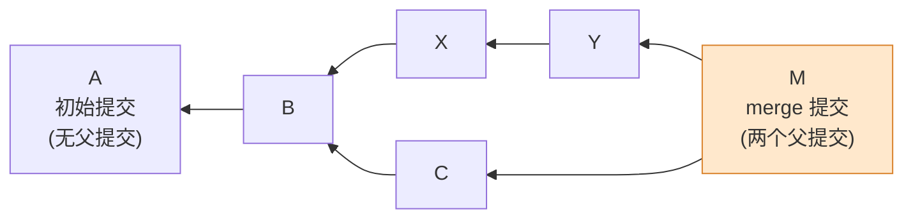
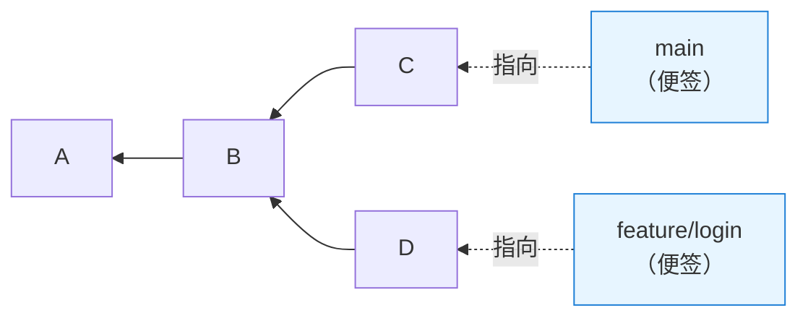
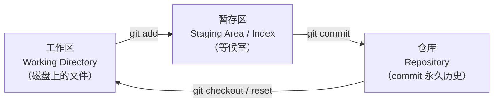
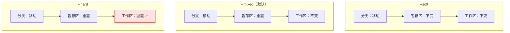
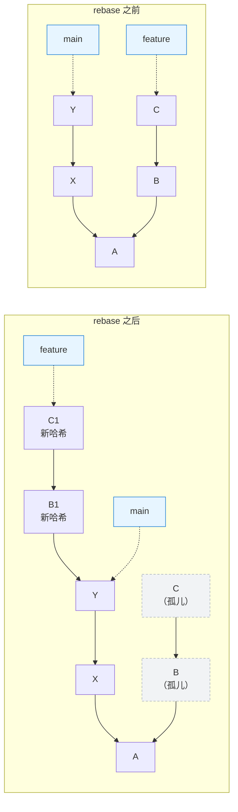

# 把 Git 想清楚：快照数据库 + 一堆指针

> 来源视频：[Git Will Finally Make Sense After This](https://www.youtube.com/watch?v=Ala6PHlYjmw)（LearnThatStack，13:25）
> 本文基于该视频的讲解顺序与转录内容整理、扩写，并补充了可直接执行的命令与验证方式。
> 英文版：[git-mental-model-snapshots-pointers.en.md](./git-mental-model-snapshots-pointers.en.md)

## 缩写对照表

| 缩写 | 英文全称 | 中文 |
|------|----------|------|
| DAG | Directed Acyclic Graph | 有向无环图 |
| HEAD | （Git 保留字，非缩写；指向"当前位置"的引用） | 头指针 / 当前位置 |
| SHA-1 | Secure Hash Algorithm 1 | 安全散列算法 1（Git 的提交哈希） |
| GC | Garbage Collection | 垃圾回收 |
| VCS | Version Control System | 版本控制系统 |
| WIP | Work In Progress | 未完成的工作 |
| reflog | Reference Log | 引用日志 |

---

## 一、为什么"会用 Git"不等于"懂 Git"

很多工作多年的工程师，Git 的日常只有三个动作：`commit`、`push`、`pull`。这套流程平时够用，直到某天出事——半夜十一点在搜索 "how to undo git rebase"，把 Stack Overflow 上的命令一条条粘贴进终端，一边祈祷别把事情搞得更糟。

问题的根源不是记的命令太少，而是**没有底层模型**：不知道 `reset` 到底移动了什么，不知道 `rebase` 为什么会"重写历史"，于是每个命令都只能靠背，出错时无法推理。

本文要建立的模型只有两句话：

1. **Git 是一个快照数据库**，基本单元是 commit（提交）。
2. **分支和 HEAD 都只是指针**，绝大多数"危险命令"做的事情就是移动指针。

理解这两句话之后，`checkout` / `reset` / `revert` / `rebase` 的差异是可以自己推导出来的，而不是背下来的。

---

## 二、commit 是快照，不是差异

最常见的误解是把 commit 理解成"这次改了哪几行"。实际上 commit 是**整个项目在某一时刻的完整快照**——每个文件当时的完整状态，而不是变更集。

一个 commit 里装了三样东西：

| 内容 | 说明 |
|------|------|
| 快照指针 | 指向该时刻整棵文件树（tree 对象），每个文件都是完整状态 |
| 元数据 | 作者、时间、提交信息（commit message） |
| 父提交指针 | 指向紧接在它之前的那个 commit |

由第三项引出一条贯穿全文的规则：**commit 只向后指，永远向后**。子提交知道自己的父提交，父提交永远不知道自己未来的子提交。

两个特殊情况：

- **第一个 commit 没有父提交**，它是历史的原点。
- **merge 产生的 commit 有两个父提交**，这是历史出现分叉后又合流的记录。

可以直接验证一个 commit 的内容：

```bash
git cat-file -p HEAD          # 看 tree / parent / author / message
git cat-file -p HEAD^{tree}   # 看这个快照里的完整文件树
```

> 补充一句视频没讲、但值得知道的实现细节：快照式存储听起来很浪费空间，但 Git 用内容寻址（相同内容只存一份 blob 对象）加打包时的 delta 压缩解决了体积问题。**存储层做压缩，语义层仍然是快照**——这就是为什么切换到任意历史点都不需要"重放"变更。

---

## 三、这些 commit 组成一张 DAG（有向无环图）

如果所有人都严格一个接一个提交，历史就是一条直线。但真实开发是分叉的：你切出一个特性分支，同事切出一个修复分支，两个 commit 共享同一个父提交却往不同方向长；随后 merge，又出现一个有两个父提交的节点。

这个结构的正式名字是 **DAG（Directed Acyclic Graph，有向无环图）**。名字唬人，含义很朴素——把它当家谱看：

- **Directed（有向）**：关系只有一个方向，子指向父，反之不成立。
- **Acyclic（无环）**：没有循环，没人能是自己的祖先，历史里不可能出现环。
- **Graph（图）**：就是节点（commit）加连线（父子指针）。



（箭头方向即"指向父提交"的方向，所以图是从右往左长的。）

这张图就是项目的完整历史：每一次分支、每一次合并、每个人做过的每个决定都留在结构里。而因为**每个 commit 都是完整快照**，你可以跳到图上任意一点，直接看到项目当时的样子——不需要重建，不需要回放，它就在那儿。

---

## 四、分支只是一张便签

新手常把分支想成很重的东西：一份代码库的完整副本。**完全错误。**

分支就是**一张便签、一个指针、一个只存了一个 commit 哈希的小文本文件**。可以亲眼看到它：

```bash
cat .git/refs/heads/main      # 输出就是一行 40 位哈希
git for-each-ref refs/heads   # 列出所有分支指向的 commit
```

创建名为 `feature/login` 的分支，Git 做的全部事情就是写一个小文件，内容是"本分支指向 commit a1b23…"。仅此而已。

由此推出几个结论：

- **commit 完全不知道有哪些分支存在。** 分支不"包含"commit，只是"指向"commit。
- **在某分支上提交时**，Git 先创建新 commit（指回原来的位置），然后把便签往前挪到新 commit 上。这就是分支的全部机制。
- **所以建分支是瞬时的**：没有复制任何东西，只是贴了一张便签。
- **`main` 一点也不特殊**，只是大家约定用来表示主线的另一张便签。



---

## 五、HEAD：Git 怎么知道"你在哪"

有了 commit，有了指向 commit 的分支，还缺一个东西：Git 怎么知道你当前在哪里工作？

答案是 **HEAD**。HEAD 也是一个指针，但通常它**不直接指向 commit，而是指向一个分支**：

```
HEAD → main → commit C
```

`git checkout feature` 之后，HEAD 改为指向 `feature` 分支，你就"在"那个分支上工作了。同样可以直接看：

```bash
cat .git/HEAD          # 通常输出 ref: refs/heads/main
git symbolic-ref HEAD  # 同上，官方命令写法
```

### detached HEAD（分离头指针）

如果你 checkout 的不是分支，而是一个**具体的 commit 哈希**呢？此时 HEAD 直接指向那个 commit，中间没有分支了。Git 把这种状态叫 **detached HEAD（分离头指针）**。

听起来吓人，理解了就不吓人。它的实际含义是：**你仍然可以工作、可以提交，但没有任何分支跟着你走。** 一旦切走，这些 commit 就成了孤儿——没有分支指向它们，它们悬在空中，最终会被 Git 的 **GC（Garbage Collection，垃圾回收）** 清掉。

视频里的典型事故：

> 某开发者 checkout 到一个旧 commit 想验证点东西，顺手发现了 bug，就地修好并提交，然后 `git checkout main` 准备合并——修复凭空消失了。它从来没在任何分支上，找不回来，被当作孤儿回收了。两小时的工作没了。

所以 Git 在进入这个状态时会警告你。不是因为你把仓库搞坏了，而是因为**你在这里提交的东西，除非建一个分支来"接住"它，否则不会被保留**：

```bash
git switch -c rescue-fix   # 在当前 detached 位置立刻建分支接住提交
```

---

## 六、三个区域：改动到底存在哪里

在谈"撤销"之前，还有一个必须先讲清楚的概念。你的代码可以存在于 Git 的**三个区域**：

| 区域 | 英文 | 是什么 |
|------|------|--------|
| 工作区 | Working Directory | 磁盘上真实的文件，编辑器里看到的东西 |
| 暂存区 | Staging Area / Index | 一个"等候室"，准备进入下一个 commit 的内容 |
| 仓库 | Repository | commit 数据库，永久历史 |

流转过程：



- 编辑文件 → 只改变了工作区，Git 察觉到了但还不管。
- `git add` → 把改动搬进暂存区，意思是"这些要进下一个 commit"。
- `git commit` → Git 把暂存区里的东西打成一个 commit，写入永久历史。

**为什么这个区分重要？** 因为接下来要讲的命令，正是以不同方式操作这三层。**理解三层，是理解 `reset` 的钥匙。**

---

## 七、checkout / reset / revert：看着都像"撤销"，其实完全不同

三个命令看上去都在"撤销"，实际做的是三件不同的事，混用会真的丢工作。

### checkout —— 移动 HEAD

`checkout` 的职责就是移动 HEAD。

- `git checkout main` → HEAD 指向 `main`。
- `git checkout C1` → HEAD 直接指向该 commit，工作区更新为那个快照的内容。

关键在于：**没有任何 commit 改变，没有任何分支移动，历史毫发无损。** 你只是换了个视角在四处看看。安全、非破坏性。

> 现代 Git 已经把 `checkout` 的两个职责拆开了：`git switch` 负责切分支，`git restore` 负责恢复文件。新代码里优先用这两个，语义更清楚。

### reset —— 移动分支

`reset` 危险得多，因为它**移动的是分支本身**。

在 `main` 上执行 `git reset C1`，意思是"把 `main` 这张便签挪到 C1 上"。原本在前面的那些 commit **仍然存在于数据库里，但成了孤儿**——没有分支指向它们。

`reset` 有三种模式，对三个区域的影响各不相同：

| 模式 | 分支 | 暂存区 | 工作区 | 典型用途 |
|------|------|--------|--------|----------|
| `--soft` | 移动 | 不变 | 不变 | 三个 commit 想压成一个：soft reset 后重新提交。被撤销的改动会以**已暂存**状态等着你 |
| `--mixed`（默认） | 移动 | 重置到目标 commit | 不变 | 已提交但想重新组织暂存内容，比如拆成多个 commit。改动仍在文件里，只是**未暂存** |
| `--hard` | 移动 | 重置 | **重置** | 彻底放弃工作、从头再来——且你确定 |



关于 `--hard` 的严肃警告：**被孤立的 commit 在一段时间内还能靠 reflog 找回（见第九节），但你从未提交过的改动会永久消失。** 视频作者说他见过开发者因为以为 `git reset --hard` 可以撤销而丢掉好几天的工作。它不能。

### revert —— 增加一个反向 commit

`revert` 的哲学完全不同：**它不移动任何东西，也不放弃任何东西**，而是**新建一个 commit，做与旧 commit 相反的事**。

commit C 加了 50 行，`git revert C` 就生成 commit D 删掉那 50 行。历史被完整保留，原来的 commit 还在，你只是记录了一句"我们决定撤销之前做的事"。

**什么时候用它？** 当你要撤销的东西**已经推送、已经共享**。共享历史不能重写，但可以往上追加。

### 一句话速查

| 命令 | 移动什么 | 安全性 | 场景 |
|------|----------|--------|------|
| `checkout` | 只移动 HEAD | 安全 | 浏览历史 |
| `reset` | 移动分支，可能连带工作区 | 有风险 | 重塑**本地**工作 |
| `revert` | 什么都不移动，新增 commit | 安全 | 撤销**已共享**的历史 |

---

## 八、rebase 为什么叫"重写历史"

场景：你从 `main` 切出特性分支，提交了 B 和 C；同时 `main` 往前走了 X 和 Y。要整合，有两条路。

**方案一：merge。** 生成一个有两个父提交的 merge commit。历史呈现的是**事实**：两条并行的工作线汇合了。

**方案二：rebase。** 把你的提交"搬"到新的 `main` 顶端重放。

这里必须理解一件事：**commit 的身份就是它的哈希，而哈希由内容 + 元数据 + 父指针共同算出。改变其中任何一项——包括父指针——得到的就是一个完全不同的哈希，也就是一个完全不同的 commit。**

所以，**Git 根本不能"移动" commit，那件事不存在。** rebase 实际做的是：

1. 看 commit B，算出它引入的变更；
2. 用同样的变更**新建**一个 commit B1，但父提交是 Y，而不是原来的基点；
3. 看 commit C，算出变更，**新建** C1，坐在 B1 之上；
4. 把特性分支的便签挪到 C1；
5. 旧的 B 和 C 成为孤儿，最终被 GC 回收。



这也就解释了那条铁律：**永远不要 rebase 别人已经看到过的 commit。** 如果同事手上有旧的 B、C，而你推上去的是内容相同、哈希不同的 B1、C1，Git 会把它们当成毫不相关的两份工作：合并变成噩梦，重复的改动到处冒出来，冲突爆炸。

但在**你自己尚未共享的本地分支**上，rebase 很好用，它让历史保持线性、干净。只要清楚这笔交易的本质：**你选择了一个整洁的故事，而不是凌乱的事实。**

---

## 九、reflog：最后的安全网

你犯错了。`reset --hard` 了，rebase 搞坏了，commit 不见了。

执行：

```bash
git reflog
```

**reflog（Reference Log，引用日志）记录了 HEAD 最近指向过的所有位置**——每一次 checkout、每一次 commit、每一次 reset。你 reset 掉的那些 commit、rebase 之前的旧 commit，大概率还在这份清单里。找到哈希，建一个分支指向它，工作就找回来了：

```bash
git reflog                      # 找到出事之前的那一行，例如 HEAD@{4}
git branch rescue HEAD@{4}      # 建分支接住它
# 或直接跳过去看看
git switch --detach HEAD@{4}
```

**Git 几乎从不真正立即删除任何东西，它只是把东西藏起来了。reflog 就是那张地图。**

一个前提要记住：**reflog 条目会过期**——可达 commit 通常 90 天，不可达 commit 30 天（由 `gc.reflogExpire` / `gc.reflogExpireUnreachable` 控制）。所以别等上几个月。但如果灾难发生在五分钟前，你大概率没事。

> 补充：`git fsck --lost-found` 可以找出连 reflog 都没记录的悬挂对象（dangling object），是 reflog 之后的第二道防线。

---

## 十、总结：把整套模型压成六行

- Git 是一个**快照数据库**。
- **commit 指向父提交**，共同构成一张 DAG（有向无环图）。
- **分支和 HEAD 只是指针**——便签，告诉 Git 什么重要、你在哪里。
- **`checkout` 移动视角；`reset` 移动分支；`revert` 追加纠正历史；`rebase` 用新的父提交重放 commit。**
- 出事时找 **reflog**。
- 判断一个命令危不危险，只需问一句：**它动的是指针，还是我未提交的工作区？**

下次出问题的时候，你不会再一边粘贴 Stack Overflow 的命令一边祈祷。你会用**图和指针**去思考，知道到底发生了什么，以及具体该怎么修。

---

## 附：本文对应的命令清单

```bash
# 看清对象与结构
git cat-file -p HEAD              # commit 里到底有什么
git cat-file -p HEAD^{tree}       # 该快照的文件树
git log --graph --oneline --all    # 把 DAG 画出来

# 看清指针
cat .git/HEAD                     # HEAD 指向谁
cat .git/refs/heads/main          # 分支就是一行哈希
git for-each-ref refs/heads       # 所有分支的指向

# 三个区域
git status                        # 工作区 / 暂存区 的差异
git diff                          # 工作区 vs 暂存区
git diff --staged                 # 暂存区 vs HEAD

# 撤销三兄弟
git switch main                   # 现代写法：只移动 HEAD
git restore <file>                # 现代写法：只恢复文件
git reset --soft  <commit>        # 只移动分支
git reset --mixed <commit>        # 移动分支 + 重置暂存区（默认）
git reset --hard  <commit>        # 移动分支 + 重置暂存区 + 重置工作区 ⚠️
git revert <commit>               # 新增反向 commit（用于已共享历史）

# 救援
git reflog                        # HEAD 去过哪儿
git branch rescue HEAD@{N}        # 接住丢失的提交
git fsck --lost-found             # 找悬挂对象
```

## 参考资料

- 视频原片：<https://www.youtube.com/watch?v=Ala6PHlYjmw>
- Git 官方文档：<https://git-scm.com/doc>
- Pro Git（免费电子书）：<https://git-scm.com/book>
- 同目录相关笔记：[git-aliases-guide.md](./git-aliases-guide.md)
