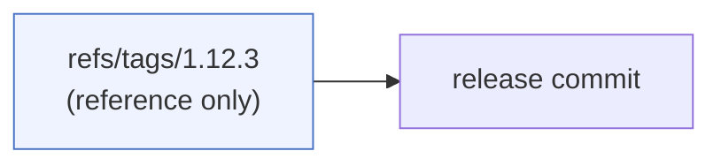
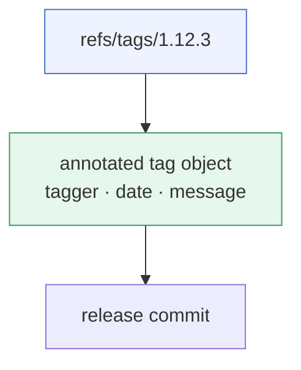
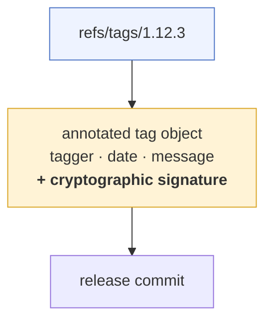
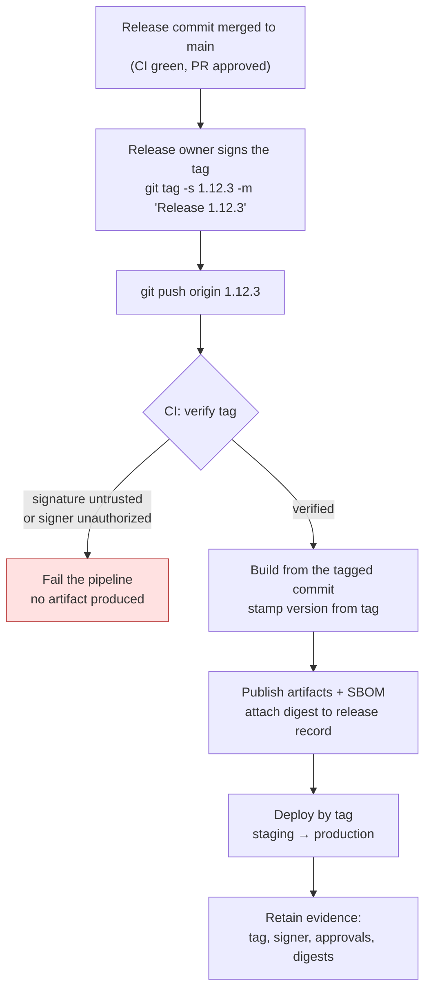
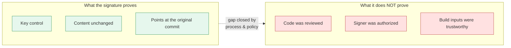

# Git Tags in the Release Process: Lightweight, Annotated, and Signed

> Written up from the study note at `raw/git-tags.md`, extended with the release-engineering practices that make tags actually useful: naming, CI triggers, verification in the pipeline, tag protection, and hotfix/rollback handling.
> Chinese version: [git-tags-in-the-release-process.zh.md](./git-tags-in-the-release-process.zh.md)
> Related note in this directory: [git-mental-model-snapshots-pointers.en.md](./git-mental-model-snapshots-pointers.en.md)

## Abbreviations

| Abbreviation | Full name |
|---|---|
| CI/CD | Continuous Integration / Continuous Delivery |
| GPG | GNU Privacy Guard (the OpenPGP implementation Git shells out to) |
| SSH | Secure Shell |
| X.509 | ITU-T standard for public key certificates (used by S/MIME signing) |
| S/MIME | Secure/Multipurpose Internet Mail Extensions |
| SemVer | Semantic Versioning (`MAJOR.MINOR.PATCH`) |
| RC | Release Candidate |
| SBOM | Software Bill of Materials |
| SHA | Secure Hash Algorithm (Git object identifiers) |
| PR | Pull Request |

---

## 1. Why a release needs more than a commit hash

A release is a promise: *this exact code is what we shipped, and here is who said it was ready.* A commit SHA identifies the code perfectly, but it carries no release intent — nobody can look at `a1b23c4` and know it was version 1.12.3, when it was cut, or who approved it.

A tag is the artifact that carries that intent. But not all tags carry the same amount of it, and the difference matters the moment an auditor, a supply-chain scanner, or an incident review asks "prove this build came from approved source".

Three forms exist, and they are genuinely different objects in the repository — not three flavours of the same thing.

---

## 2. Lightweight tag — just a pointer

```bash
git tag 1.12.3
```

That writes a single reference, `refs/tags/1.12.3`, containing a commit hash. Nothing else is created.



No message, no tagger, no timestamp of its own, no signature. It is exactly as much metadata as a branch name — which is to say, none. Fine for a private bookmark ("the commit I was debugging"), wrong for a formal release.

---

## 3. Annotated tag — a real object with release metadata

```bash
git tag -a 1.12.3 -m "Release 1.12.3"
```

This creates a **tag object** in the object database, and the reference points at that object rather than straight at the commit. The tag object holds:

- tag name
- target commit
- tagger identity
- timestamp
- release message



Inspect it:

```bash
git show 1.12.3          # tag object header, then the commit and diff
git cat-file -p 1.12.3   # the raw tag object, nothing else
```

This is a substantial upgrade — the release now records *what*, *when*, and *claims* a *who*. The caveat is that last word. Anyone with write access can create a tag under any configured `user.name` / `user.email`; the metadata is self-reported. **It documents authorship; it does not prove it.**

---

## 4. Signed annotated tag — the same object, plus a cryptographic signature

```bash
git tag -s 1.12.3 -m "Release 1.12.3"
```

Same object, same fields, with a signature appended over the tag content:



Verify it:

```bash
git tag -v 1.12.3        # equivalently: git verify-tag 1.12.3
```

A successful verification demonstrates three things, and it is worth being precise about them:

1. The tag was signed with the private key corresponding to a public key you already trust.
2. The signed content has not changed since signing.
3. The tag points at the same commit it pointed at when it was signed.

Signing can use **GPG**, **SSH**, or **X.509 (S/MIME)** keys depending on configuration:

```bash
# GPG (default)
git config --global user.signingkey <key-id>

# SSH signing — often the lowest-friction option, reuses the key you already push with
git config --global gpg.format ssh
git config --global user.signingkey ~/.ssh/id_ed25519.pub

# Sign every annotated tag automatically, so nobody has to remember -s
git config --global tag.gpgSign true
```

SSH signing needs an allowed-signers file before verification will work — without it `git tag -v` can only say "there is a signature here", not "it is a signature I trust":

```bash
git config --global gpg.ssh.allowedSignersFile ~/.config/git/allowed_signers
# each line: email  namespaces="git"  ssh-ed25519 AAAA...
```

---

## 5. Comparison

| Property | Lightweight | Annotated | Signed annotated |
|---|---|---|---|
| Separate tag object | No | Yes | Yes |
| Tagger and timestamp | No | Yes | Yes |
| Release message | No | Yes | Yes |
| Cryptographic signature | No | No | Yes |
| Detects tag-object tampering | No | No cryptographic proof | Yes |
| Proves control of an approved signing key | No | No | Yes |
| Requires signing-key setup | No | No | Yes |
| Included by `git describe` default | No | Yes | Yes |

For release governance the ordering is straightforward:

- **Signed annotated tag** — preferred whenever signing and key verification are operationally supported.
- **Annotated tag** — acceptable fallback when signing is not yet available.
- **Lightweight tag** — avoid for formal releases; it carries neither release metadata nor authenticity evidence.

One practical side effect worth knowing: `git describe` ignores lightweight tags unless you pass `--tags`. If your build stamps versions with `git describe`, lightweight tags will silently fail to show up.

```bash
git describe --tags --always --dirty    # e.g. 1.12.3-4-gA1b23c4-dirty
```

---

## 6. How the tag drives the release

The tag is not a label applied *after* a release — in a tag-driven pipeline, **creating the tag is the act that starts the release**. That single choice gives you an immutable, signed, human-named entry point for every build that ever reached production.



### 6.1 Name the tags on a scheme, and never improvise

Pick one convention and enforce it in CI. The common choice is SemVer with a `v` prefix (`v1.12.3`) — the prefix makes tags trivially distinguishable from branch names and from bare numbers in scripts. The raw note uses the unprefixed form (`1.12.3`); both work, but mixing them in one repository is a reliable source of broken tooling.

```bash
v1.12.3          # release
v1.13.0-rc.1     # release candidate — SemVer pre-release, sorts before v1.13.0
```

List them in version order rather than lexical order:

```bash
git tag --sort=-v:refname | head
git tag -l 'v1.12.*'
```

### 6.2 Tags are not pushed by default

This trips people up constantly: `git push` does not push tags.

```bash
git push origin v1.12.3      # push one tag — the deliberate, correct form
git push --follow-tags       # push commits + annotated tags reachable from them
git push --tags              # pushes every local tag, including junk — avoid in scripts
```

Prefer pushing the single named tag in a release procedure. `--tags` will happily publish half-finished experiments someone tagged locally.

### 6.3 Have CI verify the tag before it builds anything

A signature nobody checks is decoration. The pipeline should refuse to build when verification fails:

```bash
set -euo pipefail
git fetch --tags --force
git tag -v "$TAG"                                    # fails non-zero if untrusted
test "$(git rev-parse "$TAG^{commit}")" = "$(git rev-parse origin/main)"   # optional: tag must be on main
```

In GitHub Actions, the trigger and the checkout both matter — `actions/checkout` defaults to a shallow clone with no tag objects, so fetch them explicitly:

```yaml
on:
  push:
    tags: ['v[0-9]+.[0-9]+.[0-9]+']

jobs:
  release:
    runs-on: ubuntu-latest
    steps:
      - uses: actions/checkout@v4
        with:
          fetch-depth: 0   # full history + tag objects, required for verify/describe
      - name: Verify release tag
        run: git tag -v "${GITHUB_REF_NAME}"
```

### 6.4 Treat published tags as immutable

Moving a tag is the single most damaging thing you can do to a release history: anyone who already fetched `v1.12.3` keeps the old object, everyone who fetches later gets a different one, and "v1.12.3" stops identifying anything. Signatures don't save you here — a force-moved tag is validly signed for the *new* commit.

- Enable **protected tags** on the forge (GitHub rulesets → tag rules; GitLab → protected tags) so only release roles can create them and nobody can delete or force-update them.
- If a release is bad, **cut a new version**. `v1.12.4` is cheap; a mutated `v1.12.3` is a permanent trust problem.
- If a tag must be retracted, delete it explicitly and announce it — never silently repoint:

```bash
git push origin --delete v1.12.3   # requires the protection rule to allow it
git tag -d v1.12.3                 # local cleanup
```

### 6.5 Hotfixes and rollbacks read off the tag

Because the tag is an exact snapshot pointer, both operations are mechanical:

```bash
# Hotfix from a released version, not from a moving main
git switch --detach v1.12.3
git switch -c hotfix/1.12.4
# ... fix, review, merge per policy ...
git tag -s v1.12.4 -m "Release 1.12.4 — fix session leak"
git push origin v1.12.4

# Roll back a deployment: redeploy the previously verified tag
git tag -v v1.12.2 && deploy v1.12.2
```

Note the rollback still verifies. A rollback under incident pressure is exactly when an unverified artifact slips in.

---

## 7. The trust boundary — what a signature does *not* prove

This is the part most teams get subtly wrong. **A valid signature proves control of a signing key. It does not prove the release was reviewed, tested, or approved.** Someone with a trusted key can sign anything, including a commit that never saw a PR.

Closing that gap is organizational work, not a Git feature:

- **Establish which keys are trusted** — a checked-in allowed-signers file or forge-managed key list, changed only through review.
- **Verify the signer is authorized to approve releases** — key validity and release authority are separate questions; check the identity against a maintained roster.
- **Protect tags against deletion and force updates** — see §6.4.
- **Revoke compromised keys promptly**, and re-verify or re-issue anything signed after the suspected compromise window.
- **Retain approval and artifact provenance evidence** — the tag, the signer, the approvals, and the artifact digests, kept together long enough to satisfy audit.
- **Verify the whole chain, not just the tag** — a signed tag over a build that pulls unpinned dependencies still ships whatever the registry served that day.



---

## 8. Command cheat sheet

| Task | Command |
|---|---|
| Create signed release tag | `git tag -s v1.12.3 -m "Release 1.12.3"` |
| Create annotated tag (no signing) | `git tag -a v1.12.3 -m "Release 1.12.3"` |
| Tag an older commit | `git tag -s v1.12.3 <commit> -m "..."` |
| Verify | `git tag -v v1.12.3` |
| Show tag object only | `git cat-file -p v1.12.3` |
| List by version order | `git tag --sort=-v:refname` |
| List with messages | `git tag -n9 -l 'v1.*'` |
| Nearest tag describing HEAD | `git describe --tags --always --dirty` |
| Commits since last release | `git log --oneline v1.12.2..v1.12.3` |
| Push one tag | `git push origin v1.12.3` |
| Push commits + their annotated tags | `git push --follow-tags` |
| Fetch tags (and prune stale ones) | `git fetch --tags --prune --prune-tags` |
| Delete remote tag | `git push origin --delete v1.12.3` |
| Sign all annotated tags by default | `git config --global tag.gpgSign true` |

---

## 9. Pitfalls worth remembering

- **`git push` does not push tags.** A release that "went out" but produced no pipeline run is almost always this.
- **Shallow CI checkouts have no tag objects.** `git describe` and `git tag -v` both fail confusingly; set `fetch-depth: 0`.
- **`git tag -v` without a configured trust store** verifies nothing useful — GPG needs the public key in the keyring, SSH needs `allowedSignersFile`.
- **`git tag -f` on a published tag** is a history rewrite by another name. Consumers who already fetched will not pick up the change and will not be told.
- **Lightweight tags are invisible to `git describe`** unless `--tags` is passed — version strings quietly go stale.
- **A tag on the wrong commit is worse than no tag.** Always confirm `git rev-parse v1.12.3^{commit}` before pushing; the `^{commit}` peels the tag object down to the commit it targets.
- **Signing ≠ approval.** Re-read §7 before telling anyone the release chain is secure.

---

## Summary

A lightweight tag is a bookmark. An annotated tag is a release record. A signed annotated tag is a release record you can prove wasn't tampered with — and, once CI verifies it and the forge protects it, the immutable entry point that the entire release process hangs off. The cryptography is the easy half; the trust store, the authorization roster, and the tag-protection rules are what turn a valid signature into a meaningful one.
