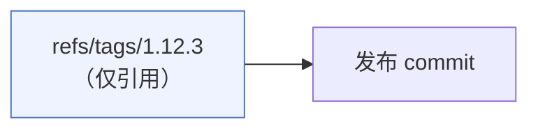
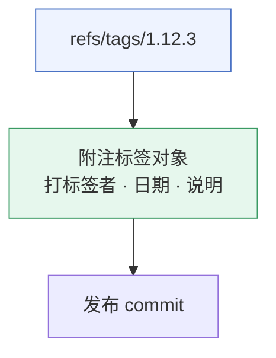
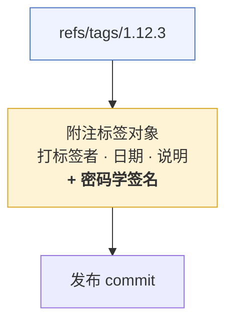
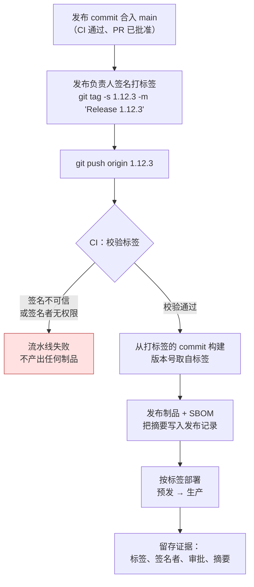
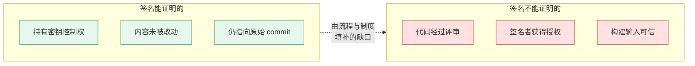

# Git 标签与发布流程：轻量标签、附注标签与签名标签

> 本文基于 `raw/git-tags.md` 的学习笔记整理、扩写，补充了让标签真正发挥作用的发布工程实践：命名规范、CI 触发、流水线中的签名校验、标签保护，以及热修复与回滚的处理方式。
> 英文版：[git-tags-in-the-release-process.en.md](./git-tags-in-the-release-process.en.md)
> 同目录相关笔记：[git-mental-model-snapshots-pointers.zh.md](./git-mental-model-snapshots-pointers.zh.md)

## 缩写对照表

| 缩写 | 英文全称 | 中文 |
|------|----------|------|
| CI/CD | Continuous Integration / Continuous Delivery | 持续集成 / 持续交付 |
| GPG | GNU Privacy Guard | GNU 隐私卫士（Git 调用的 OpenPGP 实现） |
| SSH | Secure Shell | 安全外壳协议 |
| X.509 | ITU-T standard for public key certificates | 公钥证书标准（S/MIME 签名使用） |
| S/MIME | Secure/Multipurpose Internet Mail Extensions | 安全多用途互联网邮件扩展 |
| SemVer | Semantic Versioning | 语义化版本（`主版本.次版本.修订号`） |
| RC | Release Candidate | 发布候选版本 |
| SBOM | Software Bill of Materials | 软件物料清单 |
| SHA | Secure Hash Algorithm | 安全散列算法（Git 对象标识） |
| PR | Pull Request | 合并请求 |

---

## 一、为什么发布不能只靠一个 commit 哈希

一次发布本质上是一个承诺：**我们上线的就是这段代码，并且是某个人认定它可以发布的。** commit 的 SHA 能精确标识代码，但它不携带任何"发布意图"——没人能从 `a1b23c4` 看出这是 1.12.3 版本、是什么时候切的、由谁批准的。

承载这份意图的东西就是标签（tag）。但不同形态的标签承载的信息量差别很大，而这个差别会在审计人员、供应链扫描工具或事故复盘问出"证明这个构建来自经过批准的源码"时立刻暴露出来。

标签有三种形态，它们在仓库里是**真正不同的对象**，而不是同一个东西的三种写法。

---

## 二、轻量标签（lightweight tag）——只是一个指针

```bash
git tag 1.12.3
```

这条命令只写入一个引用 `refs/tags/1.12.3`，里面存着一个 commit 哈希，除此之外什么都不创建。



没有说明信息、没有打标签的人、没有自己的时间戳、没有签名。它携带的元数据和一个分支名一样多——也就是没有。当私人书签用（"我当时在调试的那个提交"）没问题，用于正式发布则不合适。

---

## 三、附注标签（annotated tag）——带发布元数据的真实对象

```bash
git tag -a 1.12.3 -m "Release 1.12.3"
```

这会在对象数据库中创建一个**标签对象**，引用指向的是这个对象，而不是直接指向 commit。标签对象中保存：

- 标签名
- 目标 commit
- 打标签者身份
- 时间戳
- 发布说明



查看方式：

```bash
git show 1.12.3          # 先显示标签对象头，再显示 commit 与 diff
git cat-file -p 1.12.3   # 只看标签对象本身的原始内容
```

这是一次实质性的升级——发布记录下了**是什么**、**什么时候**，并**声称**了**是谁**。问题就在最后这个词：任何拥有写权限的人都能用任意 `user.name` / `user.email` 创建标签，这些元数据是自己填的。**它记录了作者身份，但并不能证明作者身份。**

---

## 四、签名附注标签（signed annotated tag）——同样的对象，外加密码学签名

```bash
git tag -s 1.12.3 -m "Release 1.12.3"
```

对象结构与字段完全相同，只是在标签内容之上附加了一段签名：



校验：

```bash
git tag -v 1.12.3        # 等价写法：git verify-tag 1.12.3
```

校验通过证明了三件事，这三点值得说精确：

1. 该标签是用你**事先已信任的公钥**所对应的私钥签的。
2. 签名覆盖的内容自签名以来**没有被改动**。
3. 该标签指向的，仍是签名当时它指向的那个 commit。

根据配置不同，签名可以使用 **GPG**、**SSH** 或 **X.509（S/MIME）** 密钥：

```bash
# GPG（默认）
git config --global user.signingkey <key-id>

# SSH 签名——通常摩擦最小，直接复用你推送用的密钥
git config --global gpg.format ssh
git config --global user.signingkey ~/.ssh/id_ed25519.pub

# 让所有附注标签默认签名，避免有人忘了加 -s
git config --global tag.gpgSign true
```

SSH 签名必须先配置 allowed signers 文件，校验才有意义——没有它，`git tag -v` 只能说"这里有一段签名"，而不能说"这是我信任的签名"：

```bash
git config --global gpg.ssh.allowedSignersFile ~/.config/git/allowed_signers
# 每行格式：邮箱  namespaces="git"  ssh-ed25519 AAAA...
```

---

## 五、三者对比

| 特性 | 轻量标签 | 附注标签 | 签名附注标签 |
|---|---|---|---|
| 独立的标签对象 | 否 | 是 | 是 |
| 打标签者与时间戳 | 否 | 是 | 是 |
| 发布说明 | 否 | 是 | 是 |
| 密码学签名 | 否 | 否 | 是 |
| 能否发现标签对象被篡改 | 否 | 无密码学证明 | 是 |
| 能否证明持有已批准的签名密钥 | 否 | 否 | 是 |
| 是否需要配置签名密钥 | 否 | 否 | 是 |
| `git describe` 默认是否纳入 | 否 | 是 | 是 |

从发布治理角度看，优先级很清晰：

- **签名附注标签** —— 只要签名与密钥校验在运维上支持得起来，就应优先使用。
- **附注标签** —— 暂时无法签名时可接受的退而求其次方案。
- **轻量标签** —— 正式发布应避免使用；它既没有发布元数据，也没有真实性证据。

还有一个容易忽略的副作用：`git describe` 默认会忽略轻量标签，除非加 `--tags`。如果你的构建用 `git describe` 生成版本号，轻量标签会悄无声息地不生效。

```bash
git describe --tags --always --dirty    # 例如 1.12.3-4-gA1b23c4-dirty
```

---

## 六、标签如何驱动整条发布流程

标签不是发布**之后**贴上去的标记——在标签驱动（tag-driven）的流水线里，**创建标签这个动作本身就是发布的起点**。仅此一个设计，就让每一个进入生产环境的构建都拥有了一个不可变、已签名、可读的入口。



### 6.1 定好命名规范，不要临场发挥

选定一种规范并在 CI 中强制执行。常见做法是 SemVer 加 `v` 前缀（`v1.12.3`）——前缀让标签能轻松地与分支名、与脚本里的裸数字区分开。原始笔记用的是不带前缀的形式（`1.12.3`）；两种都可行，但**在同一个仓库里混用**几乎必然会把工具链搞坏。

```bash
v1.12.3          # 正式发布
v1.13.0-rc.1     # 发布候选版本——SemVer 预发布号，排序在 v1.13.0 之前
```

列出标签时要按版本序而非字典序：

```bash
git tag --sort=-v:refname | head
git tag -l 'v1.12.*'
```

### 6.2 标签默认不会被推送

这一点反复坑人：`git push` 不会推送标签。

```bash
git push origin v1.12.3      # 推送单个标签——发布流程中最明确、最正确的写法
git push --follow-tags       # 推送 commit 及其可达的附注标签
git push --tags              # 推送所有本地标签，包括垃圾标签——脚本里别用
```

发布流程里优先推送明确指名的那一个标签。`--tags` 会把某人本地随手打的半成品标签一并发布出去。

### 6.3 让 CI 在构建之前先校验标签

没人校验的签名只是装饰。校验失败时流水线必须拒绝构建：

```bash
set -euo pipefail
git fetch --tags --force
git tag -v "$TAG"                                    # 不可信则返回非零，直接失败
test "$(git rev-parse "$TAG^{commit}")" = "$(git rev-parse origin/main)"   # 可选：要求标签落在 main 上
```

在 GitHub Actions 中，触发器和检出方式都很关键——`actions/checkout` 默认是不含标签对象的浅克隆，必须显式拉取：

```yaml
on:
  push:
    tags: ['v[0-9]+.[0-9]+.[0-9]+']

jobs:
  release:
    runs-on: ubuntu-latest
    steps:
      - uses: actions/checkout@v4
        with:
          fetch-depth: 0   # 完整历史 + 标签对象，verify/describe 都依赖它
      - name: Verify release tag
        run: git tag -v "${GITHUB_REF_NAME}"
```

### 6.4 已发布的标签视为不可变

移动一个标签，是对发布历史破坏性最强的操作：已经拉取过 `v1.12.3` 的人手里还是旧对象，之后才拉取的人拿到的是另一个对象，于是 "v1.12.3" 不再指代任何确定的东西。签名在这里救不了你——被强制移动的标签，对**新的** commit 而言签名依然是有效的。

- 在代码托管平台开启**标签保护**（GitHub：rulesets → tag rules；GitLab：protected tags），只允许发布角色创建标签，禁止任何人删除或强制更新。
- 发布有问题就**切一个新版本**。`v1.12.4` 的成本很低；被改写过的 `v1.12.3` 则是永久性的信任问题。
- 确实需要撤回某个标签时，显式删除并对外公告——绝不要悄悄改指向：

```bash
git push origin --delete v1.12.3   # 需要保护规则允许删除
git tag -d v1.12.3                 # 清理本地
```

### 6.5 热修复与回滚都从标签出发

因为标签就是精确的快照指针，这两个操作都是机械化的：

```bash
# 从已发布版本拉热修复分支，而不是从一直在动的 main
git switch --detach v1.12.3
git switch -c hotfix/1.12.4
# ... 修复、评审、按流程合入 ...
git tag -s v1.12.4 -m "Release 1.12.4 — 修复会话泄漏"
git push origin v1.12.4

# 回滚部署：重新部署此前已校验过的标签
git tag -v v1.12.2 && deploy v1.12.2
```

注意回滚时仍然执行了校验。故障压力之下的回滚，恰恰是未经校验的制品最容易溜进生产的时刻。

---

## 七、信任边界——签名**不能**证明什么

这是多数团队理解得最模糊的一点。**有效的签名证明的是对签名密钥的控制权，它不能证明这次发布经过了评审、测试或批准。** 持有受信任密钥的人可以给任何东西签名，包括一个从未走过 PR 的 commit。

补上这道缺口靠的是组织流程，而不是 Git 的某个功能：

- **明确哪些密钥受信任** —— 用纳入版本管理的 allowed signers 文件，或平台托管的密钥清单，且只能通过评审变更。
- **确认签名者有发布批准权限** —— 密钥有效性与发布授权是两个独立问题，必须对照一份持续维护的人员名单核验。
- **保护标签不被删除和强制更新** —— 见 6.4。
- **及时吊销已泄露的密钥**，并对疑似泄露时间窗之后签名的一切内容重新校验或重新签发。
- **留存审批与制品来源证据** —— 标签、签名者、审批记录、制品摘要要放在一起保存，保留期限满足审计要求。
- **校验整条链路，而不只是标签** —— 一个签名标签，如果对应的构建拉取的是未锁定版本的依赖，那么当天仓库给什么就发布什么。



---

## 八、命令速查

| 目标 | 命令 |
|---|---|
| 创建签名发布标签 | `git tag -s v1.12.3 -m "Release 1.12.3"` |
| 创建附注标签（不签名） | `git tag -a v1.12.3 -m "Release 1.12.3"` |
| 给历史 commit 打标签 | `git tag -s v1.12.3 <commit> -m "..."` |
| 校验签名 | `git tag -v v1.12.3` |
| 只看标签对象 | `git cat-file -p v1.12.3` |
| 按版本序列出 | `git tag --sort=-v:refname` |
| 列出标签及说明 | `git tag -n9 -l 'v1.*'` |
| 描述 HEAD 最近的标签 | `git describe --tags --always --dirty` |
| 两次发布之间的提交 | `git log --oneline v1.12.2..v1.12.3` |
| 推送单个标签 | `git push origin v1.12.3` |
| 推送 commit 及其附注标签 | `git push --follow-tags` |
| 拉取标签（并清理失效标签） | `git fetch --tags --prune --prune-tags` |
| 删除远端标签 | `git push origin --delete v1.12.3` |
| 默认对所有附注标签签名 | `git config --global tag.gpgSign true` |

---

## 九、值得记住的坑

- **`git push` 不推送标签。** "已经发出去了"却没有触发任何流水线，八成就是这个原因。
- **CI 的浅克隆里没有标签对象。** `git describe` 与 `git tag -v` 都会以令人困惑的方式失败；设置 `fetch-depth: 0`。
- **没有配置信任源时，`git tag -v` 校验不了任何有意义的东西** —— GPG 需要公钥进钥匙串，SSH 需要 `allowedSignersFile`。
- **对已发布标签执行 `git tag -f`**，本质就是一次历史改写。已经拉取过的使用方不会更新，也不会收到任何提示。
- **轻量标签对 `git describe` 不可见**（除非加 `--tags`）—— 版本号会悄悄停留在旧值上。
- **标签打错 commit 比不打标签更糟。** 推送前务必确认 `git rev-parse v1.12.3^{commit}`；`^{commit}` 会把标签对象逐层剥到它最终指向的 commit。
- **签名 ≠ 批准。** 在向任何人宣称"发布链路是安全的"之前，请重读第七节。

---

## 小结

轻量标签是一个书签；附注标签是一份发布记录；签名附注标签则是一份**可以证明未被篡改**的发布记录——再配上 CI 的校验与平台的标签保护，它就成了整条发布流程赖以挂靠的不可变入口。密码学是其中简单的那一半；真正把"签名有效"变成"签名有意义"的，是信任库、授权名单和标签保护规则。
