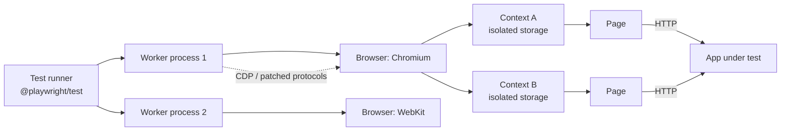
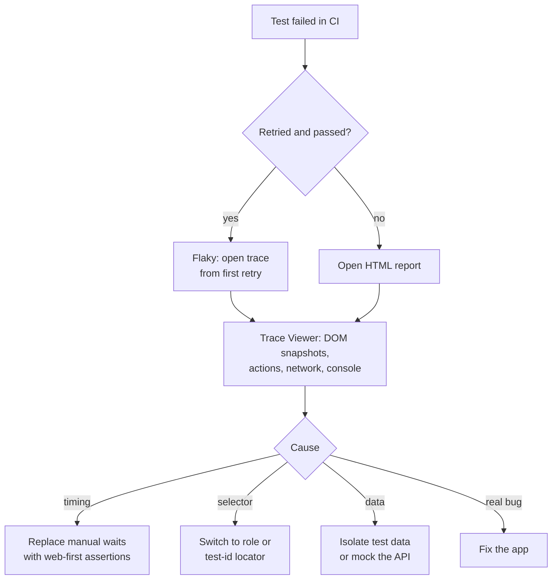

# Playwright: Reliable End-to-End Testing for Web Apps

> Source: Jira KAN-161 "Playwright" (no description on the ticket).
> A shorter Chinese summary sits in the
> [weekly listing](../../languages/java/springboot/2026-09-17-weekly-listing-kan157-161.md).

## Abbreviations

| Abbreviation | Full name |
| --- | --- |
| E2E | End-to-End |
| CI | Continuous Integration |
| UI | User Interface |
| API | Application Programming Interface |
| DOM | Document Object Model |
| CDP | Chrome DevTools Protocol |
| SPA | Single-Page Application |
| POM | Page Object Model |

## What Playwright is

Playwright is Microsoft's open-source browser automation library and E2E (End-to-End) test runner. One API drives
the three major engines — **Chromium, Firefox and WebKit** — headless or headed, on Linux, macOS and Windows.
The test runner (`@playwright/test`) is the Node.js/TypeScript flavour; bindings also exist for Python, Java and
.NET.

It is equally useful outside testing: any scripted browser task (scraping, form automation, publishing content)
uses the same `page` API.

## Why it is reliable

| Feature | What it means in practice |
| --- | --- |
| Auto-waiting | Actions wait for the element to be attached, visible, stable, enabled and receiving events — no `sleep` |
| Web-first assertions | `await expect(locator).toBeVisible()` retries until the timeout instead of checking once |
| User-facing locators | `getByRole`, `getByLabel`, `getByText`, `getByTestId` survive CSS refactors |
| Browser contexts | Each test gets a fresh, isolated context (cookies, storage) — cheap, like an incognito window |
| Network control | `page.route()` mocks or blocks requests; `waitForRequest`/`waitForResponse` assert them |
| Parallelism | Test files run in parallel worker processes out of the box |
| Tooling | `codegen` recorder, UI mode, Trace Viewer, HTML report |

## Architecture



The runner starts worker processes; each worker launches a browser once and creates a new **context** per test.
Playwright talks to Chromium over CDP (Chrome DevTools Protocol) and to Firefox/WebKit through its own patched
builds, which is why `npx playwright install` downloads specific browser versions.

## Getting started

```bash
npm init playwright@latest                    # config, example tests, browsers
npx playwright test                           # run all tests, all projects
npx playwright test --project=chromium        # one browser
npx playwright test --ui                      # interactive UI mode
npx playwright codegen http://localhost:8080  # record a script by clicking
npx playwright show-report                    # open the HTML report
npx playwright show-trace trace.zip           # replay a failed run
```

### Configuration

```ts
// playwright.config.ts
import { defineConfig, devices } from "@playwright/test";

export default defineConfig({
  testDir: "./e2e",
  fullyParallel: true,
  forbidOnly: !!process.env.CI,
  retries: process.env.CI ? 2 : 0,
  reporter: [["html"], ["list"]],
  use: {
    baseURL: "http://localhost:8080",
    trace: "on-first-retry",
    screenshot: "only-on-failure",
  },
  projects: [
    { name: "setup", testMatch: /auth\.setup\.ts/ },
    { name: "chromium", use: { ...devices["Desktop Chrome"], storageState: "e2e/.auth/user.json" }, dependencies: ["setup"] },
    { name: "webkit",   use: { ...devices["Desktop Safari"], storageState: "e2e/.auth/user.json" }, dependencies: ["setup"] },
  ],
  webServer: {
    command: "java -jar build/libs/app.jar --spring.profiles.active=e2e",
    url: "http://localhost:8080/actuator/health/readiness",
    reuseExistingServer: !process.env.CI,
    timeout: 120_000,
  },
});
```

`webServer` starts the app before the tests and waits for `url` to respond. Pointing it at the readiness
endpoint (rather than `/`) means tests start only once the Spring Boot app is really ready — runners finished,
dependencies healthy. Why "port open" and "ready" differ is explained in
[Spring Boot Startup Lifecycle](../../languages/java/springboot/2026-09-17-kan157-springboot-startup.md).

## Writing tests

### Locators and assertions

```ts
import { test, expect } from "@playwright/test";

test("user can add a product to the cart", async ({ page }) => {
  await page.goto("/product/SKU-123");

  await page.getByRole("button", { name: "Add to cart" }).click();

  await expect(page.getByRole("status")).toHaveText(/added/i);
  await expect(page.getByTestId("cart-count")).toHaveText("1");
});
```

Locator priority, most to least resilient: `getByRole` → `getByLabel` / `getByPlaceholder` → `getByText` →
`getByTestId` → CSS/XPath. Avoid `page.waitForTimeout()`; wait for a state with an assertion instead.

### Log in once, reuse the session

```ts
// e2e/auth.setup.ts
import { test as setup, expect } from "@playwright/test";

setup("authenticate", async ({ page }) => {
  await page.goto("/login");
  await page.getByLabel("Username").fill(process.env.E2E_USER!);
  await page.getByLabel("Password").fill(process.env.E2E_PASSWORD!);
  await page.getByRole("button", { name: "Sign in" }).click();
  await expect(page.getByRole("navigation")).toContainText("My account");
  await page.context().storageState({ path: "e2e/.auth/user.json" });
});
```

The `setup` project runs first (see `dependencies` in the config); other projects start with the saved cookies and
local storage. Keep `e2e/.auth/` in `.gitignore` — it contains live session tokens.

### Mocking the network

```ts
test("shows an empty state when the API returns no orders", async ({ page }) => {
  await page.route("**/api/orders", (route) => route.fulfill({ json: [] }));
  await page.goto("/orders");
  await expect(page.getByText("No orders yet")).toBeVisible();
});
```

### Fixtures and page objects

```ts
// e2e/fixtures.ts
import { test as base, expect, type Page } from "@playwright/test";

class CartPage {
  constructor(private readonly page: Page) {}
  async open() { await this.page.goto("/cart"); }
  checkoutButton() { return this.page.getByRole("button", { name: "Checkout" }); }
}

export const test = base.extend<{ cartPage: CartPage }>({
  cartPage: async ({ page }, use) => {
    await use(new CartPage(page));
  },
});
export { expect };
```

Fixtures are Playwright's dependency injection: tests declare what they need (`async ({ cartPage }) => …`) and
the runner builds and tears it down. Combined with the POM (Page Object Model) this keeps selectors in one place.

## Testing the analytics and error instrumentation

Tracking tags tend to break silently during refactors. E2E tests can assert that the requests described in
[User Behaviour Analysis With Tealium and Sentry](../../devops/observability/2026-09-17-kan158-user-behaviour-analysis-tealium-sentry.md)
are really sent.

```ts
test("add to cart fires a Tealium event", async ({ page }) => {
  await page.goto("/product/SKU-123");

  const tealiumCall = page.waitForRequest((req) => /tealiumiq\.com/.test(req.url()));
  await page.getByRole("button", { name: "Add to cart" }).click();

  const req = await tealiumCall;
  expect(req.postData() ?? req.url()).toContain("add_to_cart");
});

test("an unhandled error is reported to Sentry", async ({ page }) => {
  // Stub the ingest endpoint so tests never pollute the real Sentry project
  await page.route(/ingest\..*sentry\.io\/api\/.*\/envelope/, (route) => route.fulfill({ status: 200 }));
  const sentryCall = page.waitForRequest(/sentry\.io\/api\/.*\/envelope/);

  await page.goto("/debug/throw");
  await sentryCall;
});
```

Register the `waitForRequest` promise **before** the action that triggers it, otherwise a fast request can be
missed.

## Debugging failures



- `trace: "on-first-retry"` records a full trace (DOM snapshots, network, console, source) only when needed.
- Locally, `npx playwright test --debug` opens the inspector and steps through actions.
- `PWDEBUG=1` does the same for any run.

## Running in CI

```yaml
# .github/workflows/e2e.yml (excerpt)
- uses: actions/setup-node@v4
  with: { node-version: 22 }
- run: npm ci
- run: npx playwright install --with-deps      # browsers + OS libraries
- run: npx playwright test
- uses: actions/upload-artifact@v4
  if: ${{ !cancelled() }}
  with: { name: playwright-report, path: playwright-report/ }
```

- Pin `@playwright/test` and install browsers from the same version; or run inside the official
  `mcr.microsoft.com/playwright` image with a matching tag.
- Shard large suites across machines with `--shard=1/4` … `--shard=4/4`.
- Keep `retries` low (1–2) and treat any retried pass as a flake to fix, not a success.
- Pipeline placement: after unit tests and image build, before promotion — see
  [CI/CD](../../devops/cicd/CICD.md).

## Playwright vs alternatives

| | Playwright | Cypress | Selenium WebDriver |
| --- | --- | --- | --- |
| Engines | Chromium, Firefox, WebKit | Chromium family, Firefox (WebKit experimental) | All major browsers via drivers |
| Execution model | Out-of-process, drives browser via protocol | Runs inside the browser | Out-of-process, W3C WebDriver |
| Multiple tabs / origins | Native | Limited | Supported |
| Auto-waiting | Built in | Built in | Manual (explicit waits) |
| Languages | TS/JS, Python, Java, .NET | JS/TS | Many |
| Parallelism | Built in (free) | Via paid cloud or plugins | Via Grid |

## Conclusion

Playwright removes the two classic causes of flaky E2E suites — timing and brittle selectors — with auto-waiting,
retrying assertions and user-facing locators, and adds isolated contexts, network control and a first-class
trace viewer. Wired to the app's readiness endpoint and extended to assert analytics and error reporting, it
becomes the automated safety net for the whole path from startup to user behaviour.

## References

- Jira KAN-161 (geek-chow.atlassian.net)
- [Playwright — Getting started](https://playwright.dev/docs/intro)
- [Playwright — Best practices](https://playwright.dev/docs/best-practices)
- [Playwright — Authentication](https://playwright.dev/docs/auth)
- [Playwright — Web server](https://playwright.dev/docs/test-webserver)
- [Playwright — Trace viewer](https://playwright.dev/docs/trace-viewer)
- [Playwright — CI](https://playwright.dev/docs/ci)
