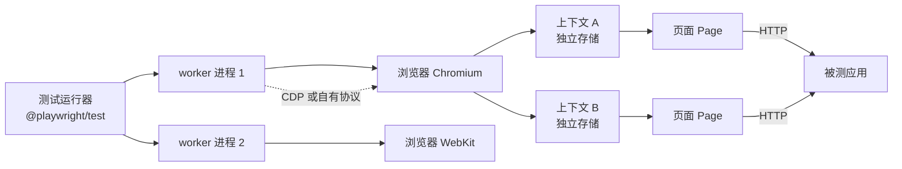
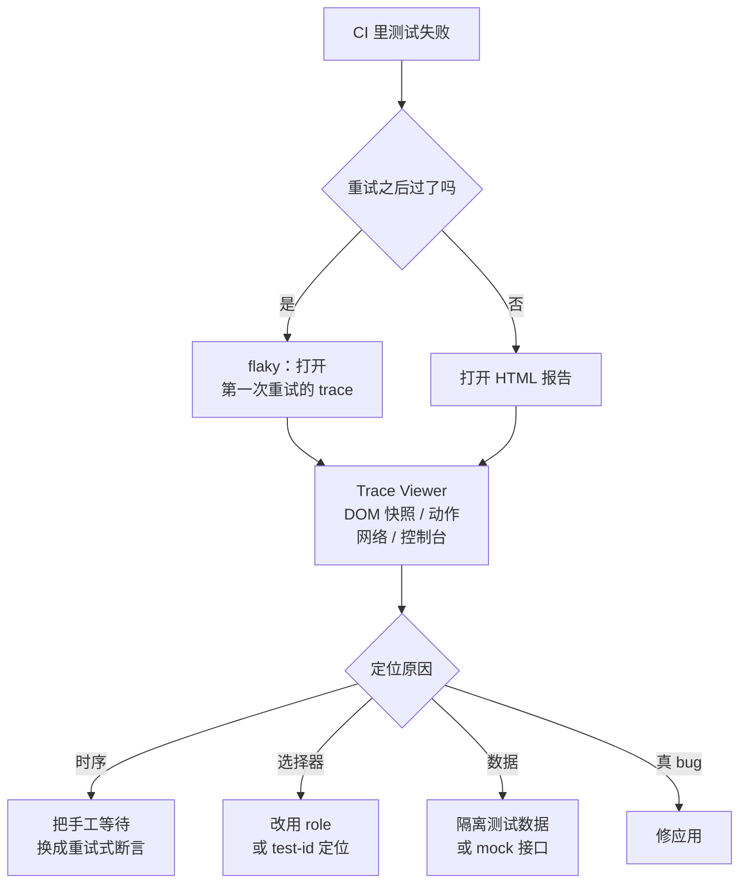

# Playwright：把端到端测试从「玄学」变回工程

## 缩写对照表

| 缩写 | 英文全称 | 中文 |
|---|---|---|
| E2E | End-to-End | 端到端 |
| CI | Continuous Integration | 持续集成 |
| UI | User Interface | 用户界面 |
| API | Application Programming Interface | 应用程序编程接口 |
| DOM | Document Object Model | 文档对象模型 |
| CDP | Chrome DevTools Protocol | Chrome 开发者工具协议 |
| SPA | Single-Page Application | 单页应用 |
| POM | Page Object Model | 页面对象模型 |

## 一、它是什么

Playwright 是微软开源的浏览器自动化库 + E2E（End-to-End，端到端）测试运行器。**一套 API 同时驱动三大浏览器引擎**——Chromium、Firefox、WebKit——可有头可无头，覆盖 Linux / macOS / Windows。测试运行器 `@playwright/test` 是 Node.js/TypeScript 版本，另有 Python、Java、.NET 绑定。

它的用途不止于测试：任何脚本化的浏览器任务——抓取、表单自动化、内容发布——用的都是同一套 `page` API。

## 二、它凭什么"不飘"

端到端测试的坏名声几乎全部来自两件事：**等待时机**和**选择器脆弱**。Playwright 的设计几乎全在对付这两点。

| 能力 | 落到实处是什么意思 |
|---|---|
| 自动等待 | 每个操作都会等元素**挂载、可见、静止、可交互、能收事件**才执行——不需要 `sleep` |
| 重试式断言 | `await expect(locator).toBeVisible()` 会一直重试到超时，而不是只查一次 |
| 面向用户的定位器 | `getByRole`、`getByLabel`、`getByText`、`getByTestId` 不会因为改 CSS 就失效 |
| 浏览器上下文 | 每个测试拿到全新隔离的 context（cookie、storage），开销极低，像无痕窗口 |
| 网络控制 | `page.route()` 可以 mock 或拦截请求；`waitForRequest`/`waitForResponse` 可以断言请求 |
| 并行 | 测试文件默认就在多个 worker 进程里并行跑 |
| 工具链 | `codegen` 录制器、UI 模式、Trace Viewer、HTML 报告 |

**自动等待是这里最关键的一条。** 传统方案里 `sleep(2000)` 既慢又不可靠——机器慢一点就挂，快一点就浪费时间。Playwright 把"等到可以点了再点"内建进每个动作，这一条就消灭了大半 flaky（不稳定）用例。

## 三、架构



*这张图回答：一次测试运行里，进程、浏览器、上下文、页面是怎么分层的。*

运行器启动若干 worker 进程；每个 worker 只启动一次浏览器，然后**为每个测试新建一个 context**。Playwright 通过 CDP（Chrome DevTools Protocol）与 Chromium 通信，对 Firefox/WebKit 则使用自己打补丁的构建版本——这正是 `npx playwright install` 必须下载特定版本浏览器的原因。

> 顺带解释一个常见报错：升级 `@playwright/test` 之后没重新 `install`，会直接报 `Executable doesn't exist`。库版本和浏览器版本是绑死的。

## 四、上手

```bash
npm init playwright@latest                    # 生成配置、示例测试、下载浏览器
npx playwright test                           # 跑全部测试、全部 project
npx playwright test --project=chromium        # 只跑一个浏览器
npx playwright test --ui                      # 交互式 UI 模式
npx playwright codegen http://localhost:8080  # 点着点着就录出脚本
npx playwright show-report                    # 打开 HTML 报告
npx playwright show-trace trace.zip           # 回放一次失败的运行
```

### 配置

```ts
// playwright.config.ts
import { defineConfig, devices } from "@playwright/test";

export default defineConfig({
  testDir: "./e2e",
  fullyParallel: true,
  forbidOnly: !!process.env.CI,
  retries: process.env.CI ? 2 : 0,
  reporter: [["html"], ["list"]],
  use: {
    baseURL: "http://localhost:8080",
    trace: "on-first-retry",
    screenshot: "only-on-failure",
  },
  projects: [
    { name: "setup", testMatch: /auth\.setup\.ts/ },
    { name: "chromium", use: { ...devices["Desktop Chrome"], storageState: "e2e/.auth/user.json" }, dependencies: ["setup"] },
    { name: "webkit",   use: { ...devices["Desktop Safari"], storageState: "e2e/.auth/user.json" }, dependencies: ["setup"] },
  ],
  webServer: {
    command: "java -jar build/libs/app.jar --spring.profiles.active=e2e",
    url: "http://localhost:8080/actuator/health/readiness",
    reuseExistingServer: !process.env.CI,
    timeout: 120_000,
  },
});
```

`webServer` 会在测试前拉起应用，并等 `url` 返回成功。**把它指向就绪探针而不是 `/`**，测试才会在应用真正可用之后才开始——runner 跑完了、依赖健康了。"端口通了"和"真的就绪了"为什么是两回事，见 [Spring Boot 启动生命周期](../../languages/java/springboot/2026-09-17-springboot-startup-lifecycle.md)。

## 五、写测试

### 定位器与断言

```ts
import { test, expect } from "@playwright/test";

test("user can add a product to the cart", async ({ page }) => {
  await page.goto("/product/SKU-123");

  await page.getByRole("button", { name: "Add to cart" }).click();

  await expect(page.getByRole("status")).toHaveText(/added/i);
  await expect(page.getByTestId("cart-count")).toHaveText("1");
});
```

定位器优先级，从最稳到最脆：`getByRole` → `getByLabel` / `getByPlaceholder` → `getByText` → `getByTestId` → CSS/XPath。

**不要用 `page.waitForTimeout()`**，改成用断言等一个状态。前者是在赌时间，后者是在等事实。

### 登录一次，全程复用

```ts
// e2e/auth.setup.ts
import { test as setup, expect } from "@playwright/test";

setup("authenticate", async ({ page }) => {
  await page.goto("/login");
  await page.getByLabel("Username").fill(process.env.E2E_USER!);
  await page.getByLabel("Password").fill(process.env.E2E_PASSWORD!);
  await page.getByRole("button", { name: "Sign in" }).click();
  await expect(page.getByRole("navigation")).toContainText("My account");
  await page.context().storageState({ path: "e2e/.auth/user.json" });
});
```

`setup` project 先跑（靠配置里的 `dependencies`），其余 project 直接带着存好的 cookie 和 localStorage 起步。

**`e2e/.auth/` 必须进 `.gitignore`**——那里面是活的会话令牌。

### Mock 网络

```ts
test("shows an empty state when the API returns no orders", async ({ page }) => {
  await page.route("**/api/orders", (route) => route.fulfill({ json: [] }));
  await page.goto("/orders");
  await expect(page.getByText("No orders yet")).toBeVisible();
});
```

### Fixture 与页面对象

```ts
// e2e/fixtures.ts
import { test as base, expect, type Page } from "@playwright/test";

class CartPage {
  constructor(private readonly page: Page) {}
  async open() { await this.page.goto("/cart"); }
  checkoutButton() { return this.page.getByRole("button", { name: "Checkout" }); }
}

export const test = base.extend<{ cartPage: CartPage }>({
  cartPage: async ({ page }, use) => {
    await use(new CartPage(page));
  },
});
export { expect };
```

Fixture 就是 Playwright 的依赖注入：测试声明自己要什么（`async ({ cartPage }) => …`），运行器负责构造和销毁。配合 POM（Page Object Model，页面对象模型），选择器就能收敛到一处。

## 六、顺手把埋点和错误上报也测了

埋点是**最容易在重构中悄悄失效**的东西——页面功能全对，只是事件不发了，而没人会立刻发现。E2E 测试可以直接断言这些请求真的发出去了（埋点本身见 [User Behaviour Analysis With Tealium and Sentry](../../devops/observability/2026-09-17-user-behaviour-analysis-tealium-sentry.md)）。

```ts
test("add to cart fires a Tealium event", async ({ page }) => {
  await page.goto("/product/SKU-123");

  const tealiumCall = page.waitForRequest((req) => /tealiumiq\.com/.test(req.url()));
  await page.getByRole("button", { name: "Add to cart" }).click();

  const req = await tealiumCall;
  expect(req.postData() ?? req.url()).toContain("add_to_cart");
});

test("an unhandled error is reported to Sentry", async ({ page }) => {
  // 把上报端点打桩，避免测试污染真实的 Sentry 项目
  await page.route(/ingest\..*sentry\.io\/api\/.*\/envelope/, (route) => route.fulfill({ status: 200 }));
  const sentryCall = page.waitForRequest(/sentry\.io\/api\/.*\/envelope/);

  await page.goto("/debug/throw");
  await sentryCall;
});
```

**`waitForRequest` 的 promise 必须在触发动作之前注册**，否则一个够快的请求会在你开始监听之前就发完了。这是这类测试最常见的一个时序坑。

## 七、失败了怎么查



*这张图回答：一次 CI 失败，应该按什么顺序往下查。*

- `trace: "on-first-retry"` 只在需要时才录制完整 trace（DOM 快照、网络、控制台、源码），平时不花这个开销。
- 本地 `npx playwright test --debug` 打开 inspector 单步执行。
- `PWDEBUG=1` 对任意一次运行都生效。

## 八、在 CI 里跑

```yaml
# .github/workflows/e2e.yml（片段）
- uses: actions/setup-node@v4
  with: { node-version: 22 }
- run: npm ci
- run: npx playwright install --with-deps      # 浏览器 + 系统依赖库
- run: npx playwright test
- uses: actions/upload-artifact@v4
  if: ${{ !cancelled() }}
  with: { name: playwright-report, path: playwright-report/ }
```

- **锁定 `@playwright/test` 版本，并用同一版本装浏览器**；或者干脆跑在官方 `mcr.microsoft.com/playwright` 镜像里，tag 对齐。
- 大套件用 `--shard=1/4` … `--shard=4/4` 切分到多台机器。
- **`retries` 保持在 1–2，并且把"重试才过"当成待修的 flaky，而不是通过。** 重试次数一多，套件就从"安全网"退化成"掷骰子"。
- 流水线位置：单元测试与镜像构建之后、晋级发布之前——见 [CI/CD](../../devops/cicd/CICD.md)。

## 九、和其他方案比

| | Playwright | Cypress | Selenium WebDriver |
|---|---|---|---|
| 引擎 | Chromium、Firefox、WebKit | Chromium 系、Firefox（WebKit 实验性） | 各主流浏览器（靠 driver） |
| 执行模型 | 进程外，用协议驱动浏览器 | **跑在浏览器内部** | 进程外，W3C WebDriver |
| 多标签页 / 跨域 | 原生支持 | 受限 | 支持 |
| 自动等待 | 内建 | 内建 | 手写显式等待 |
| 语言 | TS/JS、Python、Java、.NET | JS/TS | 多语言 |
| 并行 | 内建且免费 | 需付费云或插件 | 靠 Grid |

Cypress"跑在浏览器内部"是它很多限制的根源（跨域、多标签页）；Selenium 的问题则是自动等待要自己写，这恰恰是 flaky 的主要来源。

## 十、小结

Playwright 把 E2E 套件飘忽的两大元凶——**时序**和**脆弱选择器**——用自动等待、重试式断言和面向用户的定位器直接消掉，再补上隔离上下文、网络控制和一流的 trace 回放。

把它接到应用的就绪探针上，再扩展到断言埋点和错误上报，它就不只是"点页面的机器人"，而是覆盖**从启动到用户行为**整条链路的自动安全网。

## 参考资料

- [Playwright — Getting started](https://playwright.dev/docs/intro)
- [Playwright — Best practices](https://playwright.dev/docs/best-practices)
- [Playwright — Authentication](https://playwright.dev/docs/auth)
- [Playwright — Web server](https://playwright.dev/docs/test-webserver)
- [Playwright — Trace viewer](https://playwright.dev/docs/trace-viewer)
- [Playwright — CI](https://playwright.dev/docs/ci)
